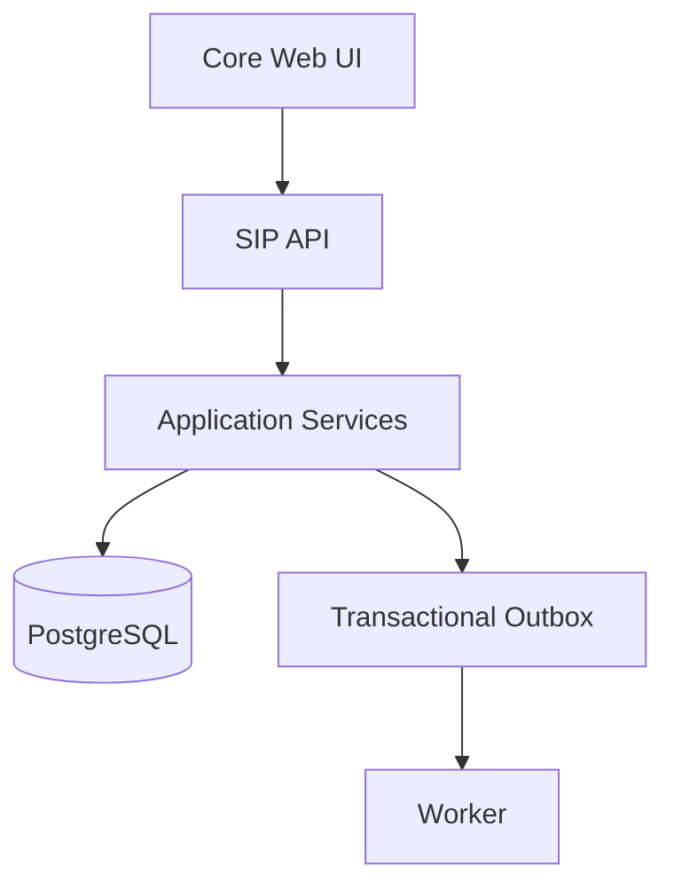

# SIP (Service Intelligence Platform) — Product Requirements Document

**Version:** 5.7 (SIPmem — Hybrid Memory System)
**Status:** Draft
**Date:** 2026-04-29
**Type:** Greenfield, Open Source (AGPLv3), AI-First Service Intelligence Platform for Physical Assets

---

## 1. Executive Summary

**SIP** is an AI-first service intelligence platform for physical assets. It builds a **maintenance intelligence layer** on top of a **service-domain canonical model** — a structured, queryable representation of every asset, every work order, and every repair decision an organization has ever made. Unlike legacy maintenance platforms that treat operational data as a passive ledger, SIP structures it as an **AI-readable operational history** — a **structured maintenance substrate** that both humans and AI agents consume through the same public API.

**Core thesis:** Maintenance data should be structured for machine reasoning first, human consumption second. Every entity in SIP exposes **agent-accessible service data** through a machine-readable interface that both the UI and AI agents consume through the same public API.

**Business model:** Open-source core (AGPLv3) with optional enterprise hosting and support. The **service-domain canonical model** is the moat — competitors can copy features but cannot replicate a coherent, cross-industry domain model evolved through real-world usage. Plugins extend the platform into domain-specific territory without compromising the core model.

**MVP scope:** Organization and tenant model, user model and basic RBAC, location hierarchy, AssetType with JSON Schema custom attributes, asset registry with manufacturer and model support, work order creation/assignment/lifecycle/history, activity audit log, basic document upload and linking, and limited AI Q&A over asset and work order history with citations from source records. Shippable as Docker Compose local deployment with initial seed data.

**Phased roadmap:** MVP Core → AI and Plugin Expansion → Core Operations → Advanced AI → Enterprise Scale. Each phase adds capabilities without compromising the **service-domain canonical model** that serves as the platform's foundation.

**Interface philosophy:** SIP supports many interfaces — web UI, public API, AI assistant, MCP server, CLI, and eventually TUI. These interfaces all operate on the same Rust core and **service-domain canonical model**. The web UI is the primary human-facing reference client. The public API is the canonical integration surface. MCP, CLI, and TUI are secondary interfaces that strengthen interoperability, automation, and agent accessibility without replacing the core product experience.

**SIPmem:** SIPmem is SIP's accurate hybrid memory system. SIPmem uses SQL to enforce operational truth, vector search to find semantic meaning, RAG to assemble grounded context, graph memory to connect relationships, temporal memory to preserve change over time, retrieval agents to select the right evidence path, and verification loops to check that final answers are supported by authorized records. SIPmem is designed to make AI-assisted maintenance answers auditable, accurate, permission-safe, and useful for real service operations.

---

## 2. Problem and Market Context

### 2.1 Problem Statement
Organizations that depend on physical assets for revenue lack a unified **maintenance intelligence layer**. Existing maintenance platforms are rigid monoliths locked to single industries. They treat operational data as a passive ledger — not as an **AI-readable operational history** that could power proactive decisions, failure prediction, and autonomous service workflows.

**SIP must solve:** How do you build a **physical asset intelligence** platform that works for *any* physical asset — from a robotic arm to a dishwasher to a lawn — and structures every service event into an **agent-accessible** format consumable by both humans and AI agents?

### 2.2 Market Landscape

| Category | Examples | Gaps SIP Exploits |
|----------|---------|-------------------|
| **Enterprise Platforms** | IBM Maximo, SAP PM, Oracle EAM | Expensive, on-premise, zero AI integration |
| **Mid-Market Platforms** | Fiix, MaintainX, UpKeep | Single-industry focus, closed-source, AI is bolt-on marketing |
| **Open-Source Alternatives** | Fracttal (freemium), openMAINT | No AI, no plugin ecosystem, limited adoption |
| **Horizontal Tools** | Jira, ServiceNow, Monday.com | Not maintenance-native; work orders need the asset context |

**Market size:** The market for maintenance and service software is $1.2B in 2025, growing at 9% CAGR toward $2.3B by 2032. No dominant open-source player exists. The **physical asset intelligence** category — AI-first platforms that treat service data as a reasoning substrate — is unoccupied.

### 2.3 Current Limitations of Existing Maintenance Platforms
1. **Single-industry schemas** — A manufacturing system can't model an apartment complex. A fleet platform can't handle kitchen equipment.
2. **No AI-native data layer** — Data is stored for PDF reports, not for embedding, vector search, or LLM context windows. There is no **structured maintenance substrate** that an AI agent can reason over.
3. **No plugin ecosystem** — Extending the system means vendor professional services or forking.
4. **Human-only interfaces** — No MCP endpoints, no function-calling tools, no agentic interfaces. **Agent-accessible service data** is an afterthought at best.
5. **Closed-source lock-in** — Maintenance data outlives the software vendor. Organizations risk data hostage situations. An open-source **service-domain canonical model** guarantees data portability.

---

## 3. Product Principles

These principles govern every architectural and product decision in SIP. They are ranked by priority — when two principles conflict, the higher-ranked principle wins.

| # | Principle | What It Means |
|---|-----------|---------------|
| P1 | **Machine-readable before human-readable** | Every entity must expose a structured API contract before any UI is built. The API is the canonical representation of data. UIs are consumers of the API — one client among many. If a human can see it, an AI must be able to query it. |
| P2 | **The public API is the AI surface** | AI agents consume the same public REST API as the frontend. There is no internal AI backdoor, no separate AI-only endpoints, no direct database access for LLMs. Every AI retrieval goes through the same authorization, rate limiting, and audit logging as a human API call. AI is not a privileged user — it is an authenticated, authorized, audited user. |
| P3 | **Every AI answer must be grounded** | Every AI response about customer data must cite retrievable source records. The AI must never speculate beyond what exists in the database. If the answer is not in the context, the AI says "I don't have enough information." Responses include citations: work order IDs, document names, timestamps. This is not optional — it is the defining quality bar for the AI layer. |
| P4 | **AI retrieval enforces authorization boundaries** | When the AI retrieves context for a query, it must enforce the same tenant isolation and RBAC permissions as direct API access. An AI query from a technician must never surface data from another organization or data the technician lacks permission to see. The RAG pipeline queries through the same service layer — not raw database queries. |
| P5 | **Operational actions create reusable intelligence** | Every completed work order, every inspection finding, every resolution note becomes part of an **AI-readable operational history**. When a technician writes "replaced bearing, found inner race spalling due to contamination," that note is immediately available as retrievable intelligence for every future query about that asset type. The platform treats maintenance data as a compounding asset — a **structured maintenance substrate** that grows more valuable with every service event. |
| P6 | **The service-domain canonical model is the moat** | The service-domain model (entities, relationships, events, state machines) is the platform's defensible intellectual property. It encodes decades of cross-industry maintenance knowledge into a coherent, queryable structure. Plugins extend the model — they do not bypass it. Competitors can copy features; they cannot copy a well-reasoned service-domain model evolved through real-world usage. |
| P7 | **Plugins extend without compromising** | Plugins must extend SIP without compromising tenant isolation, system reliability, or auditability. A plugin crash must not crash the core. A plugin's data access must be scoped and auditable. A plugin's AI tools must go through the same authorization gates as core AI tools. If a plugin degrades these guarantees, it is rejected. |
| P8 | **Modular monolith until scale demands otherwise** | SIP starts as a single deployable unit with well-defined module boundaries. Services are extracted only when there is a measurable bottleneck — not because the diagram looks better. Module boundaries are enforced by interface contracts, not network boundaries. This keeps operational complexity low while preserving the option to split later. |
| P9 | **Modular at the data layer** | Asset types are schemas, not hardcoded tables. Any physical object can be modeled without code changes. The system ships with reference types, but the schema lives in the database, not in the codebase. |
| P10 | **Audit everything, immutably** | Every state change, every AI action, every human decision is logged in an append-only Activity table. The audit trail is the system of record. Nothing is ever deleted — only marked as superseded or deactivated. |
| P11 | **Open source as a feature, not a marketing tactic** | Users can self-host forever. Data portability is guaranteed. The business model is hosting + support, not data lock-in. Every feature usable in the hosted version must be available in the open-source version, with the exception of operational concerns (SLA guarantees, managed backups, SSO integration). |
| P12 | **Progressive AI autonomy** | AI starts advisory (read-only Q&A), graduates to assisted actions (confirmed by human), and eventually reaches autonomous operation — all with human overrides. At no point does the AI operate without an audit trail or a kill switch.
| P13 | **Documentation is an acquisition surface** | SIP documentation is not just support material. It is how developers, operators, plugin authors, search engines, and AI answer engines discover and learn what SIP is. Documentation must be clear, accurate, navigable, versioned, SEO-aware, AI-search-friendly, and formatted for both GitHub browsing and a future hosted documentation website. A feature is not complete until its documentation is complete.

### 3.1 Rust Implementation Principles

SIP core is implemented in Rust. These principles govern how the codebase is structured:

| # | Principle | What It Means |
|---|-----------|---------------|
| R1 | **Rust core is the source of truth** | Domain logic lives in Rust domain crates, not in database triggers, frontend code, or AI prompts. Business rules are enforced at compile time where possible. |
| R2 | **API calls domain services, not database** | The API layer must call domain application services rather than manipulating database records directly. No raw SQL in route handlers. |
| R3 | **Authorization enforced in service boundaries** | Tenant isolation, RBAC, work order state transitions, audit creation, and outbox events must be enforced in Rust service boundaries. No bypass through stored procedures or external services. |
| R4 | **Modular crates for different builds** | Rust crates should be modular enough to support different customer builds. Optional capabilities are controlled with Cargo features and deployment configuration. |
| R5 | **Python is sidecar, not core** | Python services are optional AI/ML sidecars, not part of the trusted core. They communicate with the Rust core through stable APIs and must not bypass core authorization or tenancy rules. |
| R6 | **Plugins go through Rust core APIs** | Plugins must not bypass Rust core APIs. Plugin actions are routed through application services for authorization, tenant scoping, and audit logging. |
| R7 | **Feature flags control compile-time capability** | Cargo feature flags control whether a capability exists in the binary. Runtime feature flags control whether a tenant can use it. If a runtime flag is enabled but the binary was compiled without the capability, the API returns CAPABILITY_NOT_AVAILABLE. |

---

## 4. Users and Personas

### 4.1 Human Personas

#### P1: Maria — Maintenance Technician
> *"I need to know what I'm walking into before I get there."*

- **Context:** Field technician at a facility management company. Services 20-30 assets per week across multiple sites. Often in basements or rooftops with poor connectivity.
- **Goals:** See assigned work immediately, access asset history and manuals on mobile, log completion with photos in under 60 seconds.
- **Pain points:** Switching between paper work orders, PDF manuals, and a desktop-only maintenance system. No way to query "what fixed this last time?" without calling a senior tech. No **agent-accessible service data** — every lookup is manual.
- **Core actions in SIP:** View work queue → Accept assignment → Access AI for asset history → Execute checklist → Attach photos → Mark complete.

#### P2: David — Asset/Facility Manager
> *"I need to stop fighting fires and start preventing them."*

- **Context:** Manages 500+ assets across 3 facilities. Responsible for uptime KPIs, maintenance budget, and compliance.
- **Goals:** See asset health at a glance, schedule preventive maintenance intelligently, know which assets are at risk of failure before they break.
- **Pain points:** Spreadsheet-based scheduling, no cross-asset trend analysis, reactive maintenance culture driven by lack of visibility.
- **Core actions in SIP:** View asset health dashboard → Approve AI-recommended schedule adjustments → Prioritize backlog by criticality → Review compliance gaps.

#### P3: James — Third-Party Service Vendor
> *"I service 10 different clients. I need to prove I did the work and get paid."*

- **Context:** Independent contractor servicing HVAC systems for multiple building owners.
- **Goals:** Receive work orders from clients in one place, document completed work with timestamps and photos, generate compliance evidence packages.
- **Pain points:** Each client uses a different system (or no system). Duplicate data entry. Hard to prove maintenance was done on schedule.
- **Core actions in SIP:** Accept work order across tenant boundary → Execute work → Upload evidence → Generate service report.

#### P4: Sarah — Compliance Officer
> *"I need to prove to auditors that every inspection was done, on time, by a qualified person."*

- **Context:** Responsible for FDA/OSHA/ISO compliance at a food processing plant.
- **Goals:** Pull audit-ready evidence packages on demand, verify technician certifications are current, identify compliance gaps before auditors do.
- **Pain points:** Paper records, missing signatures, expired certifications filed away in a drawer. Audit prep takes weeks.
- **Core actions in SIP:** Query audit log by asset/date range → Verify certification validity at time of work → Export compliance report → Flag gaps for remediation.

### 4.2 AI Agent Personas

| Agent | Capability | Autonomy | Example Query | Ships In |
|-------|-----------|----------|---------------|----------|
| **Knowledge Agent** | Q&A over asset history, work orders, documents | Read-only | *"What's the maintenance history of Pump A?"* | Phase 1 |
| **Scheduling Agent** | Optimizes PM schedules, detects conflicts | Assisted | *"Reschedule next week to balance technician load."* | Phase 3 |
| **Diagnostic Agent** | Predicts failures from patterns, recommends fixes | Advisory | *"Compressor B shows bearing wear pattern — suggest inspection."* | Phase 3 |
| **Compliance Agent** | Gap analysis, evidence packaging | Advisory | *"Are we audit-ready for ISO 55000 section 7.1?"* | Phase 3 |
| **Dispatch Agent** | Auto-assigns work orders by skills, location, availability | Semi-auto | *"Assign the next corrective WO to the nearest qualified tech."* | Phase 4 |

### 4.3 AI as a First-Class User — Formal Rules
1. Each AI agent type has an **AgentIdentity record** defining its type, provider, model, and permission scope.
2. Every AI action is **logged in the Activity table** with `actor_type: AI_AGENT` and a reference to the specific `agent_identity_id`.
3. AI agents **cannot escalate their own permissions**. They operate within the same RBAC framework as humans.
4. For MVP, AI agents may draft mutations (create work order, assign technician) but may not execute high-impact mutations without human confirmation. Full tool execution ships in Phase 2. Autonomous mutation (no human in the loop) is gated behind Phase 4 trust and safety validation.
5. AI agents query through the **same public API** — they have no internal database access, no bypass of RLS, and no privileged data paths.

---

## 5. Core Use Cases

### UC1: Register a New Asset Type (MVP)
1. Admin navigates to Asset Types → Create New.
2. Defines name ("Industrial Robot Arm"), category ("ROBOTICS"), and JSON Schema for custom attributes (`{ "payload_kg": "number", "axes": "number", "controller_model": "string" }`).
3. Optionally attaches default PM schedule templates and inspection checklists.
4. Asset Type is immediately available for asset creation. No code deployment needed.

### UC2: Create a Preventive Maintenance Schedule (MVP — cron only)
1. Manager selects an asset → Schedules → Create.
2. Chooses trigger type: time-based (`0 8 * * MON`). Meter-based triggers deferred to Phase 2.
3. Defines work order template: title, description, estimated hours, default assignee, parts list.
4. System calculates `next_due` timestamp.
5. When trigger fires, system generates a new WorkOrder from the template.

### UC3: Execute a Work Order (MVP)
1. Technician opens mobile view → sees assigned work orders sorted by priority and due date.
2. Taps a work order → sees asset details, location, prior work history (via AI summary), attached manuals.
3. Travels to asset → taps "Start Work" → timer begins.
4. Executes checklist items (pass/fail, numeric readings, photos).
5. Logs parts used (decrements inventory).
6. Writes resolution notes → taps "Complete" → system logs elapsed time, updates asset status, recalculates schedule `next_due`.

### UC4: AI Query — Asset History (MVP)
1. Technician types or speaks: *"What's been going on with Conveyor C-12?"*
2. AI Service retrieves context:
   - **Relational:** Current status, recent work orders (last 90 days), open work orders.
   - **Vector:** Semantic search over work order resolution notes for similar issues.
3. LLM generates a structured response with citations.

### UC5: Inspection with Automatic Corrective Work Order (Phase 1.5)
1. Technician executes an inspection work order with checklist items.
2. One checklist item returns `result: FAIL` with finding: *"Belt tension at 30 PSI — spec is 45-55 PSI."*
3. In MVP, failed checklist items are recorded and surfaced to the user. In Phase 1.5, an automation generates a CORRECTIVE work order linked to the finding.
4. Manager is notified when automation is active.

### UC6: Install and Configure a Plugin (Phase 1.5)
1. Admin navigates to Plugins → Install.
2. Provides plugin package (Docker image + manifest) or selects from registry.
3. System validates manifest, checks compatibility with current SIP version, verifies declared permissions.
4. Plugin enters INSTALLED → CONFIGURED → ENABLED lifecycle. In Phase 1.5+, execution may use sidecars or another approved runtime.
5. Admin configures plugin-specific settings via the manifest's `config_schema`.
6. MVP only documents the plugin architecture and may include manifest validation if time permits.

---

## 6. MVP Scope

**Phase 1: MVP Core ships** with the foundational data model, asset and work order management, basic AI Q&A, and Docker Compose deployment. Everything else is deferred to a later phase.

### 6.1 In Scope for MVP

| # | Capability | Details |
|---|-----------|---------|
| 1 | **Organization and tenant model** | Organization CRUD. Slug-based tenancy. RLS isolation. Tenant settings (timezone, default currency, feature flags). |
| 2 | **User model and basic RBAC** | User CRUD with 6 roles: ADMIN, MANAGER, TECHNICIAN, VIEWER, VENDOR, AUDITOR. JWT authentication. Skills and certifications with expiry tracking. Team management with lead assignment. |
| 3 | **Location hierarchy** | Hierarchical locations (Site → Building → Floor → Room). CRUD with parent/child relationships. Geo coordinates support. |
| 4 | **AssetType with JSON Schema custom attributes** | Define asset types with custom attribute schemas (JSON Schema draft-2020-12). 6 reference types shipped as seed data. Schema validation on asset create/update. |
| 5 | **Asset registry** | Full CRUD for assets. Dynamic attributes validated against AssetType schema. Parent/child hierarchy. Status lifecycle with state machine validation. Tagging. Location assignment. |
| 6 | **Manufacturer and AssetModel support** | Manufacturer CRUD (system defaults + tenant-created). AssetModel CRUD linking manufacturer to AssetType. Asset creation pre-populates type and attributes when a model is selected. Seed data with known manufacturers and models for reference AssetTypes. |
| 7 | **Work order creation, assignment, lifecycle, and history** | Full lifecycle state machine (OPEN → ASSIGNED → IN_PROGRESS → ON_HOLD → COMPLETED/CANCELLED). Types: PREVENTIVE, CORRECTIVE, INSPECTION, EMERGENCY. Priority levels. User/team assignment. Time tracking (estimated vs actual). Resolution notes (required on completion). Parts consumption logging. Source tracking (MANUAL, SCHEDULE, API). |
| 8 | **Preventive maintenance scheduling** | Time-based cron schedules. Auto-generate work orders on trigger. Deduplication (skip if open WO already exists). Enable/disable. Next due calculation. |
| 9 | **Minimal inspections** | Work orders may have checklist items. Items support PASS_FAIL, NUMERIC, TEXT, and PHOTO metadata. Failed checklist items are recorded. Automatic corrective work order generation from failed inspection items is deferred to Phase 1.5 automation support. |
| 10 | **Activity audit log** | Immutable append-only record of all state changes. Tracks actor (human, AI agent, system, plugin), entity, action, before/after diff. Filterable by entity, date range, actor. |
| 11 | **Basic document upload and linking** | Upload documents (PDF, images) to MinIO/S3. Link to assets and work orders via DocumentLink. Text extraction for AI indexing. |
| 12 | **Document processing status** | Track document processing lifecycle: PENDING → EXTRACTING → EXTRACTED → CHUNKING → EMBEDDING → INDEXED (or FAILED). API exposes status so UI can show "this document is still being indexed." |
| 13 | **Limited AI Q&A over asset and work order history** | Natural language queries via POST /api/v1/ai/chat with SSE streaming. Answers grounded in relational data + vector search over work order notes and document text. Read-only in MVP — no tool execution for mutations. |
| 14 | **AI citations from source records** | Every AI response includes source citations: work order ID, document name, timestamp. "I don't know" response when answer is not in context. |
| 15 | **Minimal parts inventory** | Part CRUD. Manual part usage logging against a work order. Atomic decrement of quantity_on_hand. Low stock event emission exists internally, but notification, reorder recommendation, and automation handling are deferred to Phase 1.5 or Phase 2. |
| 16 | **Docker Compose local deployment** | Single `docker compose up` command. Includes: SIP API, SIP Frontend, PostgreSQL + pgvector, Redis, MinIO, Ollama (for local AI). |
| 17 | **Initial seed data** | Docker image ships with 6 reference AssetTypes, known Manufacturers and AssetModels for each type, a demo organization, sample assets, and sample work orders to demonstrate the platform immediately after startup. |

### 6.2 MVP Technical Stack

| Layer | Choice | Rationale |
|-------|--------|-----------|
| Backend | Rust | SIP core is implemented primarily in Rust using Axum for HTTP and Tokio for async runtime. Rust is used for the API server, domain model, authorization, tenancy enforcement, work order lifecycle logic, scheduling, document metadata, activity logging, outbox processing, plugin registry, and core service modules. Python may be used only for optional AI/ML sidecar services where the Python ecosystem provides clear advantages (OCR, document parsing, model experimentation, specialized ML workflows). These sidecars communicate with the Rust core through stable APIs and are not allowed to bypass core authorization or tenancy rules. |
| Frontend | TypeScript (Next.js 15) | React ecosystem, SSR, PWA-capable |
| Relational DB | PostgreSQL 16+ | pgvector, RLS, JSONB, ltree, PostGIS |
| Vector DB | pgvector | Stack consolidation, no separate service needed for MVP |
| Graph | Recursive CTEs + ltree materialized paths | Defer Neo4j to Phase 4 |
| Event Bus | In-process outbox poller | Single-node simplicity for MVP; defer NATS to Phase 1.5 |
| Cache | Redis/Valkey | Session store, rate limiting |
| Object Storage | MinIO (self-hosted) | |
| LLM | Ollama (default local provider) | MVP includes a minimal LLM adapter layer. LiteLLM may be used internally to normalize provider calls, but per-tenant provider configuration, fallback chains, token usage dashboards, and provider swapping through the UI are deferred to Phase 1.5. |
| Containerization | Docker Compose | Single-command deployment |

### 6.3 MVP API Endpoints

```
POST   /api/v1/auth/login
POST   /api/v1/auth/refresh
POST   /api/v1/auth/logout

GET    /api/v1/organizations
POST   /api/v1/organizations
GET    /api/v1/organizations/{id}
PATCH  /api/v1/organizations/{id}

GET    /api/v1/locations
POST   /api/v1/locations
GET    /api/v1/locations/{id}
PATCH  /api/v1/locations/{id}
GET    /api/v1/locations/{id}/children
GET    /api/v1/locations/{id}/assets

GET    /api/v1/asset-types
POST   /api/v1/asset-types
GET    /api/v1/asset-types/{id}
PATCH  /api/v1/asset-types/{id}

GET    /api/v1/manufacturers
POST   /api/v1/manufacturers
GET    /api/v1/manufacturers/{id}
GET    /api/v1/manufacturers/{id}/models

GET    /api/v1/models
POST   /api/v1/models
GET    /api/v1/models/{id}

GET    /api/v1/assets
POST   /api/v1/assets
GET    /api/v1/assets/{id}
PATCH  /api/v1/assets/{id}
POST   /api/v1/assets/{id}/archive
GET    /api/v1/assets/{id}/children
GET    /api/v1/assets/{id}/work-orders

GET    /api/v1/work-orders
POST   /api/v1/work-orders
GET    /api/v1/work-orders/{id}
PATCH  /api/v1/work-orders/{id}
POST   /api/v1/work-orders/{id}/cancel
POST   /api/v1/work-orders/{id}/reopen
GET    /api/v1/work-orders/{id}/assignments
POST   /api/v1/work-orders/{id}/assignments
PATCH  /api/v1/work-orders/{id}/assignments/{assignment_id}
POST   /api/v1/work-orders/{id}/assignments/{assignment_id}/remove
POST   /api/v1/work-orders/{id}/parts

GET    /api/v1/schedules
POST   /api/v1/schedules
GET    /api/v1/schedules/{id}
PATCH  /api/v1/schedules/{id}
POST   /api/v1/schedules/{id}/archive

GET    /api/v1/inspections
GET    /api/v1/inspections/{id}
PATCH  /api/v1/inspections/{id}/items

GET    /api/v1/parts
POST   /api/v1/parts
GET    /api/v1/parts/{id}
PATCH  /api/v1/parts/{id}

GET    /api/v1/users
POST   /api/v1/users
GET    /api/v1/users/{id}
PATCH  /api/v1/users/{id}

GET    /api/v1/teams
POST   /api/v1/teams
GET    /api/v1/teams/{id}
PATCH  /api/v1/teams/{id}

POST   /api/v1/documents
GET    /api/v1/documents/{id}
POST   /api/v1/documents/{id}/archive

GET    /api/v1/activities

POST   /api/v1/ai/chat              (SSE streaming response)
GET    /api/v1/ai/conversations
GET    /api/v1/ai/conversations/{id}
GET    /api/v1/ai/messages/{id}/retrieval-trace
GET    /api/v1/ai/messages/{id}/verification-trace
POST   /api/v1/ai/messages/{id}/feedback

GET    /api/v1/auth/me               (current user, role, permissions, feature flags)

GET    /api/v1/export                (JSON archive of all tenant data)

GET    /api/v1/capabilities

GET    /api/v1/health
GET    /api/v1/health/ready

POST   /api/v1/work-orders/{id}/publish     (DRAFT → OPEN)
POST   /api/v1/work-orders/{id}/start       (ACCEPTED → IN_PROGRESS)
POST   /api/v1/work-orders/{id}/hold        (IN_PROGRESS → ON_HOLD)
POST   /api/v1/work-orders/{id}/resume      (ON_HOLD → IN_PROGRESS)
POST   /api/v1/work-orders/{id}/complete    (IN_PROGRESS → COMPLETED)
POST   /api/v1/work-orders/{id}/review      (COMPLETED → REVIEWED)
POST   /api/v1/work-orders/{id}/close       (REVIEWED → CLOSED)
POST   /api/v1/work-orders/{id}/cancel      (any → CANCELLED)
POST   /api/v1/work-orders/{id}/reopen      (CLOSED → OPEN or IN_PROGRESS)
```

### 6.4 MVP Seed Data

The Docker image ships with a complete demo dataset so the system is immediately usable:

| Seed Data | Contents |
|-----------|----------|
| **Reference AssetTypes** | Pump, Motor, Conveyor, HVAC Unit, Vehicle, Generic Equipment (with JSON schemas, default PM templates, default inspection checklists) |
| **Manufacturers** | Fictional reference manufacturers (e.g., "Acme Industrial", "Northstar Motors", "Summit HVAC", "Vector Conveyance", "Atlas Fleet Vehicles") — each with 2-5 models. Real manufacturer catalogs can be added as community-maintained data in a separate repository. |
| **AssetModels** | 25+ models across all manufacturers, each linked to the appropriate AssetType |
| **Demo Organization** | "Acme Manufacturing" with sample locations, 30+ assets, 8 users across all roles, 2 teams |
| **Demo Work Orders** | 50+ work orders in various states (some completed with resolution notes, some open, some in progress) for immediate AI query testing |

---

## 7. Out of Scope for MVP

These capabilities are intentionally deferred. Each has a target phase where it ships.

| Feature | Target Phase | Rationale |
|---------|-------------|-----------|
| Plugin manifest and lifecycle foundation | Phase 1.5 | Core data model must stabilize before extension points are meaningful |
| Reference plugins (CSV import, dashboard) | Phase 1.5 | Depends on plugin framework |
| Basic UI extension points | Phase 1.5 | Depends on plugin framework |
| Per-tenant LLM provider config, fallback chains, token dashboards | Phase 1.5 | Minimal adapter with Ollama default is sufficient for MVP |
| Improved RAG pipeline (re-ranking, hybrid search) | Phase 1.5 | Basic vector search sufficient for MVP Q&A |
| Advanced document chunking and embedding refinements | Phase 1.5 | MVP supports basic fixed-size chunking (512 tokens, 64 overlap). Phase 1.5 improves chunking for large, structured, scanned, and section-aware documents. |
| RetrievalPlan and RetrievalStep recording | Phase 1.5 | Basic AIRetrievalTrace in MVP; planner + step traces in Phase 1.5 |
| VerificationTrace and VerifiedClaim | Phase 1.5 | Basic verify-cited-records-exist in MVP; full claim verification in Phase 1.5 |
| AI answer feedback (human review) | Phase 1.5 | Stored in AIAnswerFeedback table |
| Graph retrieval via AssetRelationship, PartCompatibility | Phase 2 | parent_id + ltree in MVP; explicit relationships in Phase 2 |
| Temporal queries beyond Activity/status history | Phase 2 | AssetStatusHistory, assignment history, part replacement history deferred |
| Agentic retrieval planning (LLM-based router) | Phase 3 | Rule-based router in MVP; agentic in Phase 3 |
| Cross-tenant anonymized intelligence | Phase 4 | Opt-in only |
| Optional external event bus (NATS JetStream) | Phase 1.5 | In-process outbox is sufficient for single-node MVP |
| Basic automation engine | Phase 1.5 | Time-based scheduling is in MVP; event-based automation in 1.5 |
| Meter-based scheduling (runtime/cycle triggers) | Phase 2 | Requires meter reading API |
| Parts/inventory management (full) | Phase 2 | Basic CRUD only in MVP |
| Notification service (email, push, webhook) | Phase 2 | |
| Dashboard & analytics (MTTR, MTBF) | Phase 2 | |
| AI tool execution (create WO, update status with confirmation) | Phase 2 | Read-only AI in MVP |
| Predictive maintenance ML models | Phase 3 | Requires training data accumulation |
| Smart scheduling optimization | Phase 3 | |
| Compliance agent (ISO/OSHA/FDA) | Phase 3 | |
| Full plugin marketplace | Phase 4 | Community must build plugins first |
| Advanced plugin sandboxing (WASM, vulnerability scanning) | Phase 4 | |
| Multi-modal AI (inspection photo analysis) | Phase 4 | Requires separate ML pipeline |
| Native mobile applications | Phase 4 | PWA covers mobile needs until Phase 4 |
| Advanced offline-first technician experience | Phase 4 | |
| Multi-organization vendor portal | Phase 4 | Complex cross-tenant auth |
| Dedicated graph database (Neo4j) | Phase 4 | Recursive CTEs sufficient through Phase 3; the full knowledge graph becomes necessary when multi-hop impact analysis moves from nice-to-have to enterprise requirement |
| Enterprise billing and hosted SaaS control plane | Phase 4 | |
| Advanced regulatory compliance packages | Phase 4 | Plugin territory |
| Cross-tenant shared analytics | Phase 4 | |
| Autonomous AI mutations (no human confirmation) | Phase 4 | Gated behind trust and safety validation; the **auditable AI-assisted maintenance workflows** of Phases 1-3 build the evidence base |
| Enterprise SSO (SAML/OIDC) | Phase 4 | |
| Federation / cross-org data sharing | Phase 4 | Requires the **service-domain canonical model** to be proven at single-tenant scale before multi-org complexity |

---

## 8. Service-Domain Canonical Model

The **service-domain canonical model** is the platform's foundation. It is a cross-industry, AI-consumable representation of physical assets, their maintenance history, and the people and processes that service them. Every entity, relationship, event, and state machine defined here is available to both humans and AI agents through the same public API.

### 8.1 Core Entities

#### Organization
Top-level tenancy boundary. All data scoped to exactly one Organization. Typed settings are stored in the 1:1 OrganizationSettings table.

| Attribute | Type | Constraints |
|-----------|------|-------------|
| id | UUID (PK) | |
| name | string | Required, max 255 |
| slug | string | Required, unique, URL-safe, immutable after creation |
| created_at | timestamptz | Auto-set |
| updated_at | timestamptz | Auto-set |
| archived_at | timestamptz | Nullable — soft-delete |

#### Location
Physical or logical site. Supports hierarchy (Site → Building → Floor → Room).

| Attribute | Type | Constraints |
|-----------|------|-------------|
| id | UUID (PK) | |
| organization_id | UUID (FK) | Required |
| parent_id | UUID (FK, self) | Null for top level |
| name | string | Required |
| type | enum | SITE, BUILDING, FLOOR, ROOM, AREA, OTHER |
| geo | GEOGRAPHY(POINT) | Nullable lat/lon |
| metadata | JSONB | Free-form location attributes |
| created_at | timestamptz | |
| updated_at | timestamptz | |

#### Asset
**The core entity.** Any physical thing requiring maintenance.

| Attribute | Type | Constraints |
|-----------|------|-------------|
| id | UUID (PK) | |
| organization_id | UUID (FK) | Required |
| location_id | UUID (FK) | Nullable |
| parent_id | UUID (FK, self) | Null for top-level asset |
| asset_type_id | UUID (FK) | Required |
| model_id | UUID (FK → AssetModel) | Nullable, references the specific manufacturer model |
| name | string | Required |
| description | text | Nullable, AI-indexed |
| serial_number | string | Nullable, index for search |
| firmware_version | string | Nullable — critical for recalls, known issues, AI diagnostics |
| software_version | string | Nullable |
| hardware_revision | string | Nullable |
| status | enum | OPERATIONAL, DEGRADED, DOWN, MAINTENANCE, RETIRED |
| criticality | enum | LOW, MEDIUM, HIGH, CRITICAL |
| installed_date | date | Nullable |
| warranty_expiry | date | Nullable |
| attributes | JSONB | Validated against AssetType.schema |
| tags | text[] | GIN-indexed for search |
| metadata | JSONB | System-managed (e.g., `first_seen`, `last_maintenance_date`) |
| created_at | timestamptz | |
| updated_at | timestamptz | |

When a user creates an asset and selects a model, the `asset_type_id` and initial `attributes` are pre-populated from the AssetModel. The user can override any value.

SIP must support queries across manufacturer, model, revision, firmware version, software version, and hardware revision. This is critical for service intelligence, recalls, known issues, and AI-assisted troubleshooting.

**Status state machine:**
```
OPERATIONAL ──► DEGRADED ──► DOWN
     ▲              │           │
     │              ▼           │
     └────── MAINTENANCE ◄──────┘
                    │
                    ▼
                RETIRED (terminal state)
```

Transitions are validated: DEGRADED → RETIRED is illegal (must go through DOWN or MAINTENANCE first).

#### AssetType
Classification template. Defines the schema for Asset.attributes and default maintenance patterns.

| Attribute | Type | Constraints |
|-----------|------|-------------|
| id | UUID (PK) | |
| organization_id | UUID (FK) | Null = system default, shared across tenants |
| name | string | Required, e.g., "Industrial Robot" |
| category | string | Required, e.g., "ROBOTICS" |
| description | text | Nullable, AI-indexed |
| schema | JSONB | JSON Schema (draft-2020-12) for Asset.attributes |
| default_pm_schedules | JSONB[] | Array of schedule templates |
| default_inspection_template | JSONB | Checklist template |
| icon | string | Icon identifier for UI |
| is_system | boolean | True = shipped with SIP, cannot be deleted |
| created_at | timestamptz | |
| updated_at | timestamptz | |

#### Manufacturer
Represents a company that manufactures physical assets.

| Attribute | Type | Constraints |
|-----------|------|-------------|
| id | UUID (PK) | |
| organization_id | UUID (FK) | Null = system-level, shared across tenants |
| name | string | Required, e.g., "Siemens", "Carrier", "Fanuc" |
| website | string | Nullable |
| support_url | string | Nullable |
| created_at | timestamptz | |
| updated_at | timestamptz | |

#### AssetModel
A specific product model from a manufacturer. Templates an asset's make/model/variant.

| Attribute | Type | Constraints |
|-----------|------|-------------|
| id | UUID (PK) | |
| organization_id | UUID (FK) | Null = system-level, shared across tenants |
| manufacturer_id | UUID (FK) | Required |
| name | string | Required, e.g., "Simotics GP 1LE0", "AquaSnap 30RB" |
| model_number | string | Required, manufacturer's identifier |
| revision | string | Nullable |
| lifecycle_status | enum | ACTIVE, DEPRECATED, END_OF_SUPPORT, RETIRED |
| asset_type_id | UUID (FK) | Required — the AssetType this model maps to |
| documentation_url | string | Nullable |
| default_attributes | JSONB | Default values for Asset.attributes when this model is selected |
| metadata | JSONB | Extensible |
| created_at | timestamptz | |
| updated_at | timestamptz | |

#### WorkOrder
A unit of maintenance work. The primary action entity in the platform. Work orders power **auditable AI-assisted maintenance workflows** — every status transition, assignment, and completion is recorded immutably and available for AI reasoning.

| Attribute | Type | Constraints |
|-----------|------|-------------|
| id | UUID (PK) | |
| organization_id | UUID (FK) | Required |
| asset_id | UUID (FK) | Required |
| parent_id | UUID (FK, self) | Nullable, for sub-tasks |
| schedule_id | UUID (FK) | Nullable, set if generated by a schedule |
| type | enum | PREVENTIVE, CORRECTIVE, INSPECTION, EMERGENCY |
| priority | enum | LOW, MEDIUM, HIGH, CRITICAL |
| status | enum | DRAFT, OPEN, ASSIGNED, ACCEPTED, IN_PROGRESS, ON_HOLD, COMPLETED, REVIEWED, CLOSED, CANCELLED |
| title | string | Required, max 500 |
| display_number | string | Required, unique per organization. Generated sequentially per Org per year using work_order_display_prefix. Example: WO-2026-00452. |
| description | text | Required, AI-indexed |
| scheduled_start | timestamptz | Nullable |
| scheduled_end | timestamptz | Nullable |
| actual_start | timestamptz | Set when status → IN_PROGRESS |
| actual_end | timestamptz | Set when status → COMPLETED |
| due_at | timestamptz | Nullable — target completion time for SLA tracking and overdue detection |
| estimated_hours | decimal(5,2) | Nullable |
| actual_hours | decimal(5,2) | Computed on completion from actual_end minus actual_start |
| resolution_notes | text | Required on completion, AI-indexed |
| failure_code | string | Nullable, corrective/emergency only |
| root_cause | text | Nullable, AI-indexed |
| created_by_id | UUID (FK → User) | Required |
| source_type | enum | MANUAL, SCHEDULE, AI_AGENT, API, IMPORT, PLUGIN, SYSTEM |
| source_system | string | Nullable — originating system or integration name |
| external_id | string | Nullable — source system record ID |
| external_url | string | Nullable — source system deeplink |
| reopened_count | integer | Default 0 — tracks how many times this WO has been reopened |
| last_reopened_at | timestamptz | Nullable |
| last_reopened_by_id | UUID (FK → User) | Nullable |
| version | integer | Default 1 — optimistic locking |
| archived_at | timestamptz | Nullable — soft-delete |
| archived_by_id | UUID (FK → User) | Nullable |
| archive_reason | text | Nullable |
| sla_policy_id | UUID (FK → SLAPolicy) | Nullable — deferred to Phase 2 |
| response_due_at | timestamptz | Nullable — deferred to Phase 2 |
| resolution_due_at | timestamptz | Nullable — deferred to Phase 2 |
| metadata | JSONB | Extensible |
| created_at | timestamptz | |
| updated_at | timestamptz | |

**Status state machine:**
```
DRAFT ──► OPEN ──► ASSIGNED ──► ACCEPTED ──► IN_PROGRESS ──► COMPLETED ──► REVIEWED ──► CLOSED
  │        │         │             │            │                │              │          │
  │        │         │             │            ▼                │              │          │
  │        │         │             │         ON_HOLD ──► IN_PROGRESS             │          │
  │        │         │             │            │                                 │          │
  │        ▼         ▼             ▼            ▼                                 ▼          │
  └────── CANCELLED (any non-terminal state can be cancelled with reason)    reopen ◄──┘
                                                                                 │
                                                                                 └──► OPEN or IN_PROGRESS
```

**Status definitions:**
- **DRAFT:** Work order created but not yet ready to be actioned. Not visible in technician queues.
- **OPEN:** Ready for assignment. Visible in dispatch queues.
- **ASSIGNED:** A technician/team has been assigned. Awaiting acceptance.
- **ACCEPTED:** Technician acknowledged the assignment. Not yet started.
- **IN_PROGRESS:** Technician is actively working on the asset.
- **ON_HOLD:** Work paused (waiting for parts, weather, access). Can resume to IN_PROGRESS.
- **COMPLETED:** Technician believes the work is done. Resolution notes required. Awaiting review.
- **REVIEWED:** A manager has reviewed and accepted the completion.
- **CLOSED:** The business has accepted the work as complete. Terminal state for successful work.
- **CANCELLED:** Work order cancelled with reason in resolution_notes. Terminal state.

**Reopen behavior (action, not a status):**
When a CLOSED work order is reopened:
1. System validates the user has `work_order:reopen` permission.
2. System increments `reopened_count`.
3. System sets `last_reopened_at` and `last_reopened_by_id`.
4. System changes status from CLOSED to OPEN (or IN_PROGRESS if the work should resume immediately).
5. System emits `work_order.reopened` event.
6. Original completion, review, and closure Activity records are preserved unchanged.

Reopen may also apply to CANCELLED work orders in a future phase.

**Validation rules:**
- Only ASSIGNED, ACCEPTED, or IN_PROGRESS can transition to ON_HOLD.
- COMPLETED requires `resolution_notes` (non-empty).
- REVIEWED requires a reviewer identity (captured in Activity).
- CANCELLED requires a cancellation reason in `resolution_notes`.
- Every status transition creates an Activity record and a WorkOrderStatusHistory record.
- Status transitions are validated by a state machine.

**Delete/archive semantics:**
DELETE endpoints perform soft-delete only. They set `archived_at`, `archived_by_id`, and `archive_reason`. No tenant-owned operational record is hard-deleted through the public API. Archived records remain queryable by admins and auditors.

API endpoints for archive:
```
POST /api/v1/assets/{id}/archive
POST /api/v1/work-orders/{id}/cancel    (cancellation is the archive path for work orders)
POST /api/v1/documents/{id}/archive
```

**Common archive fields** (applied to Asset, Schedule, WorkOrder, Document, Automation, Plugin):
| Attribute | Type | Description |
|-----------|------|-------------|
| archived_at | timestamptz | Nullable, set on archive |
| archived_by_id | UUID (FK → User) | Nullable |
| archive_reason | text | Nullable |

Activity records are never archived or deleted.

#### WorkOrderStatusHistory
Query-optimized lifecycle table for reporting, timelines, SLA calculations, and AI context retrieval. Complementary to Activity (the general-purpose immutable audit log).

| Attribute | Type | Constraints |
|-----------|------|-------------|
| id | UUID (PK) | |
| organization_id | UUID (FK) | Required |
| work_order_id | UUID (FK) | Required |
| from_status | enum | Nullable (null for initial creation) |
| to_status | enum | Required |
| changed_by_id | UUID (FK → User) | Nullable |
| actor_type | enum | HUMAN, AI_AGENT, SYSTEM, PLUGIN |
| agent_identity_id | UUID (FK → AgentIdentity) | Nullable |
| plugin_id | UUID (FK → Plugin) | Nullable |
| reason | text | Nullable |
| created_at | timestamptz | |

**Indexes:**
```sql
CREATE INDEX idx_wosh_work_order ON work_order_status_history (work_order_id, created_at DESC);
CREATE INDEX idx_wosh_status ON work_order_status_history (organization_id, to_status, created_at DESC);
```

#### SLAPolicy (Phase 2 — model reserved now)

| Attribute | Type | Constraints |
|-----------|------|-------------|
| id | UUID (PK) | |
| organization_id | UUID (FK) | Required |
| name | string | Required |
| description | text | Nullable |
| applies_to_priority | enum | Nullable |
| applies_to_asset_criticality | enum | Nullable |
| response_time_minutes | integer | Nullable |
| resolution_time_minutes | integer | Nullable |
| business_hours_only | boolean | Default false |
| enabled | boolean | Default true |
| created_at | timestamptz | |
| updated_at | timestamptz | |

**MVP SLA support:** MVP supports simple `due_at` tracking and overdue detection. Full SLAPolicy engine is deferred to Phase 2.

#### WorkOrderAssignment
Replaces the simple `assigned_to`/`assigned_team` pattern. A work order may involve multiple people or groups, including field technicians, remote support, vendors, approvers, managers, and AI agents — each with a specific role.

| Attribute | Type | Constraints |
|-----------|------|-------------|
| id | UUID (PK) | |
| organization_id | UUID (FK) | Required |
| work_order_id | UUID (FK) | Required |
| assignee_type | enum | USER, TEAM, VENDOR, AI_AGENT |
| assignee_id | UUID | References the assignee based on assignee_type |
| role | enum | PRIMARY, SECONDARY, OBSERVER, APPROVER, DISPATCHED_TECH, REMOTE_SUPPORT |
| assigned_at | timestamptz | Required |
| assigned_by | UUID (FK → User) | Required |
| accepted_at | timestamptz | Nullable |
| removed_at | timestamptz | Nullable |
| status | enum | ASSIGNED, ACCEPTED, DECLINED, REMOVED, COMPLETED |

**Role definitions:**
- **PRIMARY:** The lead technician responsible for completion.
- **SECONDARY:** Assistant or backup technician.
- **OBSERVER:** Manager or stakeholder who wants visibility but doesn't act.
- **APPROVER:** Person who must sign off before the work order can close.
- **DISPATCHED_TECH:** Assigned via dispatch workflow (links to Dispatch entity).
- **REMOTE_SUPPORT:** Off-site expert providing guidance.

#### Dispatch (Phase 2 — model reserved now)
An operational event tracking a technician's trip to perform work. One trip may support one or more work orders.

| Attribute | Type | Constraints |
|-----------|------|-------------|
| id | UUID (PK) | |
| organization_id | UUID (FK) | Required |
| work_order_id | UUID (FK) | Required |
| technician_id | UUID (FK → User) | Required |
| dispatch_group_id | UUID (FK) | Nullable, groups multi-WO trips |
| status | enum | PLANNED, DISPATCHED, ACCEPTED, EN_ROUTE, ARRIVED, WORK_STARTED, WORK_COMPLETED, CANCELLED |
| dispatched_at | timestamptz | Nullable |
| accepted_at | timestamptz | Nullable |
| departed_at | timestamptz | Nullable |
| arrived_at | timestamptz | Nullable |
| work_started_at | timestamptz | Nullable |
| work_completed_at | timestamptz | Nullable |
| cancelled_at | timestamptz | Nullable |
| travel_start_location | text | Nullable |
| travel_end_location | text | Nullable |
| mileage | decimal(8,2) | Nullable |
| travel_time_minutes | integer | Nullable |
| notes | text | Nullable |

Dispatch is an operational event, not just an assignment. Travel time and mileage may need to be allocated across multiple work orders in a DispatchGroup.

#### DispatchGroup (Phase 2 — model reserved now)
Groups multiple Dispatches into a single technician trip. One trip may cover multiple work orders at nearby locations.

| Attribute | Type | Constraints |
|-----------|------|-------------|
| id | UUID (PK) | |
| organization_id | UUID (FK) | Required |
| technician_id | UUID (FK → User) | Required |
| dispatch_date | date | Required |
| route_status | enum | PLANNED, IN_PROGRESS, COMPLETED, CANCELLED |
| notes | text | Nullable |
| created_at | timestamptz | |
| updated_at | timestamptz | |

#### AgentIdentity
AI agents are first-class users with traceable identities. Each agent type has a system identity record.

| Attribute | Type | Constraints |
|-----------|------|-------------|
| id | UUID (PK) | |
| organization_id | UUID (FK) | Nullable (system-level agents) |
| name | string | Required, e.g., "Knowledge Agent", "Scheduling Agent" |
| type | enum | KNOWLEDGE, SCHEDULING, DIAGNOSTIC, DISPATCH, COMPLIANCE, INVENTORY, CUSTOM |
| provider | string | Nullable, e.g., "openai", "anthropic", "ollama" |
| model | string | Nullable, e.g., "gpt-4o", "claude-sonnet-4-20250514" |
| permissions | JSONB | Scoped permission set |
| enabled | boolean | Default true |
| created_at | timestamptz | |

#### Automation (Phase 1.5 — model reserved now)
AI-native workflow rules. Equivalent of traditional maintenance workflow rules, defined as a core SIP concept.

| Attribute | Type | Constraints |
|-----------|------|-------------|
| id | UUID (PK) | |
| organization_id | UUID (FK) | Required |
| name | string | Required |
| description | text | Nullable |
| trigger_type | enum | EVENT, SCHEDULE, MANUAL, AI_RECOMMENDED |
| trigger_config | JSONB | Defines what triggers this automation |
| conditions | JSONB | Conditional filters before executing |
| actions | JSONB | What the automation does |
| enabled | boolean | Default true |
| created_by | UUID (FK → User) | Required |
| created_at | timestamptz | |
| updated_at | timestamptz | |
| last_run_at | timestamptz | Nullable |

**Built-in automations planned for Phase 1.5+:**
- When `part.quantity_on_hand < quantity_minimum`, create reorder recommendation.
- When inspection item fails, create corrective work order.
- When work order is overdue, notify manager.
- When asset status changes to DOWN, alert assigned support team.
- When a document is indexed, make it available to authorized AI retrieval.

#### AutomationRun (Phase 1.5 — model reserved now)
Tracks individual execution of an Automation. Provides auditability and debugging.

| Attribute | Type | Constraints |
|-----------|------|-------------|
| id | UUID (PK) | |
| organization_id | UUID (FK) | Required |
| automation_id | UUID (FK) | Required |
| status | enum | PENDING, RUNNING, SUCCEEDED, FAILED, CANCELLED |
| input_event_id | UUID | Nullable, FK to outbox or Activity |
| started_at | timestamptz | Required |
| completed_at | timestamptz | Nullable |
| logs | JSONB | Execution log entries |
| error | text | Nullable, set if status = FAILED |

#### AssetRelationship (Phase 2 — model reserved now)
Defines functional relationships between assets beyond parent/child hierarchy. Essential for dependency analysis and impact assessment.

| Attribute | Type | Constraints |
|-----------|------|-------------|
| id | UUID (PK) | |
| organization_id | UUID (FK) | Required |
| source_asset_id | UUID (FK → Asset) | Required |
| target_asset_id | UUID (FK → Asset) | Required |
| relationship_type | enum | PART_OF, DEPENDS_ON, POWERS, CONTROLS, CONNECTED_TO, FEEDS, PROTECTS, MONITORS, BACKS_UP |
| description | text | Nullable |
| created_by_id | UUID (FK → User) | Nullable |
| created_at | timestamptz | |

**MVP approach:** MVP only requires `parent_id` for simple physical hierarchy. AssetRelationship is deferred to Phase 2 but included here as a planned part of the **service-domain canonical model**. This preserves the path toward dependency analysis without requiring Neo4j early.

#### ServiceBulletin (Phase 2 — model reserved now)
Manufacturer-issued notices about known issues, recalls, or recommended actions for specific asset models. Central to AI-assisted troubleshooting and recall management.

| Attribute | Type | Constraints |
|-----------|------|-------------|
| id | UUID (PK) | |
| organization_id | UUID (FK) | Nullable (system-level bulletins) |
| manufacturer_id | UUID (FK) | Nullable |
| asset_model_id | UUID (FK) | Nullable |
| title | string | Required |
| bulletin_number | string | Nullable — manufacturer's bulletin identifier |
| severity | enum | INFO, LOW, MEDIUM, HIGH, CRITICAL |
| summary | text | Required |
| recommended_action | text | Nullable |
| affected_firmware_versions | text[] | Nullable — automatically matched against Asset.firmware_version |
| affected_software_versions | text[] | Nullable |
| affected_hardware_revisions | text[] | Nullable |
| effective_date | date | Nullable |
| source_document_id | UUID (FK → Document) | Nullable |
| visibility | enum | PRIVATE_TENANT, SHARED_VENDOR, PUBLIC, SYSTEM_DEFAULT |
| created_at | timestamptz | |
| updated_at | timestamptz | |

#### OrganizationSettings
Typed settings for per-tenant configuration. Replaces free-form JSONB on Organization.

| Attribute | Type | Constraints |
|-----------|------|-------------|
| organization_id | UUID (PK + FK → Organization) | Required |
| timezone | string | Default "UTC" |
| default_currency | string | Default "USD" |
| unit_system | enum | IMPERIAL, METRIC, MIXED (default METRIC) |
| ai_enabled | boolean | Default true |
| ai_provider_config | JSONB | Nullable — deferred to Phase 1.5 |
| ai_prompt_retention_policy | enum | NONE, METADATA_ONLY, FULL_PROMPT (default METADATA_ONLY) |
| ai_message_retention_days | integer | Nullable |
| ai_read_only_mode | boolean | Default true — when true, AI cannot propose mutations |
| ai_mutations_require_approval | boolean | Default true — proposed mutations require human confirmation |
| ai_max_autonomy_level | enum | READ_ONLY, DRAFT_ONLY, HUMAN_APPROVAL, LIMITED_AUTONOMY, FULL_AUTONOMY — default READ_ONLY |
| ai_allowed_tools | text[] | Default `[]` — explicitly allowed AI tools |
| ai_blocked_tools | text[] | Default `[]` — explicitly blocked AI tools |
| document_retention_days | integer | Nullable |
| work_order_display_prefix | string | Default "WO" |
| feature_flags | JSONB | Admin-toggleable features |
| created_at | timestamptz | |
| updated_at | timestamptz | |

#### IdempotencyKey
Prevents duplicate mutations when clients retry failed requests.

| Attribute | Type | Constraints |
|-----------|------|-------------|
| id | UUID (PK) | |
| organization_id | UUID (FK) | Required |
| user_id | UUID (FK → User) | Nullable |
| key | string | Required — the Idempotency-Key header value |
| request_hash | string | Required — SHA-256 hash of the request body |
| response_status | integer | Required — the original response status |
| response_body | JSONB | Required — the original response body |
| created_at | timestamptz | |
| expires_at | timestamptz | Required |

**Requirement:** All mutating POST endpoints must support the `Idempotency-Key` header. This prevents duplicate work orders, duplicate part consumption, duplicate document uploads, and duplicate AI conversation records.

#### Schedule
Recurring maintenance definition. Generates WorkOrders on trigger.

| Attribute | Type | Constraints |
|-----------|------|-------------|
| id | UUID (PK) | |
| organization_id | UUID (FK) | Required |
| asset_id | UUID (FK) | Required |
| name | string | Required |
| trigger_type | enum | CRON, METER (meter deferred to Phase 2) |
| trigger_config | JSONB | Cron: `{ "expression": "0 8 * * MON" }`. Meter: `{ "field": "operating_hours", "interval": 500 }` |
| work_order_template | JSONB | Template: `{ "title", "description", "type", "priority", "estimated_hours", "assignments": [{"assignee_type": "USER|TEAM", "assignee_id": "...", "role": "PRIMARY"}], "checklist_template" }` |
| next_due | timestamptz | Calculated on create and after each trigger |
| last_triggered | timestamptz | Set when scheduled WO is generated |
| enabled | boolean | Default true |
| created_at | timestamptz | |
| updated_at | timestamptz | |

Schedule triggers do NOT generate a new WorkOrder if a non-terminal work order from the same schedule already exists for the asset (deduplication — checked against statuses: DRAFT, OPEN, ASSIGNED, ACCEPTED, IN_PROGRESS, ON_HOLD, COMPLETED, REVIEWED).

#### Inspection
A WorkOrder of type INSPECTION with structured checklist.

| Attribute | Type | Constraints |
|-----------|------|-------------|
| id | UUID (PK) | |
| work_order_id | UUID (FK) | Required, unique (1:1 with WorkOrder) |
| template_name | string | Reference to the template used |

#### InspectionChecklistItem

| Attribute | Type | Constraints |
|-----------|------|-------------|
| id | UUID (PK) | |
| inspection_id | UUID (FK) | Required |
| ordinal | integer | Display order |
| question | text | Required, e.g., "Is the belt tension within specification?" |
| response_type | enum | PASS_FAIL, NUMERIC, TEXT, PHOTO |
| expected_value | string | Nullable, e.g., "45-55 PSI" |
| actual_value | string | Nullable, filled by technician |
| result | enum | PASS, FAIL, N/A (nullable until answered) |
| finding | text | Nullable, technician notes especially on FAIL |
| photo_url | string | Nullable, for PHOTO type |

#### Part
Consumable parts and inventory.

| Attribute | Type | Constraints |
|-----------|------|-------------|
| id | UUID (PK) | |
| organization_id | UUID (FK) | Required |
| name | string | Required |
| part_number | string | Nullable |
| description | text | Nullable |
| quantity_on_hand | decimal(10,2) | Default 0 |
| quantity_minimum | decimal(10,2) | Nullable, triggers low-stock alert |
| unit | string | Required, e.g., "each", "liters", "meters" |
| unit_cost | decimal(10,4) | Nullable, in organization's default currency |
| storage_location | string | Nullable, e.g., "Warehouse A, Shelf 3B" |
| created_at | timestamptz | |
| updated_at | timestamptz | |

#### PartUsage
Junction table: parts consumed by a work order.

| Attribute | Type | Constraints |
|-----------|------|-------------|
| id | UUID (PK) | |
| work_order_id | UUID (FK) | Required |
| part_id | UUID (FK) | Required |
| quantity | decimal(10,2) | Required, > 0 |
| used_by_id | UUID (FK → User) | Required |

On insert, `part.quantity_on_hand` is decremented atomically. If below `quantity_minimum`, a `part.low_stock` event is emitted.

#### AssetPart
BOM (Bill of Materials): parts associated with an AssetType.

| Attribute | Type | Constraints |
|-----------|------|-------------|
| id | UUID (PK) | |
| asset_type_id | UUID (FK) | Required |
| part_id | UUID (FK) | Required |
| default_quantity | decimal(10,2) | Default quantity per asset of this type |

Used to pre-populate expected parts when creating work orders.

#### User

| Attribute | Type | Constraints |
|-----------|------|-------------|
| id | UUID (PK) | |
| organization_id | UUID (FK) | Required |
| email | string | Required, unique within organization |
| name | string | Required |
| role | enum | ADMIN, MANAGER, TECHNICIAN, VIEWER, VENDOR, AUDITOR |
| skills | text[] | e.g., `["electrical", "HVAC-certified"]` |
| certifications | JSONB[] | Array of `{ "name", "issuing_body", "expiry_date", "document_url" }` |
| working_hours | JSONB | e.g., `{ "timezone": "America/Chicago", "shifts": [{"days": [1,2,3,4,5], "start": "07:00", "end": "15:30"}] }` |
| is_active | boolean | Default true. Soft-disable for offboarding (preserves audit trail). |
| created_at | timestamptz | |
| updated_at | timestamptz | |

#### Team

| Attribute | Type | Constraints |
|-----------|------|-------------|
| id | UUID (PK) | |
| organization_id | UUID (FK) | Required |
| name | string | Required |
| description | text | Nullable |
| lead_id | UUID (FK → User) | Nullable |
| created_at | timestamptz | |
| updated_at | timestamptz | |

Team membership managed via `team_members` junction table: `(team_id, user_id)`.

#### Document

| Attribute | Type | Constraints |
|-----------|------|-------------|
| id | UUID (PK) | |
| organization_id | UUID (FK) | Required |
| name | string | Required (original filename or user-provided) |
| type | enum | MANUAL, PROCEDURE, DIAGRAM, WARRANTY, CERTIFICATE, PHOTO, OTHER |
| mime_type | string | Required, e.g., "application/pdf" |
| size_bytes | bigint | Required |
| document_version | string | Nullable, document version identifier |
| checksum | string | Required, SHA-256 for integrity verification |
| source_type | enum | UPLOAD, API, PLUGIN, SYSTEM, VENDOR, PUBLIC_IMPORT |
| source_system | string | Nullable — originating system or integration name |
| external_id | string | Nullable — source system record ID |
| external_url | string | Nullable — source system deeplink |
| storage_path | string | Object storage key |
| visibility | enum | PRIVATE_TENANT, SHARED_VENDOR, PUBLIC, SYSTEM_DEFAULT |
| processing_status | enum | PENDING, EXTRACTING, EXTRACTED, CHUNKING, EMBEDDING, INDEXED, FAILED |
| processing_error | text | Nullable, set if processing_status = FAILED |
| extracted_text_path | string | Nullable, object storage key for extracted text |
| text_content | text | Extracted text for AI indexing (null until indexed) |
| effective_date | date | Nullable |
| expiration_date | date | Nullable |
| supersedes_document_id | UUID (FK, self) | Nullable, links to a document this one replaces |
| version | integer | Default 1 — optimistic locking |
| archived_at | timestamptz | Nullable |
| archived_by_id | UUID (FK → User) | Nullable |
| archive_reason | text | Nullable |
| metadata | JSONB | Extensible |
| uploaded_by_id | UUID (FK → User) | Required |
| created_at | timestamptz | |

**Knowledge scope (visibility):**
- **PRIVATE_TENANT:** Only visible within the owning organization.
- **SHARED_VENDOR:** Visible to the organization and specific vendors.
- **PUBLIC:** Publicly accessible knowledge (e.g., manufacturer manuals, regulatory standards).
- **SYSTEM_DEFAULT:** Shipped with SIP, available to all tenants as reference knowledge.

SIP must distinguish customer-specific private records from public manuals, vendor-shared documentation, system defaults, and community knowledge.

#### DocumentLink
Junction table replacing the polymorphic `entity_type`/`entity_id` pattern on Document. A single document can relate to multiple entities.

| Attribute | Type | Constraints |
|-----------|------|-------------|
| id | UUID (PK) | |
| organization_id | UUID (FK) | Required |
| document_id | UUID (FK) | Required |
| entity_type | enum | ASSET, WORK_ORDER, ASSET_MODEL, MANUFACTURER, PART, INSPECTION |
| entity_id | UUID | Required |
| relationship_type | enum | MANUAL_FOR, PHOTO_OF, WARRANTY_FOR, PROCEDURE_FOR, EVIDENCE_FOR, ATTACHMENT |
| created_by_id | UUID (FK → User) | Required |
| created_at | timestamptz | |

**Rationale:** A manual may apply to an AssetModel and also be attached to a specific Asset. A photo may be evidence for a WorkOrder and associated with an InspectionChecklistItem.

#### DocumentChunk
Document-specific chunking structure for embedding and citation.

| Attribute | Type | Constraints |
|-----------|------|-------------|
| id | UUID (PK) | |
| organization_id | UUID (FK) | Required |
| document_id | UUID (FK) | Required |
| chunk_index | integer | Required |
| content | text | Required |
| token_count | integer | Nullable |
| page_number | integer | Nullable |
| section_title | string | Nullable |
| metadata | JSONB | |
| created_at | timestamptz | |

**Indexes:**
```sql
CREATE INDEX idx_dc_document ON document_chunks (document_id, chunk_index);
CREATE INDEX idx_dc_org_doc ON document_chunks (organization_id, document_id);
```

#### EmbeddingRecord

| Attribute | Type | Constraints |
|-----------|------|-------------|
| id | UUID (PK) | |
| organization_id | UUID (FK) | Required (null for PUBLIC or SYSTEM_DEFAULT knowledge) |
| source_type | enum | ASSET, WORK_ORDER, DOCUMENT_CHUNK, INSPECTION_FINDING, SERVICE_BULLETIN, SUPPORT_SESSION, KNOWN_ISSUE |
| source_id | UUID | |
| source_scope | enum | PRIVATE_TENANT, SHARED_VENDOR, PUBLIC, SYSTEM_DEFAULT |
| collection | string | Required — e.g., "work_order_notes", "document_chunks" |
| content | text | Required |
| embedding | vector(1024) | |
| embedding_model | string | Required |
| embedding_model_version | string | Nullable |
| metadata | JSONB | |
| created_at | timestamptz | |
| updated_at | timestamptz | |

**Index:** HNSW index on `embedding`.

**Document ingestion flow (revised):**
1. User uploads a document → stored in object storage, SHA-256 checksum calculated.
2. Document record created with `processing_status = PENDING`.
3. Background worker extracts text → `processing_status = EXTRACTING`.
4. Text stored in object storage → `processing_status = EXTRACTED`.
5. Text chunked into segments (512 tokens, 64 overlap) → DocumentChunk records created → `processing_status = CHUNKING`.
6. Embedding generation queued → `processing_status = EMBEDDING`.
7. Embeddings created → EmbeddingRecord inserted for each chunk → `processing_status = INDEXED`.
8. `document.indexed` event emitted → AutomationEngine makes it available for authorized AI retrieval.
9. If any step fails → `processing_status = FAILED`, error recorded in `processing_error`.

#### Activity
Immutable audit log. Append-only, never updated or deleted.

| Attribute | Type | Constraints |
|-----------|------|-------------|
| id | UUID (PK) | |
| organization_id | UUID (FK) | Required |
| actor_id | UUID | Nullable, FK to users (null for system events) |
| actor_type | enum | HUMAN, AI_AGENT, SYSTEM, PLUGIN |
| agent_identity_id | UUID (FK → AgentIdentity) | Nullable, set if actor_type = AI_AGENT |
| plugin_id | UUID (FK → Plugin) | Nullable, set if actor_type = PLUGIN |
| entity_type | string | e.g., "asset", "work_order", "schedule" |
| entity_id | UUID | |
| action | string | e.g., "created", "status_changed", "assigned", "completed" |
| changes | JSONB | `{ "field": { "old": ..., "new": ... } }` diff of changed fields |
| request_id | string | Nullable — for tracing across services |
| correlation_id | string | Nullable — for grouping related events |
| source | enum | API, UI, AI, AUTOMATION, PLUGIN, SYSTEM |
| reason | text | Nullable — human-readable explanation |
| metadata | JSONB | Extensible |
| ip_address | inet | Nullable, client IP |
| user_agent | string | Nullable |
| created_at | timestamptz | |

Activity is written **atomically** with the business change and outbox event in the same database transaction for direct user/API mutations. Derived async events may create additional Activity records. The application must not expose update or delete endpoints for Activity. Database permissions should prevent UPDATE/DELETE by the application role.

#### AIConversation

| Attribute | Type | Constraints |
|-----------|------|-------------|
| id | UUID (PK) | |
| organization_id | UUID (FK) | Required |
| user_id | UUID (FK → User) | Required |
| agent_identity_id | UUID (FK → AgentIdentity) | Required |
| title | string | Nullable — auto-generated from first message |
| entity_type | string | Nullable — context entity type |
| entity_id | UUID | Nullable — context entity (e.g., asset being discussed) |
| created_at | timestamptz | |
| updated_at | timestamptz | |
| archived_at | timestamptz | Nullable |

#### AIMessage

| Attribute | Type | Constraints |
|-----------|------|-------------|
| id | UUID (PK) | |
| organization_id | UUID (FK) | Required |
| conversation_id | UUID (FK → AIConversation) | Required |
| role | enum | USER, ASSISTANT, SYSTEM, TOOL |
| content | text | Nullable — retained only if organization ai_prompt_retention_policy permits it |
| content_retained | boolean | Default false — whether content was preserved based on retention policy |
| retention_policy_at_creation | enum | NONE, METADATA_ONLY, FULL_PROMPT — snapshot of policy at message creation time |
| structured_response | JSONB | Nullable — the `{ answer, confidence, sources, ... }` object |
| sources | JSONB | Nullable — source citations for this message |
| token_input_count | integer | Nullable |
| token_output_count | integer | Nullable |
| model | string | Nullable |
| provider | string | Nullable |
| created_at | timestamptz | |

#### AIRetrievalTrace

| Attribute | Type | Constraints |
|-----------|------|-------------|
| id | UUID (PK) | |
| organization_id | UUID (FK) | Required |
| message_id | UUID (FK → AIMessage) | Required |
| retrieval_plan_id | UUID (FK → RetrievalPlan) | Nullable |
| retrieval_step_id | UUID (FK → RetrievalStep) | Nullable |
| retriever_type | enum | SQL, VECTOR, RAG, GRAPH, TEMPORAL, TOOL |
| source_type | string | e.g., "work_order", "document_chunk" |
| source_id | UUID | |
| source_scope | enum | PRIVATE_TENANT, SHARED_VENDOR, PUBLIC, SYSTEM_DEFAULT |
| score | decimal(5,4) | Nullable — relevance/similarity score |
| rank | integer | Nullable — position in re-ranked results |
| included_in_context | boolean | Default false — was this result included in the prompt? |
| verified_by_sql | boolean | Default false |
| verification_trace_id | UUID (FK → VerificationTrace) | Nullable |
| created_at | timestamptz | |

#### RetrievalPlan

| Attribute | Type | Constraints |
|-----------|------|-------------|
| id | UUID (PK) | |
| organization_id | UUID (FK) | Required |
| conversation_id | UUID (FK → AIConversation) | Nullable |
| message_id | UUID (FK → AIMessage) | Nullable |
| question | text | Nullable |
| selected_paths | text[] | e.g., ["SQL", "VECTOR", "TEMPORAL"] |
| reason | text | Nullable |
| created_by_id | UUID (FK → User) | Nullable |
| agent_identity_id | UUID (FK → AgentIdentity) | Nullable |
| created_at | timestamptz | |

#### RetrievalStep

| Attribute | Type | Constraints |
|-----------|------|-------------|
| id | UUID (PK) | |
| organization_id | UUID (FK) | Required |
| retrieval_plan_id | UUID (FK → RetrievalPlan) | Required |
| step_order | integer | Required |
| retrieval_type | enum | SQL, VECTOR, RAG, GRAPH, TEMPORAL, TOOL |
| query_summary | text | |
| source_collection | string | Nullable |
| result_count | integer | Required |
| status | enum | SUCCEEDED, FAILED, SKIPPED |
| error | text | Nullable |
| created_at | timestamptz | |

#### VerificationTrace

| Attribute | Type | Constraints |
|-----------|------|-------------|
| id | UUID (PK) | |
| organization_id | UUID (FK) | Required |
| conversation_id | UUID (FK → AIConversation) | Nullable |
| message_id | UUID (FK → AIMessage) | Nullable |
| retrieval_plan_id | UUID (FK → RetrievalPlan) | Nullable |
| answer_id | UUID | Nullable |
| verification_status | enum | VERIFIED, PARTIALLY_VERIFIED, UNSUPPORTED, CONTRADICTED, FAILED |
| checked_claim_count | integer | Default 0 |
| verified_claim_count | integer | Default 0 |
| unsupported_claim_count | integer | Default 0 |
| contradicted_claim_count | integer | Default 0 |
| verifier_type | enum | RULE_BASED, LLM_JUDGE, HUMAN_REVIEW, HYBRID |
| created_at | timestamptz | |

#### VerifiedClaim

| Attribute | Type | Constraints |
|-----------|------|-------------|
| id | UUID (PK) | |
| organization_id | UUID (FK) | Required |
| verification_trace_id | UUID (FK → VerificationTrace) | Required |
| claim_text | text | Required |
| claim_type | enum | exact_fact, temporal_fact, relationship_fact, similarity_claim, summary_claim, recommendation, inference |
| verification_status | enum | VERIFIED, PARTIALLY_VERIFIED, UNSUPPORTED, CONTRADICTED, STALE, PERMISSION_BLOCKED, NOT_CHECKED |
| supporting_sources | JSONB | Required |
| contradicting_sources | JSONB | Nullable |
| confidence | decimal(5,4) | Nullable |
| notes | text | Nullable |
| created_at | timestamptz | |

#### AIAnswerFeedback

| Attribute | Type | Constraints |
|-----------|------|-------------|
| id | UUID (PK) | |
| organization_id | UUID (FK) | Required |
| conversation_id | UUID (FK → AIConversation) | Nullable |
| message_id | UUID (FK → AIMessage) | Required |
| user_id | UUID (FK → User) | Required |
| rating | enum | CORRECT, INCORRECT, INCOMPLETE, UNSAFE, HELPFUL, NOT_HELPFUL |
| comment | text | Nullable |
| corrected_answer | text | Nullable |
| corrected_sources | JSONB | Nullable |
| created_at | timestamptz | |

#### AssetRelationship (Phase 2 — model reserved now)

| Attribute | Type | Constraints |
|-----------|------|-------------|
| id | UUID (PK) | |
| organization_id | UUID (FK) | Required |
| source_asset_id | UUID (FK → Asset) | Required |
| target_asset_id | UUID (FK → Asset) | Required |
| relationship_type | enum | PART_OF, DEPENDS_ON, POWERS, CONTROLS, CONNECTED_TO, FEEDS, PROTECTS, MONITORS, BACKS_UP |
| description | text | Nullable |
| created_by_id | UUID (FK → User) | Nullable |
| created_at | timestamptz | |

#### AssetStatusHistory (Phase 2 — model reserved now)

| Attribute | Type | Constraints |
|-----------|------|-------------|
| id | UUID (PK) | |
| organization_id | UUID (FK) | Required |
| asset_id | UUID (FK → Asset) | Required |
| previous_status | enum | Nullable |
| new_status | enum | Required |
| changed_by_id | UUID (FK → User) | Nullable |
| reason | text | Nullable |
| created_at | timestamptz | |

**AI logging and privacy:** Activity stores AI action metadata and links to AIConversation/AIMessage records. Full prompt context is stored only if tenant settings permit. Prompt retention is configurable per organization via `ai_prompt_retention_policy`:

| Setting | Value | Behavior |
|---------|-------|----------|
| `ai_prompt_retention_policy` | NONE | No prompt or message content retained |
| | METADATA_ONLY (default) | Conversation metadata + structured responses retained; raw prompts discarded |
| | FULL_PROMPT | Full prompt context retained for debugging |
| `ai_message_retention_days` | integer | Days before messages are deleted (null = indefinite) |

Sensitive auth data, secrets, access tokens, and raw passwords must never be logged in AIConversation, AIMessage, Activity, traces, or eval datasets.

#### Plugin (Phase 1.5 — model reserved now)
Plugin registry record.

| Attribute | Type | Constraints |
|-----------|------|-------------|
| id | UUID (PK) | |
| organization_id | UUID (FK) | Required (which tenant installed it) |
| name | string | Required, matches manifest |
| version | string | Required, semver |
| trust_level | enum | UI_ONLY, READ_ONLY_DATA, MUTATING_WORKFLOW, AI_TOOL, ENTERPRISE_PRIVATE |
| manifest | JSONB | Full manifest snapshot at install time |
| config | JSONB | Plugin-specific config values |
| status | enum | INSTALLED, CONFIGURED, ENABLED, DISABLED, FAILED, NEEDS_UPDATE, BLOCKED_BY_VERSION, UNINSTALLED |
| installed_at | timestamptz | |
| updated_at | timestamptz | |

#### ServiceContract (Phase 2-3 — model reserved now)

Service contracts connect maintenance activity to commercial outcomes. SIP must support internal maintenance teams, third-party service providers, vendors, and enterprise support organizations.

| Attribute | Type | Constraints |
|-----------|------|-------------|
| id | UUID (PK) | |
| organization_id | UUID (FK) | Required |
| name | string | Required |
| contract_type | enum | WARRANTY, SERVICE_PLAN, TIME_AND_MATERIALS, SUBSCRIPTION, INTERNAL |
| status | enum | DRAFT, ACTIVE, EXPIRED, CANCELLED, SUSPENDED |
| start_date | date | Required |
| end_date | date | Nullable |
| coverage_rules | JSONB | Nullable — what is covered and what is billable |
| response_sla_policy_id | UUID (FK → SLAPolicy) | Nullable |
| resolution_sla_policy_id | UUID (FK → SLAPolicy) | Nullable |
| billing_terms | JSONB | Nullable |
| created_at | timestamptz | |
| updated_at | timestamptz | |

#### Entitlement (Phase 3 — model reserved now)

Defines what is covered under a service contract for a specific asset, model, or type.

| Attribute | Type | Constraints |
|-----------|------|-------------|
| id | UUID (PK) | |
| organization_id | UUID (FK) | Required |
| service_contract_id | UUID (FK) | Required |
| asset_id | UUID (FK) | Nullable |
| asset_model_id | UUID (FK) | Nullable |
| asset_type_id | UUID (FK) | Nullable |
| coverage_type | enum | PARTS, LABOR, REMOTE_SUPPORT, DISPATCH, PREVENTIVE_MAINTENANCE, INSPECTION, SOFTWARE_SUPPORT |
| included_quantity | decimal | Nullable |
| overage_rate | decimal | Nullable |
| currency | string | Nullable |
| status | enum | ACTIVE, EXPIRED, SUSPENDED |
| created_at | timestamptz | |
| updated_at | timestamptz | |

#### Quote (Phase 3 — model reserved now)

Generated estimate before paid service work begins.

| Attribute | Type | Constraints |
|-----------|------|-------------|
| id | UUID (PK) | |
| organization_id | UUID (FK) | Required |
| work_order_id | UUID (FK) | Nullable |
| service_contract_id | UUID (FK) | Nullable |
| status | enum | DRAFT, SENT, ACCEPTED, REJECTED, EXPIRED, CANCELLED |
| line_items | JSONB | Required — array of BillingLineItem objects |
| subtotal_amount | decimal | Required |
| tax_amount | decimal | Nullable |
| total_amount | decimal | Required |
| currency | string | Required |
| valid_until | date | Nullable |
| created_by_id | UUID (FK → User) | Required |
| created_at | timestamptz | |
| updated_at | timestamptz | |

#### Invoice (Phase 4 — model reserved now)

Billing document generated from completed work or service contracts.

| Attribute | Type | Constraints |
|-----------|------|-------------|
| id | UUID (PK) | |
| organization_id | UUID (FK) | Required |
| work_order_id | UUID (FK) | Nullable |
| service_contract_id | UUID (FK) | Nullable |
| quote_id | UUID (FK) | Nullable |
| status | enum | DRAFT, SENT, PAID, PARTIALLY_PAID, VOID, OVERDUE |
| line_items | JSONB | Required — array of BillingLineItem objects |
| subtotal_amount | decimal | Required |
| tax_amount | decimal | Nullable |
| total_amount | decimal | Required |
| balance_due | decimal | Required |
| currency | string | Required |
| issued_at | timestamptz | Nullable |
| due_at | timestamptz | Nullable |
| paid_at | timestamptz | Nullable |
| created_at | timestamptz | |
| updated_at | timestamptz | |

#### Payment (Phase 4 — model reserved now)

| Attribute | Type | Constraints |
|-----------|------|-------------|
| id | UUID (PK) | |
| organization_id | UUID (FK) | Required |
| invoice_id | UUID (FK) | Required |
| provider | enum | STRIPE, SQUARE, MANUAL, OTHER |
| amount | decimal | Required |
| currency | string | Required |
| status | enum | PENDING, SUCCEEDED, FAILED, REFUNDED, CANCELLED |
| provider_reference | string | Nullable |
| received_at | timestamptz | Nullable |
| created_at | timestamptz | |

**Billing line items** (stored as JSONB in Quote/Invoice line_items, may be normalized later):

| Field | Type | Description |
|-------|------|-------------|
| description | string | |
| quantity | decimal | |
| unit_price | decimal | |
| total_price | decimal | |
| taxable | boolean | |
| source_type | enum | WORK_ORDER, PART_USAGE, DISPATCH, SUPPORT_SESSION, CONTRACT, MANUAL |
| source_id | UUID | Nullable |

**Key use cases (future):**
- Determine whether a work order is covered by warranty or service contract.
- Generate a quote before paid service work begins.
- Convert accepted quote into work order.
- Convert completed work order into invoice.
- Bill for dispatch, labor, remote support, parts, inspections, and disposables.
- Track billable vs non-billable work.
- Track service revenue by account, asset, contract, or work order type.

Service contracts and billing are core future domain capabilities, not merely unrelated plugins. Payment provider integrations may be plugins, but the underlying service contract and entitlement concepts belong in the canonical **service-domain canonical model**.

### 8.2 Entity Relationship Map

```
Organization
 ├── 1:N Location          (hierarchy: parent_id FK to self)
 ├── 1:N Asset
 ├── 1:N AssetType         (null org_id = system default)
 ├── 1:N Manufacturer      (null org_id = system default)
 ├── 1:N AssetModel        (null org_id = system default)
 ├── 1:N WorkOrder
 ├── 1:N WorkOrderAssignment
 ├── 1:N Schedule
 ├── 1:N Dispatch
 ├── 1:N DispatchGroup
 ├── 1:N User
 ├── 1:N Team
 ├── 1:N Part
 ├── 1:N DocumentLink
 ├── 1:N Activity
 ├── 1:N Automation
 ├── 1:N AutomationRun
 ├── 1:N AgentIdentity     (null org_id = system-level)
 └── 1:N Plugin

Location   1:N Asset
Location   1:N Location    (parent/child)

Asset      1:N WorkOrder
Asset      1:N Schedule
Asset      1:N DocumentLink    (via DocumentLink junction)
Asset      N:1 AssetType
Asset      N:1 AssetModel  (optional, pre-populates type+attributes)
Asset      N:1 Location
Asset      1:N Asset       (parent/child hierarchy)

AssetType  1:N Asset
AssetType  1:N AssetModel
AssetType  1:N AssetPart   (BOM)

Manufacturer 1:N AssetModel

AssetModel N:1 Manufacturer
AssetModel N:1 AssetType
AssetModel 1:N Asset

WorkOrder  N:1 Asset
WorkOrder  N:1 Schedule    (generated from)
WorkOrder  1:N WorkOrderAssignment
WorkOrder  1:N Dispatch
WorkOrder  1:N PartUsage
WorkOrder  1:N DocumentLink    (via DocumentLink junction)
WorkOrder  1:N Activity
WorkOrder  1:1 Inspection

WorkOrderAssignment N:1 WorkOrder
WorkOrderAssignment N:1 User | Team (polymorphic by assignee_type)

DispatchGroup 1:N Dispatch
Dispatch       N:1 WorkOrder
Dispatch       N:1 User        (technician)
Dispatch       N:1 DispatchGroup

Schedule   N:1 Asset
Schedule   1:N WorkOrder   (generates)

Inspection 1:N InspectionChecklistItem

Part       1:N PartUsage
Part       1:N AssetPart

Team       N:N User        (team_members junction)

User       1:N WorkOrderAssignment
User       1:N WorkOrder   (created_by)
User       1:N Dispatch    (technician)
User       1:N Activity    (actor)
User       1:N DocumentLink    (uploaded_by via DocumentLink)

AssetType  1:N DocumentLink    (via DocumentLink junction)
Manufacturer 1:N DocumentLink    (via DocumentLink junction)
Part       1:N DocumentLink    (via DocumentLink junction)
Inspection 1:N DocumentLink    (via DocumentLink junction)

Document   1:N DocumentLink
Document   1:1 Document    (supersedes)
DocumentLink N:1 Document
DocumentLink N:1 Asset | WorkOrder | AssetModel | Manufacturer | Part | Inspection (polymorphic by entity_type)

AgentIdentity 1:N Activity
AgentIdentity 1:N RetrievalPlan

Automation   1:N AutomationRun

Plugin       1:N Activity

AIMessage    1:N AIRetrievalTrace
AIMessage    1:N VerificationTrace
AIMessage    1:N AIAnswerFeedback
AIMessage    1:N RetrievalPlan

RetrievalPlan 1:N RetrievalStep

RetrievalStep 1:N AIRetrievalTrace

VerificationTrace 1:N VerifiedClaim
VerificationTrace 1:N AIRetrievalTrace

AIConversation 1:N RetrievalPlan
AIConversation 1:N VerificationTrace
AIConversation 1:N AIAnswerFeedback

WorkOrder 1:N AIAnswerFeedback (via AIMessage)
WorkOrder 1:N VerifiedClaim (via VerificationTrace → sources)
```

### 8.3 Critical Events

| Event | Trigger | Primary Consumers | Phase |
|-------|---------|-------------------|-------|
| `asset.created` | POST /assets | VectorIndexer, ActivityLog | MVP |
| `asset.status_changed` | PATCH /assets/{id} | NotificationService, ActivityLog | MVP |
| `asset.decommissioned` | status → RETIRED | ActivityLog | MVP |
| `manufacturer.created` | POST /manufacturers | ActivityLog | MVP |
| `model.created` | POST /models | ActivityLog | MVP |
| `work_order.created` | POST /work-orders or Schedule trigger | NotificationService, AutomationEngine (Phase 1.5), ActivityLog | MVP |
| `work_order.status_changed` | Any status transition | AutomationEngine (Phase 1.5), ActivityLog | MVP |
| `work_order.assigned` | INSERT into WorkOrderAssignment | NotificationService, ActivityLog | MVP |
| `work_order.assignment_accepted` | assignment status → ACCEPTED | NotificationService, ActivityLog | MVP |
| `work_order.assignment_declined` | assignment status → DECLINED | NotificationService, ActivityLog | MVP |
| `work_order.started` | PATCH or POST /start | ActivityLog | MVP |
| `work_order.completed` | PATCH or POST /complete | VectorIndexer, ScheduleService, ActivityLog | MVP |
| `work_order.reviewed` | PATCH or POST /review | ActivityLog | MVP |
| `work_order.closed` | PATCH or POST /close | VectorIndexer, ActivityLog | MVP |
| `work_order.reopened` | POST /work-orders/{id}/reopen | ActivityLog, WorkOrderStatusHistory | MVP |
| `work_order.cancelled` | POST /cancel | ActivityLog | MVP |
| `work_order.overdue` | Scheduled job (poll past-due WOs) | NotificationService (Phase 2), AutomationEngine (Phase 1.5), ActivityLog | MVP event, later action |
| `schedule.triggered` | Cron tick or meter check | WorkOrder generator, ActivityLog | MVP (cron); Phase 2 (meter) |
| `inspection.failed` | Checklist item result = FAIL | ActivityLog in MVP; AutomationEngine generates corrective WO in Phase 1.5 | MVP event, Phase 1.5 automation |
| `part.consumed` | INSERT into PartUsage | InventoryService, ActivityLog | MVP |
| `part.low_stock` | quantity_on_hand < quantity_minimum | ActivityLog in MVP; AutomationEngine/NotificationService in Phase 1.5/2 | MVP event, later action |
| `document.uploaded` | POST /documents | VectorIndexer (extract text, embed, index), ActivityLog | MVP |
| `document.indexed` | processing_status → INDEXED | AI retrieval availability update, ActivityLog | MVP |
| `document.processing_failed` | processing_status → FAILED | Admin notification, retry logic | MVP |
| `dispatch.created` | POST /dispatches | NotificationService, ActivityLog | Phase 2 |
| `dispatch.status_changed` | PATCH /dispatches/{id} | NotificationService, ActivityLog | Phase 2 |
| `dispatch_group.completed` | route_status → COMPLETED | ActivityLog | Phase 2 |
| `automation.triggered` | Matching event or schedule | AutomationRun executor | Phase 1.5 |
| `automation_run.completed` | Run finishes | ActivityLog | Phase 1.5 |
| `plugin.installed` | Plugin lifecycle transition | PluginRegistry, ActivityLog | Phase 1.5 |
| `plugin.uninstalled` | Plugin lifecycle transition | PluginRegistry (stop, cleanup), ActivityLog | Phase 1.5 |
| `ai.retrieval_planned` | Retrieval plan created | RetrievalTraceService, ActivityLog | Phase 1.5 |
| `ai.retrieval_step_completed` | Step execution finished | RetrievalTraceService, ActivityLog | Phase 1.5 |
| `ai.answer_verified` | Verification loop completed | VerificationService, RetrievalTraceService, ActivityLog | Phase 1.5 |
| `ai.claim_contradicted` | Contradiction found | VerificationService, ActivityLog | Phase 2 |
| `ai.feedback_received` | Human feedback on AI answer | FeedbackService, ActivityLog | Phase 1.5 |

---

## 9. Key Workflows

### WF1: Asset Creation (MVP — End-to-End)

```
1. Admin creates or selects an AssetType.
2. Admin defines required custom fields through JSON Schema on the AssetType.
3. User creates an Asset from that AssetType (POST /api/v1/assets).
4. User optionally links the Asset to Location, Manufacturer, and AssetModel.
5. If AssetModel is selected, asset_type_id and default attributes are pre-populated.
6. System validates the asset attributes against the AssetType schema.
7. System creates the asset record.
8. System emits asset.created.
9. System writes an Activity record.
10. System queues asset metadata for vector indexing.
11. Asset becomes available through API, UI, and authorized AI retrieval.
```

### WF2: Work Order Full Lifecycle (MVP)

```
1. Work order is created (DRAFT or OPEN):
   - Manually via POST /api/v1/work-orders
   - Automatically via schedule trigger (source = SCHEDULE)
   - Via AI recommendation converted by human
   - Work order created in DRAFT is not yet visible in technician queues.

2. Work order is published (DRAFT → OPEN):
   - PATCH /api/v1/work-orders/{id} { status: "OPEN" }
   - Now visible in dispatch queues.

3. Technicians/teams are assigned via WorkOrderAssignment:
   POST /api/v1/work-orders/{id}/assignments
   → { assignee_type: "USER", assignee_id: "...", role: "PRIMARY" }
   → Emits event: work_order.assigned
   → Work order status transitions to ASSIGNED.

4. Technician accepts:
   PATCH /api/v1/work-orders/{id}/assignments/{assignment_id}
   → { status: "ACCEPTED" }
   → Emits event: work_order.assignment_accepted
   → Work order status transitions to ACCEPTED.

5. Technician starts work:
   PATCH /api/v1/work-orders/{id} { status: "IN_PROGRESS" }
   → Sets actual_start = NOW()
   → Emits event: work_order.started

6. Technician executes work:
   - Completes inspection checklist items if applicable
   - Logs parts used (POST /api/v1/work-orders/{id}/parts)
   - Parts inventory decremented atomically
   - If below threshold → emits part.low_stock → AutomationEngine evaluates

7. Technician marks complete:
   PATCH /api/v1/work-orders/{id} {
     status: "COMPLETED",
     resolution_notes: "Replaced bearing...",
     actual_end: NOW()
   }
   → Validates resolution_notes is non-empty
   → Sets actual_hours = actual_end - actual_start
   → Emits event: work_order.completed

8. Manager reviews and closes:
   PATCH /api/v1/work-orders/{id} { status: "REVIEWED" }
   → Review activity logged with reviewer identity
   PATCH /api/v1/work-orders/{id} { status: "CLOSED" }
   → Terminal state for successful work

9. If reopened:
   POST /api/v1/work-orders/{id}/reopen
   → Body: { "reason": "Issue recurred", "target_status": "OPEN" }
   → System validates work_order:reopen permission
   → Increments reopened_count, sets last_reopened_at and last_reopened_by_id
   → Changes status from CLOSED to OPEN (or IN_PROGRESS if explicitly requested)
   → Emits work_order.reopened
   → Original completion, review, and closure history remain preserved

10. If cancelled at any point:
    PATCH /api/v1/work-orders/{id} { status: "CANCELLED", resolution_notes: "Reason..." }
    → Cancellation reason required

Every status transition creates an Activity record.
```

### WF3: Dispatch Workflow (Phase 2)

```
1. Manager creates a DispatchGroup for a technician's day:
   POST /api/v1/dispatch-groups
   → { technician_id, dispatch_date, route_status: "PLANNED" }

2. Manager adds dispatches to the group:
   POST /api/v1/dispatches
   → { work_order_id, technician_id, dispatch_group_id, status: "PLANNED" }

3. Technician receives dispatch notifications.

4. Dispatcher marks dispatch as sent:
   PATCH /api/v1/dispatches/{id} { status: "DISPATCHED", dispatched_at: NOW() }

5. Technician accepts and departs:
   PATCH { status: "ACCEPTED", accepted_at: NOW() }
   PATCH { status: "EN_ROUTE", departed_at: NOW(), travel_start_location: "..." }

6. Technician arrives on site:
   PATCH { status: "ARRIVED", arrived_at: NOW(), travel_end_location: "..." }
   → System records mileage and travel_time_minutes

7. Technician starts work:
   PATCH { status: "WORK_STARTED", work_started_at: NOW() }
   → Corresponding work order transitions to IN_PROGRESS

8. Technician completes work:
   PATCH { status: "WORK_COMPLETED", work_completed_at: NOW() }
   → Corresponding work order transitions to COMPLETED

9. When all dispatches in the group are completed:
   PATCH /api/v1/dispatch-groups/{id} { route_status: "COMPLETED" }
```

### WF4: AI Query with Citations (MVP)

```
1. User asks a question about an asset, work order, symptom, or document.
   POST /api/v1/ai/chat { message: "What's the history of Pump A?" }

2. System identifies the user and their permission scope.

3. System retrieves only authorized records:
   - Relational: asset metadata, work order history within user's organization/scope
   - Vector: semantic search over work order notes and documents (scope-filtered)
   - All retrieval goes through the service layer, not raw DB queries

4. System gathers relevant context:
   - Asset metadata and status
   - Recent work orders with resolution notes
   - Related document chunks (manuals, procedures)
   - Similar failure patterns on comparable assets

5. AI generates a cited, structured response:
   {
     "answer": "Pump A has had three bearing-related failures...",
     "confidence": 0.87,
     "sources": [{ "type": "work_order", "id": "wo_123", ... }],
     "unsupported_claims": [],
     "recommended_actions": []
   }

6. User may convert the recommendation into a draft work order.

7. Human confirms before any mutation occurs.

8. System records AI interaction metadata in Activity with agent_identity_id and links to AIConversation, AIMessage, and AIRetrievalTrace. Full prompt context is retained only if the organization's ai_prompt_retention_policy permits it.
```

### WF5: Document Ingestion (MVP)

```
1. User uploads a document (POST /api/v1/documents).

2. System stores the original file in object storage.

3. System calculates SHA-256 checksum.

4. System creates Document record with processing_status = PENDING.

5. Background worker picks up the document:
   a. Extracts text content from the file.
   b. Stores extracted text in object storage, sets extracted_text_path.
   c. Chunks extracted text (512 tokens, 64 overlap).
   d. Sets processing_status = EXTRACTING during extraction.

6. Background worker generates embeddings:
   a. Sets processing_status = EMBEDDING.
   b. Generates vector embeddings for each chunk.
   c. Inserts EmbeddingRecord rows for each DocumentChunk (source_type = DOCUMENT_CHUNK, source_id = document_chunk.id).

7. System updates:
   processing_status = INDEXED

8. System emits document.indexed event.

9. AutomationEngine triggers: make document available for authorized AI retrieval.

10. Authorized AI queries can now cite this document.
```

### WF6: Plugin Installation with Trust Levels (Phase 1.5)

```
1. Admin uploads plugin package (Docker image + plugin.json manifest).

2. System reads plugin manifest:
   - Validates required fields (name, version, sip_version, trust_level, permissions)
   - Checks plugin trust_level against allowed levels for the organization

3. System displays requested permissions:
   - extension_points the plugin wants to hook into
   - API permissions the plugin requires
   - AI tools the plugin wants to register (if trust_level = AI_TOOL)

4. Admin approves or rejects each permission scope.

5. System validates compatibility:
   - sip_version semver range check
   - Plugin name + version not already installed
   - All declared permission identifiers exist in the registry

6. Plugin enters INSTALLED → CONFIGURED → ENABLED lifecycle.

7. Plugin registers extension points.

8. Plugin actions are written to Activity with plugin_id.

9. Admin can disable (ENABLED → DISABLED), re-enable, or uninstall (→ UNINSTALLED).

10. Uninstall triggers safe cleanup: sidecar stopped, data policy applied.
```

### WF7: Automation Execution (Phase 1.5)

```
1. An event is emitted (e.g., part.low_stock, inspection.failed, work_order.overdue).

2. AutomationEngine receives the event.

3. Engine queries enabled automations matching the event trigger_type = EVENT:
   SELECT * FROM automations
   WHERE enabled = true
     AND trigger_type = 'EVENT'
     AND trigger_config->>'event_type' = $event.type

4. For each matching automation, engine evaluates conditions:
   - If conditions match → create AutomationRun with status = PENDING
   - If conditions don't match → skip

5. Engine executes the automation actions defined in actions JSONB:
   - Create work order
   - Send notification
   - Update entity status
   - Call webhook

6. AutomationRun transitions:
   - RUNNING during execution
   - SUCCEEDED on success, with logs
   - FAILED on error, with error message

7. Activity record written for the run.
```

---

## 10. AI Requirements

The AI layer operates on the **structured maintenance substrate** — the **AI-readable operational history** built from every work order, inspection, document, and resolution note in the platform. AI retrieval goes through the same authorization boundaries as direct API access. No backdoors, no raw database queries, no privileged data paths.

### 10.1 Knowledge Agent (MVP)

**Capability:** Natural language Q&A over all ingested SIP data.

**Required behaviors:**

| # | Requirement | Detail |
|---|-------------|--------|
| AI1 | **Source citation** | Every factual claim in the response must cite its source (work order ID, document name, timestamp). |
| AI2 | **Honesty on gaps** | If the answer is not in the available context, the agent must say "I don't have enough information to answer that" rather than hallucinate. |
| AI3 | **Authorization-bound retrieval** | AI retrieval must enforce the same authorization boundary as direct API access. If a user cannot retrieve a record through the API, the AI must not be able to retrieve, summarize, embed, cite, or infer from that record for that user. |
| AI4 | **Scope of query** | The MVP agent can retrieve asset metadata, work order history, resolution notes, document text, and inspection findings through authorized retrieval services. Parts inventory may be included through structured read-only retrieval if implemented, but AI tool calling is deferred to Phase 2. |
| AI5 | **Read-only in MVP** | For MVP, AI agents are read-only. They may recommend actions in structured response fields (`recommended_actions`), but they do not create, modify, or draft database records. Human-confirmed AI tool execution begins in Phase 2. |
| AI6 | **Structured response format** | Every AI response is returned as a structured JSON object: `{ "answer", "confidence", "sources": [...], "unsupported_claims": [], "recommended_actions": [] }`. |
| AI7 | **Streaming responses** | Responses are streamed via Server-Sent Events (SSE) for low perceived latency. |
| AI8 | **Conversation context** | Multi-turn conversations are supported. The agent remembers prior turns within a session (configurable window). |
| AI9 | **Multi-lingual** | Query and response in the user's language. No language restriction. |
| AI10 | **Auditability** | Every AI query and response is auditable. Activity stores metadata and links to AIConversation, AIMessage, and AIRetrievalTrace. Full prompt context is stored only if tenant ai_prompt_retention_policy permits it. Activity must never store raw full prompts directly. |

**Retrieval strategy (RAG):**

```
1. Embed query text using the configured embedding model.
2. Parallel retrieval:
   a. Vector similarity search on work_order_notes collection (top_k=5)
   b. Vector similarity search on document_chunks collection (top_k=3)
   c. Vector similarity search on asset_metadata collection (top_k=3)
   d. Structured query to relational DB for "hard facts":
      - Current asset status
      - Last 10 work orders (chronological)
      - Open work orders
      - Upcoming scheduled maintenance
3. Merge results into a context window.
4. Re-rank merged results by cross-encoder relevance score (if configured).
5. Build final prompt: system prompt + formatted context + user message + conversation history.
```

**Hallucination mitigation:**
- System prompt instructs: "If the information is not in the provided context, respond with 'I don't have enough information to answer that question.' Do not fabricate."
- Context is always provided in the prompt — the LLM never queries databases directly.
- In Phase 1.5, add a "faithfulness evaluator" that checks the response against retrieved context and flags potential hallucinations.
- Every response includes an `unsupported_claims` array that calls out any statement the LLM cannot source.

**Structured AI response format (mandatory for all Knowledge Agent responses):**

```json
{
  "answer": "Pump A has had three bearing-related failures in the last 90 days.",
  "confidence": 0.87,
  "sources": [
    {
      "type": "work_order",
      "id": "wo_123",
      "field": "resolution_notes",
      "quote": "Bearing assembly replaced due to inner race spalling...",
      "timestamp": "2026-04-21T15:00:00Z"
    },
    {
      "type": "document",
      "id": "doc_456",
      "name": "Pump A Maintenance Manual",
      "section": "Section 4.2 - Bearing Specifications",
      "timestamp": "2025-11-01T00:00:00Z"
    }
  ],
  "unsupported_claims": [],
  "recommended_actions": [
    {
      "action": "create_work_order",
      "title": "Inspect bearing assembly on Pump A",
      "justification": "Three bearing failures in 90 days suggests systemic issue",
      "requires_confirmation": true
    }
  ]
}
```

**Field definitions:**
- `answer`: The natural language response to the user's query.
- `confidence`: 0.0–1.0 score reflecting the LLM's confidence in the factual accuracy.
- `sources`: Array of source records the answer is grounded in. No AI answer about customer data should be considered valid unless it can cite the records it used.
- `unsupported_claims`: Array of statements the LLM believes but cannot directly cite. Should be empty in practice; populated as a safety valve for transparency.
- `recommended_actions`: Suggested next steps the user may want to take (create WO, schedule inspection, order part). Each action has `requires_confirmation` flag.

**MVP AI eval harness requirement:** The MVP must include an AI evaluation harness before public release, testing:
- Factual accuracy on asset history questions
- Citation accuracy (are citations real and correct?)
- Refusal when data is unavailable
- Tenant isolation (does AI leak cross-org data?)
- Permission boundary enforcement (does AI respect RBAC?)
- Work order summarization quality
- Document Q&A accuracy
- Regression tests across model/provider changes

**Tool calling (Phase 2):**
- The Knowledge Agent will support function calling for structured queries (e.g., "List all work orders for asset X in the last 30 days" executes a SQL query via tool).
- Tools are registered via the `ai.tools` extension point.
- Mutating tools (create WO, update status) are gated behind human confirmation in the UI.
- The `ai.tools` extension point ships in Phase 2, but tool definitions appear in Phase 1 manifest format for forward compatibility.

### 10.2 AI Service Architecture

```
┌─────────────────────────────────────────────┐
│                AI Service                     │
│                                               │
│  POST /api/v1/ai/chat                         │
│       │                                       │
│       ▼                                       │
│  ┌─────────────┐    ┌──────────────────────┐ │
│  │ Intent      │    │ Context Builder      │ │
│  │ Classifier  │    │                      │ │
│  │             │    │ ┌──────────────────┐ │ │
│  │ "asset_     │    │ │ Relational       │ │ │
│  │  history"   │    │ │ Fetcher          │ │ │
│  │ "document_  │    │ └──────────────────┘ │ │
│  │  qa"        │    │ ┌──────────────────┐ │ │
│  │ "general"   │    │ │ Vector Retriever │ │ │
│  └─────────────┘    │ └──────────────────┘ │ │
│                      │ ┌──────────────────┐ │ │
│                      │ │ Tool Executor    │ │ │
│                      │ │ (Phase 2)        │ │ │
│                      │ └──────────────────┘ │ │
│                      └──────────────────────┘ │
│                               │               │
│                               ▼               │
│                      ┌──────────────────────┐ │
│                      │ Prompt Assembler     │ │
│                      │ (system + context    │ │
│                      │  + history + query)  │ │
│                      └──────────────────────┘ │
│                               │               │
│                               ▼               │
│                      ┌──────────────────────┐ │
│                      │ LLM Provider         │ │
│                      │ (LiteLLM → OpenAI /  │ │
│                      │  Anthropic / Ollama) │ │
│                      └──────────────────────┘ │
│                               │               │
│                               ▼               │
│                      ┌──────────────────────┐ │
│                      │ Response Streamer    │ │
│                      │ (SSE → client)       │ │
│                      └──────────────────────┘ │
└─────────────────────────────────────────────┘
```

### 10.3 LLM Provider Abstraction (MVP Minimal, Phase 1.5 Full)

SIP must support multiple LLM providers through an abstraction layer (LiteLLM-compatible internally).

**MVP:**
- Ollama as default local provider.
- Minimal provider interface in Rust.
- Optional LiteLLM-compatible internal adapter if simple to implement.
- No tenant-level provider UI.
- No fallback chains.
- No token usage dashboards.

**Phase 1.5:**
- Per-tenant provider configuration.
- Fallback chains (e.g., Ollama → OpenAI → Anthropic).
- Token usage tracking and reporting.
- Provider switching without code changes.
- Provider health monitoring.
- Cost attribution per organization.

### 10.4 Embedding Requirements

| Requirement | Detail |
|-------------|--------|
| Model | Configurable. Default: `BGE-M3` (open-source, 1024-dim, multilingual). Support OpenAI `text-embedding-3-small` as alternative. |
| Dimensions | Configurable per model. Store dimension in collection metadata. |
| Chunking | Documents: 512-token chunks with 64-token overlap. Work orders: per work order (no chunking needed for short notes). |
| Re-indexing | Full re-index on embedding model change. Triggered via admin API. |
| Async processing | Embedding generation happens in background workers. Document upload returns immediately; text is available after indexing completes (typically < 5 seconds). |

---

### 10.5 SIPmem — Accurate Hybrid Memory System

SIPmem is SIP's accurate hybrid memory system. It combines SQL, vector search, RAG, graph relationships, temporal history, agentic retrieval routing, and verification loops to produce grounded, auditable, permission-safe answers about physical assets, service work, repairs, documents, parts, contracts, and operational history.

**Core principle:** Vectors find meaning, SQL enforces truth, graphs connect relationships, temporal memory preserves change over time, agents decide which retrieval path fits the question, and verification loops ensure final answers are supported by evidence.

SIPmem is designed to make AI-assisted maintenance answers auditable, accurate, permission-safe, and useful for real service operations. It prevents SIP from becoming a simple RAG wrapper — it is a structured service intelligence memory system that can answer questions using the right evidence path.

#### 10.5.1 Memory Layers

SIPmem is composed of six cooperating memory layers coordinated by a Retrieval Router:

| Layer | Purpose | MVP | Phase 1.5 | Phase 2+ |
|-------|---------|-----|-----------|----------|
| **SQL Memory** | Authoritative operational truth | Full support | — | — |
| **Vector Memory** | Semantic similarity search | work_order_notes, document_chunks | inspection_findings, service_bulletins, support_sessions | known_issues, failure_modes, corrective_actions |
| **RAG Memory** | Permission-safe, citation-ready evidence assembly | Basic context assembly | Claim extraction, re-ranking | Advanced assembly |
| **Graph Memory** | Relationship traversal | parent_id, ltree, DocumentLink | AssetRelationship, PartCompatibility | ServiceBulletin, ServiceContract relationships |
| **Temporal Memory** | Change-over-time preservation | Activity, WorkOrderStatusHistory | AssetStatusHistory, assignment history | Part replacement history, contract coverage history |
| **Verification Memory** | Answer accuracy checking | Verify cited records exist + accessible | Claim extraction, contradiction detection | LLM-based verifier |

#### 10.5.2 SQL Memory

SQL is the authoritative source of operational truth. If an answer depends on an exact operational fact, SIPmem must verify it against SQL.

**Responsibilities:**
- Exact asset lookup, work order lookup, status, assignments, permissions, part counts, document metadata, schedule metadata, activity records, WorkOrderStatusHistory, contract records
- Enforce Row-Level Security where applicable
- Execute with TenantContext
- Return source identifiers for citation

**Example questions:** "What is the serial number?" "Who is assigned?" "Is this work order closed?" "When was this asset last serviced?" "What firmware version is installed?"

#### 10.5.3 Vector Memory

Vector Memory finds semantically similar information. Used when the question is about meaning, similarity, symptoms, narratives, or troubleshooting descriptions.

**Vector truth rule:** Vectors find meaning, but vectors do not establish truth by themselves. Vector results must resolve back to source records before being cited.

**MVP collections:**
| Collection | Source | Use Case |
|-----------|--------|----------|
| `work_order_notes` | WorkOrder.description + resolution_notes | "Have we seen this symptom before?" |
| `document_chunks` | DocumentChunk.content | "What does the manual say about calibration?" |

**Phase 1.5+ collections:** `inspection_findings`, `service_bulletins`, `support_sessions`, `known_issues`, `failure_modes`, `corrective_actions`

**Requirements:**
- Store embeddings in PostgreSQL using pgvector for MVP
- Every embedding includes `organization_id` unless PUBLIC or SYSTEM_DEFAULT
- Every embedding includes `source_type`, `source_id`, and `source_scope`
- Vector retrieval must permission-filter results before use
- Vector matches must be verified against source records before citation
- Similarity scores recorded in AIRetrievalTrace
- Embeddings must be rebuildable from source records

#### 10.5.4 RAG Memory

RAG Memory assembles retrieved evidence into grounded AI context. RAG in SIPmem does not mean "vector search plus prompt" — it means permission-safe, citation-ready, multi-path evidence assembly.

**Responsibilities:**
- Retrieve relevant records and document chunks
- Merge SQL, vector, graph, and temporal results
- Enforce authorization before context assembly
- Deduplicate and rank evidence by relevance, authority, recency, and source quality
- Build compact prompt context with citations
- Track what evidence was included or excluded

**Context rules:**
- Context must include source identifiers, `source_scope`, and timestamps
- Context must distinguish current records from historical records
- Context must not include records the user cannot access
- Context must not include raw secrets, access tokens, credentials, or private config
- Context must prefer authoritative SQL facts for exact claims
- Context must include uncertainty when evidence is incomplete

**Evidence ranking factors:** Permission eligibility, source authority, semantic relevance, SQL exactness, recency, relationship proximity, temporal relevance, citation quality, verification potential

**Source authority ranking (default):**
1. Current SQL operational record
2. Timestamped activity/history record
3. Official tenant-uploaded document
4. Manufacturer/vendor-shared service bulletin
5. Public manual or public documentation
6. Similar prior work order
7. AI-generated note or summary

AI-generated notes never outrank primary source records.

#### 10.5.5 Graph Memory

Graph Memory connects relationships across service data — assets, components, parts, documents, models, locations, vendors, users, accounts, contracts, and work orders.

**MVP strategy:** Use SQL relationship tables and hierarchy patterns (parent_id, ltree paths, DocumentLink, AssetPart). No dedicated graph database.

**Phase 2:** Add AssetRelationship, PartCompatibility, ServiceBulletin relationships, Account/Contract relationships.

**Graph truth rule:** Relationship claims must resolve to explicit auditable records. A graph answer must cite the relationship source.

**Example questions:** "What assets are affected if this component fails?" "Which machines use the same actuator revision?" "Which documents apply to this asset model?" "What is upstream or downstream of this asset?"

#### 10.5.6 Temporal Memory

Temporal Memory preserves change over time. Service truth is not static — assets move, firmware changes, work orders progress, assignments change, documents are superseded, contracts expire.

**MVP temporal data sources:**
- Activity records
- WorkOrderStatusHistory
- `created_at` / `updated_at` / `completed_at` fields
- `Document.created_at` and document version

**Phase 2+:** AssetStatusHistory, assignment history, part replacement history, contract coverage history, ServiceBulletin effective dates

**Temporal truth rule:** Time-based claims must include the timestamp or date range used for verification.

**Example questions:** "What changed since the last service visit?" "What was the firmware version when this failed?" "Who reassigned this work order?" "Was this asset covered under warranty at the time?"

#### 10.5.7 Retrieval Router

The Retrieval Router decides which memory layers to use for a given question.

**Retrieval path types:** SQL, VECTOR, RAG, GRAPH, TEMPORAL, HYBRID, TOOL

**MVP: Rule-based routing rules:**
- Exact facts (serial number, status, assigned, due, closed, current): **SQL**
- Similarity/pattern (similar, seen before, sounds like, symptom): **VECTOR + SQL verification**
- Change/time (what changed, since, last time, before, after): **TEMPORAL + SQL**
- Relationships (related, depends on, uses same, connected, applies to): **GRAPH** where available
- Root cause (why, root cause, keeps failing): **HYBRID**

**Decision matrix:**

| Question Type | Primary | Secondary | Example |
|--------------|---------|-----------|---------|
| Exact factual lookup | SQL | Activity | "What is the serial number?" |
| Status or assignment | SQL | WorkOrderStatusHistory | "Who owns this work order?" |
| Similar issue | VECTOR | SQL verification | "Have we seen this error before?" |
| Manual/document answer | RAG/VECTOR | SQL document metadata | "What does the manual say about calibration?" |
| Relationship impact | GRAPH | SQL | "What assets use this controller?" |
| Historical change | TEMPORAL | SQL | "What changed since last month?" |
| Root cause analysis | HYBRID | Agent-ranked evidence | "Why does this keep failing?" |
| Compliance evidence | SQL + TEMPORAL | Documents | "Show audit evidence for this inspection." |

**Future (Phase 3+):** Agentic retrieval planning using LLM. Must obey safety rules: cannot bypass permissions, cannot select unavailable tools, cannot use unverified evidence as fact, must record the retrieval plan.

The router records retrieval plans in `RetrievalPlan` and `RetrievalStep` entities, with each step traced in `AIRetrievalTrace`.

#### 10.5.8 Verification Loop

The Verification Loop checks that final answers are supported by evidence. SIPmem prioritizes verified answers over plausible answers.

**Verification principle:** Verified answers over plausible answers.

**Checks performed:**
- Did the answer cite real records?
- Does the user have permission to see the cited records?
- Do the cited records support the answer?
- Are exact facts verified against SQL?
- Are relationship claims verified against graph records?
- Are time-based claims verified against temporal records?
- Are vector matches resolved to source records?
- Are there conflicting records?

**Claim types:** exact_fact, temporal_fact, relationship_fact, similarity_claim, summary_claim, recommendation, inference

**Claim verification rules:**
| Claim Type | Must Be Verified By |
|-----------|-------------------|
| exact_fact | SQL |
| temporal_fact | Activity, history tables, or timestamped records |
| relationship_fact | Relationship tables or graph retrieval |
| similarity_claim | Similar source records (citations required) |
| summary_claim | Summarized records (citations required) |
| recommendation | Evidence + must be labeled as recommendation |
| inference | Supporting evidence + must be labeled as inference |

**Verification statuses:** VERIFIED, PARTIALLY_VERIFIED, UNSUPPORTED, CONTRADICTED, STALE, PERMISSION_BLOCKED, NOT_CHECKED, FAILED

**Failure behaviors:**
- UNSUPPORTED: Do not present as fact; move to `unsupported_claims`; state what evidence is missing
- CONTRADICTED: Present conflict clearly; cite supporting and contradicting records
- PARTIALLY_VERIFIED: Present verified facts; label uncertain parts; lower confidence
- FAILED: Return cautious answer; explain verification incomplete; avoid high-impact recommendations

#### 10.5.9 SIPmem Answer Contract

Every SIPmem-generated answer supports this structure:

```json
{
  "answer": "This asset has had three similar bearing-related failures in the last 90 days.",
  "confidence": 0.86,
  "verification_status": "VERIFIED",
  "retrieval_paths": ["SQL", "VECTOR", "TEMPORAL"],
  "sources": [
    {
      "type": "work_order",
      "id": "wo_123",
      "field": "resolution_notes",
      "source_scope": "PRIVATE_TENANT",
      "retrieval_type": "VECTOR",
      "verified_by_sql": true,
      "quote": "Bearing assembly replaced due to inner race spalling...",
      "timestamp": "2026-04-21T15:00:00Z"
    }
  ],
  "verified_claims": [
    {
      "claim": "The asset had three bearing failures in the last 90 days.",
      "status": "VERIFIED",
      "supporting_sources": ["wo_123", "wo_124", "wo_125"]
    }
  ],
  "unsupported_claims": [],
  "contradicted_claims": [],
  "recommended_actions": []
}
```

This extends the MVP structured response format (Section 10.1) with `verification_status`, `retrieval_paths`, `verified_claims`, `contradicted_claims`, and per-source `retrieval_type`, `source_scope`, and `verified_by_sql` fields.

#### 10.5.10 SIPmem API Endpoints

**Phase 1.5:**
```
POST   /api/v1/ai/chat
GET    /api/v1/ai/conversations
GET    /api/v1/ai/conversations/{id}
GET    /api/v1/ai/messages/{id}/retrieval-trace
GET    /api/v1/ai/messages/{id}/verification-trace
POST   /api/v1/ai/messages/{id}/feedback
```

**Phase 2+:**
```
POST   /api/v1/sipmem/query
POST   /api/v1/sipmem/retrieve
POST   /api/v1/sipmem/verify
GET    /api/v1/sipmem/retrieval-plans/{id}
GET    /api/v1/sipmem/verification-traces/{id}
GET    /api/v1/sipmem/metrics
```

#### 10.5.11 SIPmem Security Requirements

SIPmem must enforce security across every memory layer:

**Tenant isolation:** SQL retrieval uses TenantContext. Vector retrieval filters by `organization_id` and `source_scope`. Graph traversal enforces `organization_id`. Temporal queries enforce `organization_id`. All traces are tenant-scoped.

**Permission enforcement:** Retrieval must not include records the user cannot access. Citations must not reveal inaccessible records. Permission-blocked evidence cannot support claims. AI answers must not infer hidden information from inaccessible records.

**Source scope enforcement:**
| Scope | Rules |
|-------|-------|
| PRIVATE_TENANT | Belongs to one organization only |
| SHARED_VENDOR | Requires explicit sharing rules |
| PUBLIC | May be used across tenants |
| SYSTEM_DEFAULT | May be used across tenants |

**Sensitive data rules:** Never include secrets, API keys, auth tokens, or private credentials in AI context. Prompt retention must follow OrganizationSettings. Retrieval and verification traces must preserve audit metadata without violating retention settings.

#### 10.5.12 SIPmem UI Requirements

AI answers in the UI must show:
- Answer text, verification status badge, confidence score
- Retrieval paths used (SQL, Vector, Graph, Temporal)
- Source citations with links to records
- Unsupported and contradicted claims
- Recommended actions

A "How This Answer Was Verified" expandable panel must show:
- Retrieval paths and number of sources retrieved
- Sources included vs excluded in context
- SQL facts checked, temporal records checked, relationship records checked
- Verification status with per-claim detail

**Human feedback:** Users can mark answers as Correct, Incorrect, Incomplete, Unsafe, Helpful, or Not Helpful. Feedback is stored in `AIAnswerFeedback`.

#### 10.5.13 SIPmem Metrics

**Retrieval metrics:** Path distribution, SQL/Vector/Graph/Temporal success rates, average sources per answer, sources included vs excluded, permission-filtered result counts.

**Verification metrics:** Answer verification rate, unsupported claim rate, contradicted claim rate, citation accuracy rate, SQL verification success rate, vector result support rate, human correction rate, verification failure rate.

**User trust metrics:** Helpful answer rate, incorrect/incomplete/unsafe answer report rate, human review frequency.

#### 10.5.14 SIPmem Eval Requirements

SIPmem evals must test:
- Exact fact retrieval, SQL truth verification, vector similarity relevance
- RAG citation accuracy, temporal claim verification, relationship claim verification
- Unsupported claim detection, contradiction detection
- Permission boundary enforcement, tenant isolation
- Retrieval path selection, answer confidence calibration

**Example eval questions:**
- "What is the serial number of Asset A?" → Expected: SQL path, exact answer with citation
- "Have we seen this vibration issue before?" → Expected: VECTOR + SQL + TEMPORAL path, similar WOs cited, no unsupported root cause claim
- "What changed between the last two failures?" → Expected: TEMPORAL + SQL path, timeline with timestamps
- "What assets use this same actuator?" → Expected: GRAPH + SQL path, relationship records cited

Evals are written in Python for iteration speed, call SIP through the public API, and include seeded data with known expected answers.

#### 10.5.15 SIPmem Phase Plan Summary

| Phase | SIPmem Milestones |
|-------|-------------------|
| **MVP** | SQL exact retrieval; basic vector retrieval over work order notes + document chunks; basic RAG context assembly; Activity + WorkOrderStatusHistory temporal support; rule-based router; AIRetrievalTrace; basic verification (cited records exist + accessible); unsupported claims field |
| **1.5** | Advanced document chunking; RetrievalPlan + RetrievalStep; claim extraction; VerificationTrace + VerifiedClaim; basic contradiction detection; AIAnswerFeedback; retrieval trace endpoints; verification trace endpoints; improved routing logic |
| **2** | Graph retrieval via AssetRelationship, DocumentLink, AssetPart, PartCompatibility, ServiceBulletin; advanced temporal queries; verification dashboards; contract/warranty verification |
| **3** | Agentic retrieval planning; root cause analysis assistant; multi-step investigation; hybrid verifier (rules + LLM judge); data quality agent; advanced RAG quality evaluation |
| **4** | Optional dedicated graph database; cross-tenant anonymized intelligence (opt-in); autonomous retrieval and action planning with safety gates; benchmarking |

---

## 11. Plugin and Extension Requirements

### 11.1 Plugin Trust Levels

Every plugin is classified into one of five trust levels, each with increasing scrutiny:

| Level | Name | Risk | Capabilities | Approval |
|-------|------|------|-------------|----------|
| 1 | **UI-only** | Lowest | Adds frontend panels, tabs, dashboards, or visualizations. No direct backend mutation. | Auto-approved (read-only surface) |
| 2 | **Read-only data** | Low | Can read scoped data through approved APIs. Cannot mutate operational records. | Admin review of data scope |
| 3 | **Mutating workflow** | Medium | Can create or update records through scoped APIs. | Explicit admin approval per permission |
| 4 | **AI tool** | High | Registers callable tools for AI agents. AI may invoke the tool directly. | Explicit permission review + audit logging + dry-run support |
| 5 | **Enterprise/private** | Variable | Tenant-controlled. May have custom deployment and review process. | Custom per-tenant approval workflow |

Trust levels are declarative — set in the manifest. The system enforces the level's constraints. A plugin cannot escalate its trust level at runtime.

### 11.2 Plugin Manifest Specification

```json
{
  "name": "iot-connector",
  "version": "1.0.0",
  "description": "Ingest MQTT sensor data into SIP",
  "author": "Example Developer",
  "license": "AGPL-3.0",
  "sip_version": ">=0.1.0",
  "trust_level": "MUTATING_WORKFLOW",
  "extension_points": [
    "entity.custom_entity",
    "events.subscribers",
    "ai.context_providers"
  ],
  "permissions": [
    "read:asset",
    "write:asset",
    "read:work_order"
  ],
  "config_schema": {
    "mqtt_broker_url": "string",
    "topic_map": "object"
  },
  "migrations": [],
  "ui_extensions": [],
  "ai_tools": []
}
```

**Manifest field requirements:**

| Field | Required | Description |
|-------|----------|-------------|
| name | Yes | Unique identifier. Lowercase, hyphenated. Max 64 chars. |
| version | Yes | Semver. |
| sip_version | Yes | Semver range for compatible SIP core versions. |
| description | Yes | Max 500 chars. |
| author | No | Author/org name. |
| license | Yes | SPDX identifier. |
| trust_level | Yes | One of: UI_ONLY, READ_ONLY_DATA, MUTATING_WORKFLOW, AI_TOOL, ENTERPRISE_PRIVATE. |
| extension_points | Yes | Array of extension point identifiers this plugin hooks into. |
| permissions | Yes | Array of permission identifiers. Must be subset of available permissions. |
| config_schema | No | JSON Schema for plugin configuration. |
| resources | No | Minimum compute resources for the sidecar container. |
| dependencies | No | Array of `{ "plugin_name": ">=version" }` for plugin-to-plugin dependencies. |
| migrations | No | Array of migration scripts for the plugin's custom entities. |
| ui_extensions | No | Array of UI extension declarations. |
| ai_tools | No | Array of AI tool definitions (only valid if trust_level = AI_TOOL). |

### 11.3 Plugin Lifecycle

```
INSTALLED ──► CONFIGURED ──► ENABLED
                                 │
                    ┌────────────┼────────────┐
                    ▼            ▼            ▼
                DISABLED     FAILED    NEEDS_UPDATE
                    │            │            │
                    ▼            ▼            ▼
                ENABLED     DISABLED    BLOCKED_BY_VERSION
                                              │
                    ┌─────────────────────────┼────────────────┐
                    ▼                         ▼                ▼
              UNINSTALLED              (version fixed)   (stay blocked)
```

**Status definitions:**
- **INSTALLED:** Plugin record created. Manifest validated. Not yet configured or active.
- **CONFIGURED:** Admin has set required config values.
- **ENABLED:** Plugin is running. Extension points active. Actions auditable.
- **DISABLED:** Plugin stopped by admin. Extension points deactivated. Data preserved.
- **FAILED:** Plugin crashed or health check failed. Auto-disabled after N failures.
- **NEEDS_UPDATE:** Newer version available. Compatible plugin version exists.
- **BLOCKED_BY_VERSION:** Plugin incompatible with current SIP core version.
- **UNINSTALLED:** Plugin removed. Sidecar destroyed. Data cleanup policy applied.

### 11.4 Plugin Security Model

| Requirement | Detail |
|-------------|--------|
| **Permission declaration** | Plugins must declare permissions before installation. Cannot exceed declared scope at runtime. |
| **Admin approval** | Admins must approve requested permissions during the INSTALLED → CONFIGURED step. |
| **Auditability** | Plugin actions must be written to Activity with plugin_id. |
| **Tenant isolation** | Plugins must not bypass tenant isolation. RLS enforced at API layer regardless of caller. |
| **Secret isolation** | Plugins must not access secrets outside their configured scope. |
| **Crash isolation** | Failed plugins must not crash the core SIP process. Sidecar isolation (Docker containers). |
| **Cleanup on uninstall** | Plugin uninstall must define safe cleanup behavior (data retention policy). |
| **Version compatibility** | Plugin sip_version must be checked against SIP core version on install and startup. |
| **AI tool dry-run** | AI tool plugins (trust_level 4) must support dry-run mode where possible for safety verification. |
| **Vulnerability scanning** | Plugin images scanned for known CVEs before installation (Phase 4 enterprise). |

### 11.5 Extension Points

| Extension Point | Purpose | Ships In |
|----------------|---------|----------|
| `entity.custom_fields` | Add JSON Schema-validated fields to any core entity | Phase 1.5 |
| `entity.custom_entity` | Register new entity types with their own table, API, and AI indexing | Phase 1.5 |
| `api.routes` | Mount custom HTTP endpoints under `/api/v1/plugins/{plugin_name}/` | Phase 1.5 |
| `ai.tools` | Register function-calling tools the AI agent can invoke | Phase 2 |
| `ai.context_providers` | Inject additional context into RAG prompt assembly | Phase 1.5 |
| `events.subscribers` | Subscribe to event bus topics for async processing | Phase 1.5 |
| `scheduler.jobs` | Register cron jobs | Phase 1.5 |
| `auth.permissions` | Define custom RBAC permission scopes | Phase 1.5 |
| `ui.panels` | Add panels/tabs to asset and work order detail views | Phase 1.5 |
| `ui.dashboards` | Add custom dashboard widgets | Phase 2 |
| `reports.templates` | Add report definitions (PDF/CSV export) | Phase 2 |
| `notifications.channels` | Register new notification channels (Slack, Teams, SMS) | Phase 2 |
| `workflows.hooks` | Intercept work order state transitions (approval gates, custom validation) | Phase 2 |
| `ui.dashboard.widgets` | Add custom dashboard widgets | Phase 2 |
| `ui.reports.definitions` | Register report definitions | Phase 2 |
| `ui.reports.renderers` | Register custom report renderers | Phase 2 |
| `ui.saved_views` | Register saved view providers | Phase 2 |

### 11.6 Plugin Ecosystem and Developer Experience

The long-term plugin marketplace depends on the quality of the core plugin ecosystem. SIP should prioritize clear extension points, strong plugin contracts, excellent documentation, example plugins, permission safety, and developer tooling before attempting a marketplace. A marketplace can come later, but the ecosystem foundation must be designed from the beginning.

**Core plugin ecosystem requirements:**

| Requirement | Detail |
|-------------|--------|
| Stable plugin manifest format | Versioned, forward-compatible manifest schema |
| Clear extension point registry | Documented, tested extension points with contracts |
| Version compatibility rules | Semver-based SIP core compatibility |
| Permission declaration and approval model | Trust-level graduated approval |
| Plugin lifecycle states | INSTALLED → CONFIGURED → ENABLED → DISABLED → UNINSTALLED |
| UI extension contracts | Defined slots for panels, dashboards, widgets |
| Backend sidecar contract | HTTP/gRPC contract for backend plugins |
| AI tool plugin contract | Dry-run support, scoped API access |
| Plugin testing utilities | Test helpers for plugin developers |
| Plugin SDK | CLI tool for manifest validation, local dev, packaging |
| Example plugins | Reference implementations covering common patterns |
| Plugin developer documentation | Comprehensive docs (see below) |
| Security review checklist | Per-trust-level review requirements |
| Plugin compatibility test harness | Automated compatibility testing |

**Plugin developer documentation must include:**
- Plugin quickstart guide
- `plugin.json` manifest reference
- Extension point reference
- UI extension guide
- Backend sidecar plugin guide
- AI tool plugin guide
- Permission scope reference
- Plugin lifecycle guide
- Version compatibility guide
- Testing guide
- Security checklist per trust level
- Example plugin walkthroughs
- Publishing and distribution guidelines

**Reference plugins (ecosystem roadmap):**
- CSV import plugin
- Dashboard widget plugin
- Notification channel plugin
- AI tool plugin
- Report definition plugin
- Disposables tracking plugin

Not all reference plugins need to ship in MVP. They are part of the plugin ecosystem roadmap for Phase 1.5 through Phase 3.

**Plugin SDK** (Phase 2):
SIP should eventually provide a plugin SDK that helps developers: validate plugin manifests, register extension points, call SIP APIs safely, generate typed API clients, test plugin permissions, package plugins, and run plugins locally during development.

**Plugin marketplace** (Phase 4): The marketplace may include community plugins, verified plugins, enterprise-supported plugins, paid support listings, ratings, compatibility badges, and security review status. The near-term priority is the plugin ecosystem foundation, not the marketplace itself.

---

## 12. Security, Permissions, and Multi-Tenancy

### 12.1 Security Architecture

SIP uses layered authorization:

| Layer | Mechanism | Description |
|-------|-----------|-------------|
| **RBAC** | Role-based permissions | 6 roles with defined permission sets (see grid below) |
| **ABAC** | Attribute-based permissions | Region-scoped access, certification-gated work orders |
| **Record-level sharing** | Explicit sharing | Specific records shared with users, vendors, or teams |
| **Field-level security** | Sensitive field masking | Cost fields, PII hidden from unauthorized users |
| **Plugin permission scopes** | Scoped API keys | Each plugin operates within an approved permission boundary |
| **AI retrieval scopes** | Authorization-bound retrieval | AI only retrieves records the requesting user can access |

**Example authorization scenarios:**
- A technician can view only assigned work orders.
- A vendor can view only work orders explicitly shared with that vendor.
- A manager can view all assets in their region.
- An auditor can view activity logs but cannot mutate operational records.
- An AI agent can only retrieve records available to the user invoking it.
- A plugin can only access API scopes approved during installation.

### 12.2 Multi-Tenancy Security

| Requirement | Detail |
|-------------|--------|
| **organization_id on all tables** | All tenant-owned tables must include organization_id unless explicitly global (e.g., system AssetTypes) |
| **RLS mandatory** | RLS must be enabled for tenant-owned tables. Integration tests must verify tenant isolation. |
| **API key scoping** | API keys scoped to organization + permission set |
| **Secret encryption** | Secrets encrypted at rest. Passwords hashed with Argon2id using current OWASP guidance. Auth tokens never exposed to AI context. |
| **PII exclusion** | PII excluded from embeddings unless explicitly required and authorized |
| **Audit append-only** | Activity records never updated or deleted |
| **Admin auditability** | All admin actions auditable |

### 12.3 Authentication

| Requirement | Detail |
|-------------|--------|
| **Human auth** | Email + password with Argon2id hashing. JWT access tokens (15 min) + refresh tokens (7 days). |
| **API key auth** | Per-user API keys with configurable expiry and scope. Used by plugins and integrations. |
| **OAuth2/OIDC** | Phase 4 for enterprise SSO. |
| **MFA** | Phase 4. TOTP-based. |
| **Session management** | Token blacklist on logout. Refresh token rotation (new refresh token issued with each access token refresh; old refresh token invalidated). |
| **Brute force protection** | Rate-limit login attempts per IP and per email. Account lockout after N failed attempts (configurable, default 5). |

### 12.4 Authorization (RBAC)

**Roles and their permissions:**

| Permission | ADMIN | MANAGER | TECHNICIAN | VIEWER | VENDOR | AUDITOR |
|-----------|-------|---------|------------|--------|--------|---------|
| `org:manage` | ✓ | | | | | |
| `org:read` | ✓ | ✓ | ✓ | ✓ | | ✓ |
| `asset:create` | ✓ | ✓ | | | | |
| `asset:update` | ✓ | ✓ | | | | |
| `asset:archive` | ✓ | ✓ | | | | |
| `asset:read` | ✓ | ✓ | ✓ | ✓ | ✓* | ✓ |
| `work_order:create` | ✓ | ✓ | ✓ | | | |
| `work_order:update` | ✓ | ✓ | ✓** | | | |
| `work_order:cancel` | ✓ | ✓ | | | | |
| `work_order:read` | ✓ | ✓ | ✓ | ✓ | ✓* | ✓ |
| `work_order:assign` | ✓ | ✓ | | | | |
| `work_order:review` | ✓ | ✓ | | | | |
| `schedule:manage` | ✓ | ✓ | | | | |
| `schedule:read` | ✓ | ✓ | ✓ | ✓ | | ✓ |
| `dispatch:manage` | ✓ | ✓ | | | | |
| `dispatch:read` | ✓ | ✓ | ✓ | ✓ | | ✓ |
| `user:manage` | ✓ | | | | | |
| `user:read` | ✓ | ✓ | ✓ | ✓ | | ✓ |
| `team:manage` | ✓ | ✓ | | | | |
| `part:manage` | ✓ | ✓ | | | | |
| `part:consume` | ✓ | ✓ | ✓ | | | |
| `part:read` | ✓ | ✓ | ✓ | ✓ | ✓* | ✓ |
| `document:upload` | ✓ | ✓ | ✓ | | ✓* | |
| `document:read` | ✓ | ✓ | ✓ | ✓ | ✓* | ✓ |
| `document:archive` | ✓ | ✓ | | | | |
| `schedule:archive` | ✓ | ✓ | | | | |
| `automation:manage` | ✓ | ✓ | | | | |
| `automation:read` | ✓ | ✓ | | | | ✓ |
| `plugin:manage` | ✓ | | | | | |
| `activity:read` | ✓ | ✓ | | | ✓ | ✓ |
| `ai:query` | ✓ | ✓ | ✓ | ✓ | ✓ | ✓ |

\* Scoped to assets/work orders the vendor is assigned to via WorkOrderAssignment or explicitly shared.
\** Technicians can update work order status (accept, start, complete) and add notes/parts to assigned work orders. Cannot change type, priority, or approve completion (REVIEWED/CLOSED states restricted to MANAGER/ADMIN).

### 12.5 Multi-Tenancy Operations

| Requirement | Detail |
|-------------|--------|
| **Isolation strategy** | Row-Level Security (RLS) with `organization_id` on every table. |
| **RLS enforcement** | `SET app.current_organization_id = '<uuid>'` at the start of every request context. All queries implicitly filtered. |
| **Tenant creation** | Self-service via registration OR admin-created (configurable). |
| **Data export** | Tenants can export all their data at any time (JSON/CSV). Required for open-source trust. |
| **Tenant deletion** | Soft-delete with configurable retention period. Hard-delete after retention expires. |
| **Isolation testing** | Integration test suite must include tenant isolation tests: user in Org A must not see Org B data. |

### 12.6 Data Security

| Requirement | Detail |
|-------------|--------|
| **Encryption at rest** | Filesystem, volume, disk, or managed-provider encryption at rest for PostgreSQL data. MinIO server-side encryption for objects. |
| **Encryption in transit** | TLS 1.3 for all HTTP connections. Internal service-to-service mTLS (Phase 4 enterprise). |
| **PII handling** | User email, name, and IP addresses must not be included in AI context windows. AI agents use pseudonymous references (`User #1234`). |
| **Secret management** | API keys, LLM provider keys, DB credentials managed via environment variables or a secret manager (Vault in enterprise). Never logged. |
| **Input validation** | All API inputs validated against schemas. SQL injection prevented by SQLx parameterized queries and compile-time checked SQL where feasible. XSS prevented by output encoding. |
| **CORS** | Configurable per-tenant CORS policy. Default: same-origin only. |
| **Security headers** | Content-Security-Policy, X-Content-Type-Options, X-Frame-Options, Strict-Transport-Security. |
| **Dependency scanning** | CI pipeline includes `cargo audit`, `cargo deny check`, and `npm audit` / `pnpm audit` for frontend dependencies. Container image scanning for release builds. `pip-audit` applies only to optional Python sidecars. |

---

## 13. Data Architecture

### 13.1 Relational Database (PostgreSQL)

**Schema design principles:**
- Every table has `organization_id` with RLS policy.
- Every table has `created_at` and `updated_at` timestamps.
- UUIDs for all primary keys (no sequential IDs — prevents enumeration attacks).
- JSONB for extensible attributes, validated at the application layer.
- Foreign keys are enforced with `ON DELETE RESTRICT` (no cascading deletes — historical integrity).

**Indexing strategy:**

| Table | Index | Type | Purpose |
|-------|-------|------|---------|
| assets | (organization_id, status) | B-tree | Status filter per tenant |
| assets | (organization_id, location_id) | B-tree | Assets at a location |
| assets | (organization_id, asset_type_id) | B-tree | Assets by type |
| assets | tags | GIN | Tag search |
| assets | attributes | GIN (jsonb_path_ops) | Custom attribute queries |
| assets | parent_id | B-tree | Hierarchy traversal |
| work_orders | (organization_id, asset_id, status) | B-tree | Work orders for an asset |
| work_order_assignments | (organization_id, work_order_id) | B-tree | Assignments for a work order |
| work_order_assignments | (organization_id, assignee_type, assignee_id, status) | B-tree | Work queue for a user/team/vendor/agent |
| work_order_assignments | (organization_id, assignee_type, assignee_id, role, status) | B-tree | Role-specific assignment queries |
| work_orders | (organization_id, status, scheduled_start) | B-tree (partial: WHERE status IN ('OPEN','ASSIGNED','IN_PROGRESS')) | Upcoming work queue |
| activities | (organization_id, entity_type, entity_id, created_at DESC) | B-tree | Audit trail queries |
| document_links | (organization_id, entity_type, entity_id) | B-tree | Documents linked to an entity |
| document_links | (organization_id, document_id) | B-tree | Entities linked to a document |
| documents | (organization_id, processing_status) | B-tree | Document processing queues and status views |
| documents | (organization_id, display_number) unique | B-tree | Human-friendly document lookup |
| document_chunks | (organization_id, document_id, chunk_index) | B-tree | Ordered chunk retrieval |
| embedding_records | (organization_id, collection, source_type, source_id) | B-tree | Source lookup for embeddings |
| embedding_records | (organization_id, source_scope, collection) | B-tree | Scope-filtered vector queries |
| embedding_records | embedding | HNSW | Vector similarity search |
| work_orders | (organization_id, display_number) unique | B-tree | Human-friendly work order lookup |
| work_order_status_history | (work_order_id, created_at DESC) | B-tree | Work order status timeline queries |
| schedules | (organization_id, next_due) | B-tree (partial: WHERE enabled = true) | Due schedule polling |
| retrieval_plans | (organization_id, created_at DESC) | B-tree | Recent retrieval plans |
| retrieval_steps | (organization_id, retrieval_plan_id, step_order) | B-tree | Ordered steps per plan |
| verification_traces | (organization_id, message_id) | B-tree | Verification lookups by message |
| verified_claims | (organization_id, verification_trace_id) | B-tree | Claims per verification trace |
| ai_answer_feedback | (organization_id, message_id) | B-tree | Feedback per AI message |
| outbox | (status, next_attempt_at, created_at) | B-tree (partial: WHERE status IN ('PENDING','FAILED')) | Ready event polling |
| idempotency_keys | (organization_id, key) unique | B-tree | Idempotency key lookup |

### 13.2 Vector Database (pgvector)

**Collections (MVP):**

| Collection | Source | Chunking | Dims | Use Case |
|-----------|--------|----------|------|----------|
| `work_order_notes` | WorkOrder.resolution_notes + WorkOrder.description | Per work order | 1024 | "What fixed this issue last time?" |
| `asset_metadata` | Asset.name + Asset.description + flattened Asset.attributes | Per asset | 1024 | "Find all pumps with flow rate > 100 GPM" |
| `document_chunks` | Document.text_content | 512 tokens, 64 overlap | 1024 | "What is the torque spec?" |
| `inspection_findings` | InspectionChecklistItem.finding (non-null) | Per finding | 1024 | "What recurring inspection failures exist?" |

**Index:** HNSW index on each collection's embedding column. `m = 16`, `ef_construction = 200`.

### 13.3 Graph Strategy

**Phase 1–3:** No dedicated graph database. Use relational adjacency lists + recursive CTEs for asset and location hierarchy traversal. Materialized path column (ltree) added for fast subtree queries:

```sql
-- Add to assets table
ALTER TABLE assets ADD COLUMN path ltree;

-- Query all descendants of Asset X
SELECT * FROM assets WHERE path <@ 'root.parent.child';
```

**Phase 4:** Neo4j for full knowledge graph + dependency graph. Multi-hop impact analysis. Dependency visualization. Asset relationship discovery. Deferred until multi-hop impact analysis becomes a required enterprise feature.

### 13.4 Transactional Outbox Pattern

**How it works:**

```
1. Application service begins a database transaction.
2. Performs the business write (INSERT/UPDATE on asset, work_order, etc.).
3. In the SAME transaction, INSERTs into the `outbox` table:
   { id, aggregate_type, aggregate_id, event_type, payload (JSONB), status = 'PENDING' }
4. Commits transaction. Business write, Activity record, and outbox event succeed or fail atomically.
5. OutboxPoller claims ready events:
   SELECT *
   FROM outbox
   WHERE status IN ('PENDING', 'FAILED')
     AND (next_attempt_at IS NULL OR next_attempt_at <= NOW())
   ORDER BY created_at
   LIMIT 100
   FOR UPDATE SKIP LOCKED;

   FOR EACH claimed row:
     - Set status = PROCESSING.
     - Publish to in-process event queue (MVP) or NATS JetStream (Phase 1.5+).
     - On success: set status = PUBLISHED.
     - On failure: increment attempts, set status = FAILED, set next_attempt_at with exponential backoff.
     - After max attempts: set status = DEAD_LETTER.
6. Sync Workers consume events:
   - VectorIndexer: Embeds new/changed text, upserts into pgvector collections.
   - ActivityLogger: Writes Activity record.
   - NotificationWorker: Sends email/push notifications.
```

**Idempotency:** All sync workers are idempotent — they upsert by entity ID, so replaying an event produces the same result.

**Atomic activity writes:** For direct user/API mutations, Activity records are written in the same database transaction as the business change and outbox event. This guarantees the audit trail exists even if the outbox worker fails.

Business transaction writes (all atomic):
1. Business entity change (INSERT/UPDATE).
2. Activity record.
3. Outbox event.

All three succeed or fail atomically. Derived async events from workers may create additional Activity records.

**Outbox table:**
```sql
CREATE TABLE outbox (
    id BIGSERIAL PRIMARY KEY,
    aggregate_type VARCHAR(100) NOT NULL,
    aggregate_id UUID NOT NULL,
    event_type VARCHAR(200) NOT NULL,
    payload JSONB NOT NULL,
    status VARCHAR(20) NOT NULL DEFAULT 'PENDING',
    attempts INTEGER NOT NULL DEFAULT 0,
    last_attempt_at TIMESTAMPTZ,
    next_attempt_at TIMESTAMPTZ,
    error TEXT,
    created_at TIMESTAMPTZ NOT NULL DEFAULT NOW()
);

CREATE INDEX idx_outbox_ready ON outbox (status, next_attempt_at, created_at)
    WHERE status IN ('PENDING', 'FAILED');
```

**Outbox statuses:**
- **PENDING:** Ready for processing.
- **PROCESSING:** Worker has claimed the event.
- **PUBLISHED:** Successfully delivered (terminal).
- **FAILED:** Processing failed, will retry.
- **DEAD_LETTER:** Exceeded max attempts, requires operator review.

Outbox workers retry failed events with exponential backoff. After max attempts (default 10), events move to DEAD_LETTER.

### 13.5 Data Classification for AI Access

| Category | AI Access | Constraint |
|----------|-----------|------------|
| Asset metadata | Direct (vector search) | No restrictions |
| Work order notes/descriptions | Direct (vector search) | Organization-scoped only |
| Document text | Direct (vector search) | Organization-scoped + visibility-filtered (PRIVATE_TENANT, SHARED_VENDOR, PUBLIC, SYSTEM_DEFAULT) |
| Inspection findings | Direct (vector search) | Organization-scoped only |
| Parts inventory (name, stock) | Via tool call | Read-only |
| User names/emails | Restricted | Anonymized in AI context (`User #1234`) |
| Activity log | Via tool call | Read-only, scoped |
| Auth data (passwords, tokens) | Never | Firewalled at API layer |
| AI retrieval/verification traces | Via dedicated endpoints | Tenant-scoped, must not leak prompts |
| Cross-tenant data | Blocked | Source scope enforcement prevents cross-tenant mixing |
| Financial/cost data | Via tool call (Phase 2) | Permission-gated |
| Cross-tenant data | Never | RLS prevents even accidental access |

---

## 14. System Architecture

### 14.1 Deployment Architecture (MVP)

```
┌──────────────────────────────────────────────────────────┐
│                    Docker Host (single node)               │
│                                                           │
│  ┌─────────────────┐  ┌─────────────────┐                │
│  │  SIP API        │  │  SIP Frontend   │                │
│  │  (Axum)        │  │  (Next.js)      │                │
│  │  Port 8000      │  │  Port 3000      │                │
│  └────────┬────────┘  └─────────────────┘                │
│           │                                               │
│  ┌────────┴────────────────────────────────────────┐     │
│  │              SIP Core Services                    │     │
│  │  ┌──────────┐ ┌─────────┐ ┌──────────────────┐  │     │
│  │  │ Scheduler │ │ Outbox  │ │ AI Service       │  │     │
│  │  │ (cron)    │ │ Poller  │ │ (RAG + LLM)      │  │     │
│  │  └──────────┘ └─────────┘ └──────────────────┘  │     │
│  └──────────────────────────────────────────────────┘     │
│           │                                               │
│  ┌────────┴────────────────────────────────────────┐     │
│  │            Data Layer                             │     │
│  │  ┌──────────┐ ┌────────┐ ┌──────────────────┐   │     │
│  │  │PostgreSQL│ │ Redis  │ │ MinIO            │   │     │
│  │  │+ pgvector│ │        │ │ (Docs/Photos)    │   │     │
│  │  └──────────┘ └────────┘ └──────────────────┘   │     │
│  └──────────────────────────────────────────────────┘     │
│                                                           │
│  ┌──────────────────────────────────────────────────┐     │
│  │         Plugin Sidecars (Phase 1.5+)               │     │
│  │  ┌──────────┐  ┌──────────┐  ┌──────────┐        │     │
│  │  │ Plugin A │  │ Plugin B │  │ Plugin C │        │     │
│  │  └──────────┘  └──────────┘  └──────────┘        │     │
│  └──────────────────────────────────────────────────┘     │
└──────────────────────────────────────────────────────────┘
```

### 14.2 API Design

**Base URL:** `/api/v1`

The canonical MVP API endpoint list is maintained in Section 6.3. This section defines API conventions only.

**API conventions:**
- All list endpoints support: `?page=1&per_page=50&sort=created_at&order=desc`
- All list endpoints support: `?search=<query>` for basic text search
- All list endpoints support: `?page=1&per_page=50&sort=created_at&order=desc`
- All list endpoints support: `?search=<query>` for basic text search
- All list endpoints support: `?filter[status]=OPEN&filter[priority]=HIGH` for field filtering
- POST/PATCH bodies validated against JSON Schema
- Error responses: `{ "error": { "code": "VALIDATION_ERROR", "message": "...", "details": [...] } }`

### 14.3 Rust-First Modular Monolith: Crate Boundaries

SIP is a Rust-first modular monolith. The first production build ships as a single Rust API service with internal module boundaries. Modules are organized as crates inside a Cargo workspace. Over time, selected crates may be compiled into separate binaries or services when scale or deployment requirements demand it.

**Runtime stack:**
- Language: Rust stable
- Web framework: Axum
- Async runtime: Tokio
- Database access: SQLx
- Serialization: serde
- Validation: garde or validator, plus jsonschema for AssetType validation
- Auth/JWT: jsonwebtoken
- Password hashing: argon2
- OpenAPI: utoipa
- Observability: tracing, tracing-subscriber, opentelemetry
- Metrics: metrics or prometheus crates
- Background jobs: Tokio workers initially, optional external queue later
- Object storage: object_store crate or AWS SDK compatible S3 client
- Vector search: pgvector through PostgreSQL/SQLx
- Config: figment or config crate
- Error handling: thiserror and anyhow where appropriate

**Cargo workspace structure:**

```
sip/
├── Cargo.toml
├── crates/
│   ├── sip-api/                 # Axum HTTP API binary
│   ├── sip-domain/              # Core domain entities, value objects, state machines
│   ├── sip-application/         # Use cases and application services
│   ├── sip-infrastructure/      # DB, object storage, Redis, external clients
│   ├── sip-auth/                # Auth, JWT, password hashing, API keys, RBAC
│   ├── sip-tenancy/             # Tenant context, RLS session handling, org scoping
│   ├── sip-assets/              # Asset, AssetType, Manufacturer, AssetModel module
│   ├── sip-work-orders/         # WorkOrder, Assignment, Dispatch, Inspection module
│   ├── sip-documents/           # Document metadata, links, processing pipeline
│   ├── sip-activity/            # Activity audit log
│   ├── sip-outbox/              # Transactional outbox, poller, retry/dead-letter
│   ├── sip-ai/                  # AI orchestration, retrieval, provider abstraction
│   ├── sip-plugins/             # Plugin registry, manifests, extension point contracts
│   ├── sip-scheduler/           # Cron scheduling, due work generation
│   ├── sip-parts/               # Parts and part usage
│   ├── sip-search/              # Structured and keyword search
│   ├── sip-observability/       # tracing, metrics, health checks
│   ├── sip-config/              # Config loading and environment profiles
│   └── sip-cli/                 # Admin/dev CLI for migrations, seed data, maintenance
├── frontend/
│   └── ...                      # Next.js frontend
├── migrations/
├── docs/
│   └── adr/
└── docker/
```

**Binary layout:**

```
sip-api
- Main HTTP API server.

sip-worker
- Background worker for outbox, document processing, embeddings, scheduled jobs.
- Can be compiled into the same binary for lite mode or deployed separately for enterprise.

sip-cli
- Admin CLI for migrations, seed data, user creation, export/import, reindexing.
```

MVP recommendation: MVP can run API and worker loops in the same `sip-api` process for simplicity, controlled by configuration. The `sip-worker` binary can be introduced when operational complexity requires it.

**Core crate responsibilities:**

#### sip-domain
Owns pure domain logic and types. No database, HTTP, or external service dependencies. Highly testable with fast unit tests.

| Responsibility |
|----------------|
| Entity IDs and value objects |
| WorkOrder status enum and state machine |
| Asset status enum and state machine |
| Priority, criticality, visibility, role, permission enums |
| Domain validation errors |
| Business rule validation |

#### sip-application
Owns use cases and application services. Coordinates domain logic but contains no HTTP framework code.

| Responsibility |
|----------------|
| CreateAsset, UpdateAsset, CreateWorkOrder |
| AssignWorkOrder, TransitionWorkOrderStatus |
| UploadDocumentMetadata, AskKnowledgeAgent |
| CreateActivityAndOutboxEvents |
| Enforce transaction boundaries through repository traits |

#### sip-infrastructure
Owns concrete adapters.

| Responsibility |
|----------------|
| SQLx repository implementations |
| PostgreSQL connection pool |
| RLS session variable setup |
| Redis client |
| Object storage client |
| LiteLLM/Ollama HTTP clients |
| Document extraction client adapters |
| Email/webhook adapters when added |

#### sip-api
Owns HTTP transport. Calls application services — does not implement business rules directly.

| Responsibility |
|----------------|
| Axum routers |
| Request extraction |
| Auth middleware |
| Tenant context middleware |
| Request validation |
| Response mapping |
| SSE streaming for AI chat |
| OpenAPI generation |
| Error response formatting |

#### sip-ai
Owns AI orchestration, not domain authority. Must not bypass application services or direct authorization.

| Responsibility |
|----------------|
| AIConversation and AIMessage services |
| Retrieval orchestration and citation contract |
| Prompt assembly |
| LLM provider interface |
| Ollama/LiteLLM adapter calls through infrastructure |
| SSE response streaming |
| AIRetrievalTrace creation |
| AI eval harness support |

#### sip-plugins
Owns plugin contracts and registry. MVP may include only types and manifest validation if plugin execution is deferred.

| Responsibility |
|----------------|
| plugin.json schema |
| Plugin trust levels and permission declarations |
| Extension point registry |
| Plugin lifecycle states |
| UI extension metadata |
| Backend plugin sidecar contracts |
| Future WASM/plugin runner integration |

**Repository trait pattern:**

```rust
#[async_trait::async_trait]
pub trait AssetRepository {
    async fn create_asset(
        &self,
        ctx: &TenantContext,
        input: CreateAssetInput,
    ) -> Result<Asset, RepositoryError>;

    async fn get_asset(
        &self,
        ctx: &TenantContext,
        id: AssetId,
    ) -> Result<Option<Asset>, RepositoryError>;

    async fn update_asset(
        &self,
        ctx: &TenantContext,
        id: AssetId,
        expected_version: i32,
        patch: UpdateAssetPatch,
    ) -> Result<Asset, RepositoryError>;
}
```

Application services depend on repository traits. Infrastructure crates provide SQLx implementations. This keeps domain/application logic testable and allows future alternative storage adapters.

**Domain state machine example (Rust):**

```rust
impl WorkOrderStatus {
    pub fn can_transition_to(self, next: WorkOrderStatus) -> bool {
        matches!(
            (self, next),
            (WorkOrderStatus::Draft, WorkOrderStatus::Open)
                | (WorkOrderStatus::Open, WorkOrderStatus::Assigned)
                | (WorkOrderStatus::Assigned, WorkOrderStatus::Accepted)
                | (WorkOrderStatus::Accepted, WorkOrderStatus::InProgress)
                | (WorkOrderStatus::InProgress, WorkOrderStatus::OnHold)
                | (WorkOrderStatus::OnHold, WorkOrderStatus::InProgress)
                | (WorkOrderStatus::InProgress, WorkOrderStatus::Completed)
                | (WorkOrderStatus::Completed, WorkOrderStatus::Reviewed)
                | (WorkOrderStatus::Reviewed, WorkOrderStatus::Closed)
        )
    }
}
```

Work order and asset state machines must be implemented in Rust domain code and covered with unit tests. The API and database must not implement independent, conflicting transition logic.

**Error handling strategy (Rust):**

```rust
#[derive(thiserror::Error, Debug)]
pub enum SipError {
    #[error("validation error: {0}")]
    Validation(String),

    #[error("permission denied")]
    PermissionDenied,

    #[error("tenant scope violation")]
    TenantScopeViolation,

    #[error("invalid state transition from {from:?} to {to:?}")]
    InvalidStateTransition {
        from: WorkOrderStatus,
        to: WorkOrderStatus,
    },

    #[error("version conflict")]
    VersionConflict {
        current_version: i32,
        submitted_version: i32,
    },

    #[error("capability not available: {0}")]
    CapabilityNotAvailable(String),
}
```

All domain and application errors must map to the standard API error code registry.

**Crate boundary rules:**
- `sip-domain` has no dependency on infrastructure, api, database, or AI provider crates.
- `sip-api` depends on `sip-application`, not directly on SQLx repositories except through composition/bootstrap.
- `sip-ai` cannot directly query the database except through authorized application services or repository traits that require `TenantContext`.
- `sip-plugins` cannot call internal domain mutations directly. Plugin actions go through application services.
- `sip-infrastructure` may depend on domain types but domain must not depend on infrastructure.
- Cross-crate dependencies should be acyclic where possible.

### 14.4 User Interface Engine

The User Interface Engine is the first-party web application and extension framework for SIP. It provides the core human experience, renders the **service-domain canonical model**, exposes reports and dashboards, and gives plugins safe places to extend the product. The core UI is the reference client for SIP — not a plugin. Plugins extend the UI, but SIP must remain usable without any third-party UI plugins installed.

**Core UI Engine responsibilities:**
- App shell and navigation
- Role-aware route protection
- Permission-aware UI rendering
- Entity list/detail/create/edit patterns
- JSON Schema form rendering for AssetType attributes
- Work order lifecycle UI
- Assignment UI
- Document upload UI
- Activity timeline UI
- AI chat panel
- Dashboard home
- Reports and saved views
- Plugin slot rendering
- Design system and reusable components

#### Reports and Dashboards

Reports and dashboards are a primary business value driver for SIP. Users need to see operational performance, asset health, work order trends, compliance readiness, parts usage, dispatch activity, AI activity, and service cost in a clear visual interface. The User Interface Engine must treat dashboards, report definitions, charts, saved views, and exportable reports as first-class capabilities.

**UI engine capabilities:**

| Capability | Phase |
|-----------|-------|
| Dashboard home pages | Phase 1 (basic) |
| Role-specific dashboards | Phase 2 |
| Saved views (filtered/sorted lists) | Phase 1 (basic), Phase 2 (formal) |
| Filterable reports | Phase 2 |
| Exportable reports (CSV/JSON) | Phase 2 |
| Chart widgets | Phase 2 |
| KPI cards | Phase 1 (basic) |
| Table widgets | Phase 2 |
| Activity timeline widgets | Phase 1 |
| AI-generated report summaries | Phase 3 |
| Plugin-provided dashboard widgets | Phase 2 |
| Permission-aware report visibility | Phase 2 |
| PDF export | Phase 3 |

**Built-in dashboard widgets by phase:**

| Phase | Widgets |
|-------|---------|
| Phase 1 | Open work orders by status, overdue work orders, asset status summary, recent activity, recently completed work orders |
| Phase 2 | MTTR, MTBF, repeat failures by asset, work order completion trend, technician workload, parts low stock, inspection failures, schedule compliance |
| Phase 3+ | Predictive risk by asset, AI-detected failure patterns, contract coverage exposure, revenue protected |

**Built-in reports:**
Asset inventory, asset status, work order backlog, completed work orders, overdue work orders, work orders by priority/asset type/technician, repeat failures, parts usage, low stock, PM schedule compliance, inspection failures, activity audit, AI query audit, document indexing status.

**MVP starting point:** Dashboard home with basic KPI cards and recent activity. Basic saved filters on major list pages. Activity audit viewer. Full reporting engine ships in Phase 2.

#### Dashboard (Phase 2 entity — model reserved now)

| Attribute | Type | Constraints |
|-----------|------|-------------|
| id | UUID (PK) | |
| organization_id | UUID (FK) | Required |
| name | string | Required |
| description | text | Nullable |
| dashboard_type | enum | SYSTEM, CUSTOM, PLUGIN |
| role_visibility | text[] | Nullable |
| layout | JSONB | Widget positioning |
| is_default | boolean | Default false |
| created_by_id | UUID (FK → User) | Nullable |
| created_at | timestamptz | |
| updated_at | timestamptz | |

#### DashboardWidget (Phase 2 entity — model reserved now)

| Attribute | Type | Constraints |
|-----------|------|-------------|
| id | UUID (PK) | |
| organization_id | UUID (FK) | Required |
| dashboard_id | UUID (FK) | Required |
| widget_type | enum | KPI_CARD, CHART, TABLE, TIMELINE, AI_SUMMARY, PLUGIN |
| title | string | Required |
| data_source | string | Required |
| query_definition | JSONB | Required |
| visualization_config | JSONB | Required |
| position | JSONB | Required |
| required_permissions | text[] | Default `[]` |
| created_at | timestamptz | |
| updated_at | timestamptz | |

#### ReportDefinition (Phase 2 entity — model reserved now)

| Attribute | Type | Constraints |
|-----------|------|-------------|
| id | UUID (PK) | |
| organization_id | UUID (FK) | Nullable (system reports) |
| name | string | Required |
| description | text | Nullable |
| report_type | enum | SYSTEM, CUSTOM, PLUGIN |
| query_definition | JSONB | Required |
| default_filters | JSONB | Nullable |
| output_formats | text[] | Default `["csv", "json"]` |
| required_permissions | text[] | Default `[]` |
| is_system | boolean | Default false |
| created_at | timestamptz | |
| updated_at | timestamptz | |

#### SavedView (Phase 2 entity — model reserved now)

| Attribute | Type | Constraints |
|-----------|------|-------------|
| id | UUID (PK) | |
| organization_id | UUID (FK) | Required |
| user_id | UUID (FK → User) | Nullable (shared views) |
| entity_type | enum | ASSET, WORK_ORDER, PART, DOCUMENT, ACTIVITY, DISPATCH |
| name | string | Required |
| filters | JSONB | Required |
| sort | JSONB | Nullable |
| columns | JSONB | Nullable |
| visibility | enum | PRIVATE, TEAM, ORGANIZATION |
| created_at | timestamptz | |
| updated_at | timestamptz | |

### 14.5 MCP Server Support

SIP should support MCP-compatible access so AI agents and external tools can safely interact with the **service-domain canonical model**. MCP is an important agent interoperability layer, but it is not the primary user interface for SIP. The primary interfaces remain the core web UI, public API, and AI assistant experience inside SIP.

**Requirements:**
- SIP must define MCP-compatible tool contracts for core read operations.
- MCP tools must call the same Rust application services used by the REST API and core UI.
- MCP tools must not bypass tenant isolation, RBAC, audit logging, or AI safety controls.
- MCP tool calls must be logged in Activity.
- MCP tools must return structured, citation-friendly responses.
- Mutating MCP tools must require human confirmation until higher-trust autonomy is explicitly enabled.
- MCP support should enhance SIP's agent interoperability, but MCP should not drive the core architecture more than the public API, domain model, and Rust application services already do.

**MCP tools:**

| Tool | Type | Phase |
|------|------|-------|
| search_assets | Read-only | Phase 1.5 |
| get_asset | Read-only | Phase 1.5 |
| get_asset_history | Read-only | Phase 1.5 |
| search_work_orders | Read-only | Phase 1.5 |
| get_work_order | Read-only | Phase 1.5 |
| get_open_work_orders_for_asset | Read-only | Phase 1.5 |
| get_documents_for_asset | Read-only | Phase 1.5 |
| query_maintenance_history | Read-only | Phase 1.5 |
| get_parts_for_asset_model | Read-only | Phase 2 |
| get_activity_timeline | Read-only | Phase 2 |
| create_work_order_draft | Assisted mutation | Phase 3 |
| draft_asset_update | Assisted mutation | Phase 3 |
| draft_work_order_status_change | Assisted mutation | Phase 3 |
| draft_part_usage_entry | Assisted mutation | Phase 3 |

**Phase placement:**
- **MVP:** Document MCP tool contracts as future-facing architecture. Do not require a working MCP server for MVP.
- **Phase 1.5:** Ship read-only MCP server support if feasible.
- **Phase 3:** Add human-confirmed mutating MCP tools.
- **Phase 4:** Consider autonomous MCP operations with tenant-level safety gates.

### 14.6 CLI and TUI Operator Interfaces

SIP should support command-line and eventually terminal-user-interface workflows for operators, administrators, developers, and AI agents. CLI/TUI support is valuable because it reinforces structured, scriptable, **agent-accessible** workflows. However, CLI/TUI is not the primary user experience. The core web UI remains the reference client for human users.

The `sip-cli` crate serves admin/dev tasks and common operator workflows:

**Example commands:**
```bash
sip setup init
sip db migrate
sip seed demo
sip org create "Acme Manufacturing"
sip asset-types list
sip assets create --type pump --name "Pump A"
sip assets history <asset-id>
sip work-orders create --asset <asset-id> --type corrective --title "Inspect vibration"
sip work-orders transition <wo-id> --status in_progress
sip documents upload --asset <asset-id> ./manual.pdf
sip ai ask --asset <asset-id> "What fixed this last time?"
sip export tenant --org <org-id>
sip reindex documents --org <org-id>
```

**Phase placement:**
- **Phase 1:** `sip-cli` for admin/dev tasks if feasible. Do not require TUI for MVP.
- **Phase 2:** Expand CLI to support common operator workflows.
- **Phase 3:** Consider optional TUI for technician, dispatcher, or service desk workflows.
- **Phase 4:** Enterprise terminal workflows for high-volume dispatch, remote support, and operations centers.

CLI and TUI support should strengthen SIP's API-first and agent-friendly design, but they should not replace or delay the core web UI.

---

## 15. Non-Functional Requirements

SIP must serve as a reliable **maintenance intelligence layer** across deployment scales — from a single-node Docker Compose instance for a small shop to a horizontally-scaled multi-tenant platform for enterprise service providers.

### 15.1 Performance

| Metric | Target | Measurement |
|--------|--------|-------------|
| API latency (p95) for CRUD operations | < 300ms | Server-side timing, excludes network |
| Search queries initial results | < 1 second for normal tenant data sizes | From query to first page |
| AI query latency (p95, time to first token) | < 2 seconds | From POST to first SSE chunk |
| Work order list (100 items) | < 300ms | With sorting and basic filters |
| Asset hierarchy (100 nodes) | < 500ms | Full recursive tree |
| AI responses | Stream partial output as soon as available | SSE chunk interval |
| Concurrent users (MVP) | 50 simultaneous active users | Load test with k6 |
| Work order throughput | 1,000 work orders created per minute | Bulk schedule trigger scenario |

**MVP scale targets:**
- 1 organization per local deployment
- 10k assets
- 100k work orders
- 10k documents
- 100 users

**Enterprise scale targets (Phase 4):**
- Multi-tenant hosted deployment
- 1M+ assets
- 10M+ work orders
- 1M+ documents

### 15.2 Availability

| Metric | Target |
|--------|--------|
| Uptime (self-hosted) | Best-effort for open-source. 99.9% for enterprise hosting. |
| Recovery Time Objective (RTO) | < 1 hour (single-node Docker Compose restart) |
| Recovery Point Objective (RPO) | < 5 minutes (daily + WAL backups) |
| Graceful degradation | AI queries return "AI service unavailable" instead of 500 errors if LLM unreachable. Core CRUD remains functional. |
| Single-node operation | Local OSS deployment must support single-node operation. |
| Horizontal scaling | Hosted enterprise deployment must support horizontal scaling (Phase 4). |
| Background workers | Background workers must be restart-safe and idempotent. |

### 15.3 Backup and Recovery

| Requirement | Detail |
|-------------|--------|
| Database backups | Provide documented backup and restore process for Postgres. Daily full backup + WAL archiving. |
| Object storage backups | Provide documented backup process for object storage. MinIO mirror or S3 replication. |
| Vector index rebuild | Document how to rebuild vector indexes from source records. |
| Graph index rebuild | Document how to rebuild graph indexes from source records (Phase 4). |
| Backup verification | Automated restore test weekly. |
| Tenant self-service export | Admin can export full tenant data as JSON archive. |

### 15.4 Observability

| Requirement | Detail |
|-------------|--------|
| Structured logging | JSON-formatted logs. Include: timestamp, level, service, trace_id, user_id (pseudonymized), org_id, message. |
| Distributed tracing | OpenTelemetry spans across API → Service → DB → AI Service → LLM → Plugin execution. Trace IDs propagated in headers. |
| Metrics | Prometheus endpoint at `/metrics`. Core metrics: request count, latency percentiles, error rate, AI token usage, outbox lag, DB connection pool utilization, embedding failures, plugin failures, document indexing status, queue depth, failed jobs. |
| Request IDs | Provide request IDs across API, worker, AI, and plugin execution. |
| Health checks | `/api/v1/health` (liveness). `/api/v1/health/ready` (readiness: DB + Redis + MinIO + Ollama reachable). |

### 15.5 Accessibility and Internationalization

| Requirement | Detail |
|-------------|--------|
| **Accessibility** | Web UI should target WCAG 2.1 AA. Keyboard navigation supported for core workflows. Color not the only communication channel for status. |
| **Time zones** | Configurable per organization and per user. All timestamps stored as timestamptz (UTC). |
| **Units of measure** | Configurable per organization. Support imperial and metric. |
| **Locale-aware formatting** | Support locale-aware date and number formatting. |
| **Language** | UI and AI responses in configurable language. Multi-lingual AI from Phase 1. |

### 15.6 Compliance Readiness

| Standard | SIP Capability |
|----------|---------------|
| SOC 2 | Design toward SOC 2 readiness. Support audit exports. Immutable Activity history. Retention policies. Tenant data export. |
| ISO 55000 (Asset Management) | Asset lifecycle tracking, audit trail, maintenance scheduling, terminology alignment |
| ISO 27001 (InfoSec) | RLS, encryption, audit logging, RBAC |
| FDA 21 CFR Part 11 / HIPAA | Electronic signatures (Phase 4), immutable audit trail, PII handling. Keep HIPAA/FDA-adjacent auditability in mind even if MVP does not claim compliance. |
| OSHA | Inspection checklists, compliance evidence storage |
| GDPR | Data export, tenant deletion, PII pseudonymization in AI context |

### 15.7 Testing Requirements

**Rust test strategy:**
- Unit tests in domain crates for state machines and validation.
- Application service tests using mock repository traits.
- SQLx integration tests against ephemeral Postgres.
- RLS tenant isolation tests against real Postgres.
- Axum route tests using `tower::ServiceExt`.
- Property tests for state machine invariants where useful.
- Snapshot tests for API error responses.
- Contract tests for plugin manifests and UI extension metadata.

**Test tools:** `cargo test`, `cargo nextest`, proptest, testcontainers, sqlx migrate, insta for snapshots, cargo-deny, cargo-audit, cargo-tarpaulin or llvm-cov.

| Test Type | Coverage Target | Tool |
|-----------|----------------|------|
| Unit tests (domain logic, state machines) | > 80% line coverage on domain crates | cargo test / nextest |
| Integration tests (API endpoints) | All API endpoints with test database | cargo test + testcontainers |
| Tenant isolation tests | Every tenant-owned entity: prove Org A cannot access Org B records through API, AI retrieval, plugin execution, search, or export | cargo test |
| Permission boundary tests | Verify each role can/cannot perform expected actions | cargo test |
| Work order lifecycle tests | All valid and invalid state transitions | cargo test |
| Outbox idempotency tests | Replay events and verify no duplicate side effects | cargo test |
| Document ingestion tests | Full pipeline: upload → extract → embed → index | cargo test |
| AI citation accuracy tests | Verify citations reference real, accessible records | Custom eval harness |
| AI authorization tests | Verify AI does not surface data outside user's permission scope | Custom eval harness |
| Plugin compatibility tests | Manifest validation, permission scoping | cargo test |
| Plugin permission tests | Verify plugin cannot exceed declared permissions | cargo test |
| Migration tests | Forward and rollback migrations | sqlx migrate |
| Load tests | Asset and work order queries at scale | k6 |

**Tenant isolation test requirement (mandatory):**
Every tenant-owned entity must have automated tests proving that users from Organization A cannot access Organization B records through API, AI retrieval, plugin execution, search, or export. CI/CD blocks merge on failure.

---

## 16. Success Metrics

### 16.1 Phase 1: MVP Core Success Criteria

| # | Criterion | Target |
|---|-----------|--------|
| SM1 | A new AssetType can be created and used | < 5 minutes, no code changes |
| SM2 | End-to-end asset + work order flow | Create asset, create WO, complete WO, view full history |
| SM3 | AI answers basic asset history questions | With cited source records |
| SM4 | AI citation accuracy on eval set | > 95% |
| SM5 | Tenant isolation tests pass | Across API and AI retrieval paths |
| SM6 | Docker Compose deployment | Works from a clean checkout |

### 16.2 Phase 1.5 Success Criteria

| # | Criterion | Target |
|---|-----------|--------|
| SM7 | Build and register a simple read-only plugin | < 1 day |
| SM8 | Document lifecycle: upload → extract → index → AI cite | Fully automated pipeline |
| SM9 | Basic automations run from system events | At least 3 built-in automations active |
| SM10 | LLM provider swap | Through configuration only, no code changes |

### 16.3 Phase 2 Success Criteria

| # | Criterion | Target |
|---|-----------|--------|
| SM11 | Inspection templates support structured checklist completion | Drag-and-drop builder shipped |
| SM12 | Inventory tracks part consumption against work orders | Real-time stock updates |
| SM13 | Basic PM schedules generate work orders reliably | < 1% missed triggers over 30 days |
| SM14 | Dashboard shows MTTR, overdue work, work order status, asset status | All widgets functional |

### 16.4 Long-Term Success Metrics

| # | Metric | Target |
|---|--------|--------|
| SM15 | GitHub stars | 1,000 within 6 months of public release |
| SM16 | Community contributors | 20 unique contributors within 6 months |
| SM17 | Community-contributed plugins | 10 plugins within 12 months |
| SM18 | Enterprise deployments | 5+ paying enterprise customers within 18 months |
| SM19 | AI-driven reduction in downtime | Measurable reduction for pilot customers vs baseline |
| SM20 | Repeat failure reduction | Reduction in repeat work orders for same failure pattern |

---

## 17. Execution Plan

SIP ships in five phases. Each phase builds on the previous one without compromising the **service-domain canonical model**. The model is designed upfront; features are layered onto it progressively.

### Phase 1: MVP Core (8-12 weeks, with 8 weeks as aggressive stretch goal)

**Goal:** A working, self-hostable open-source service intelligence platform with limited AI Q&A that a single organization can deploy via Docker Compose and immediately explore with seed data.

**MVP must include:**
- Core web UI as reference client (Next.js).
- Basic dashboard home with KPI cards and recent activity.
- Activity viewer.
- API-first Rust core (Axum, SQLx, pgvector).
- Future-facing MCP tool contract documentation.
- `sip-cli` foundation for admin/dev tasks if feasible.
- Service contract and billing models referenced as future domain areas.
- Plugin ecosystem architecture documented (extension points, trust levels, manifest format).

**MVP must not require:**
- Working MCP server.
- TUI.
- Full operator CLI.
- Service contract execution.
- Billing or payment processing.
- Formal reporting engine (reports/dashboards except the basic dashboard home).
- Plugin marketplace.
- Full plugin SDK.
- Plugin execution (manifest validation only if time permits).

**Deliverables:**

| # | Deliverable | Details |
|---|-------------|---------|
| D1 | Database schema + RLS | Full relational schema for all MVP entities. Row-level security for multi-tenancy. UUIDv7 primary keys. ltree materialized paths for asset hierarchy. |
| D2 | Auth service | JWT login/refresh/logout. 6 RBAC roles. API key support for future integrations. |
| D3 | Organization + Location CRUD | Tenant-aware CRUD with hierarchy. Geo support. |
| D4 | AssetType + Manufacturer + AssetModel CRUD | JSON Schema validation for custom attributes. Seed data: 6 AssetTypes, 9+ manufacturers, 25+ models. |
| D5 | Asset registry | Full CRUD with dynamic attributes, hierarchy, status state machine, tagging, location assignment. |
| D6 | User + Team CRUD | User management with role assignment, skills, certifications with expiry. Team management with lead. |
| D7 | Work order management | Full lifecycle state machine. Status transitions with validation. Assignment to user/team. Time tracking. Resolution notes. Parts consumption. |
| D8 | Schedule engine | Cron-based trigger evaluation (polling every 60s). Auto-generate work orders. Deduplication. Next due calculation. |
| D9 | Minimal inspection support | Work orders may include checklist items. Pass/fail, numeric, text, and photo metadata are supported. Failed checklist items are recorded. Automatic corrective work order generation is deferred to Phase 1.5. |
| D10 | Minimal parts inventory | Part CRUD, manual part usage logging against work orders, and atomic decrement of quantity_on_hand. Low stock events may be emitted internally, but notifications, reorder recommendations, and automation handling are deferred. |
| D11 | Document upload + processing | Upload to MinIO/S3-compatible storage. Text extraction and basic fixed-size chunking (512 tokens, 64 overlap). Processing status tracking: PENDING → EXTRACTING → EXTRACTED → CHUNKING → EMBEDDING → INDEXED or FAILED. No OCR in MVP. |
| D12 | AI Knowledge Agent v1 | Embedding pipeline with pgvector. RAG retrieval over work order notes + document text. Source citations in responses. SSE streaming. "I don't know" honesty. Read-only. Structured response with sources + unsupported_claims + recommended_actions. Rule-based retrieval router (SQL + Vector paths). Basic verification: cited records exist and are accessible. |
| D13 | Activity audit log | Immutable append-only log. Actor identity (human/AI agent/system). Before/after diffs. Filterable query API. |
| D14 | Docker Compose deployment | Single `docker compose up`. Includes all services. Seed data auto-loads on first run. |
| D15 | Open-source release | AGPLv3 license. README, CONTRIBUTING guide, API documentation. Docker image published. |

**Phase 1 weekly breakdown:**

| Week | Focus |
|------|-------|
| 1-2 | DB schema, migrations, RLS policies. Auth service (JWT + RBAC). API skeleton. Docker Compose setup. |
| 3-4 | Organization, Location, AssetType, Manufacturer, AssetModel CRUD. JSON Schema validation. Seed data. User + Team CRUD. Tenant isolation tests. |
| 5-6 | Asset registry. WorkOrder CRUD + state machine. Schedule engine (cron). Inspection + checklist. Parts CRUD + consumption. |
| 7 | Document upload + processing status. AI embedding pipeline + pgvector. RAG retrieval + SSE streaming. AI eval harness. |
| 8 | Activity audit log. Polish, bug fixes, documentation. Docker Compose release. Seed data finalization. |

**Phase 1 risks:**
- AI accuracy below acceptable threshold → Mitigation: eval harness from Day 1 of AI work (Week 7). Stretch goal to add re-ranking in Week 8 if accuracy is weak.
- Multi-tenant data leak → Mitigation: dedicated tenant isolation test suite from Week 3 onward. CI/CD blocks merge on failure.
- Scope creep on asset type flexibility → Mitigation: 6 reference AssetTypes ship as seed data. Custom AssetType builder is UI-only work; the schema system is built in Weeks 3-4.

---

### Phase 1.5: AI and Plugin Expansion (Weeks 9-14)

**Goal:** Harden the AI layer, ship the plugin framework foundation, expand interfaces. The platform transitions from "AI as a demo feature" to "AI as a reliable tool." Plugins become possible.

**Phase 1.5 must include:**
- Read-only MCP server if feasible.
- CLI expansion for common maintenance operations.
- Plugin manifest validation.
- Initial UI plugin extension metadata.
- First reference plugin.
- Improved plugin documentation.
- Per-tenant LLM provider configuration.
- Improved RAG pipeline.
- SIPmem retrieval traces and verification traces.
- SIPmem claim extraction and contradiction detection.
- Human feedback on AI answers.

**Deliverables:**

| # | Deliverable | Details |
|---|-------------|---------|
| D16 | Plugin manifest and lifecycle foundation | Manifest validation (plugin.json). Plugin registry. Sidecar deployment model. Permission scoping. Lifecycle: INSTALL → RUNNING → STOPPED → UNINSTALLED. |
| D17 | Reference plugins (2) | CSV import plugin (bulk asset + work order import). Basic asset dashboard plugin (health overview, status distribution). |
| D18 | Basic UI extension points | `ui.panels` (tabs on asset/WO detail). `ui.dashboards` (custom widgets). Plugin-mounted API routes under `/api/v1/plugins/{name}/`. |
| D19 | LLM provider abstraction | LiteLLM integration for multi-provider swap. Per-tenant LLM configuration. Fallback chain (Ollama → OpenAI → Anthropic). Token usage tracking. |
| D20 | Improved RAG pipeline | Hybrid search (keyword + vector). Cross-encoder re-ranking. Expanded context retrieval (relational facts + vector + graph). RetrievalPlan + RetrievalStep tables active. Rule-based retrieval router hardened. |
| D21 | Document chunking and embedding | 512-token chunks with overlap. Per-chunk embeddings for large documents. Recursive chunking for structured documents. |
| D22 | Optional external event bus | NATS JetStream integration (optional — in-process outbox still supported for single-node). Enables multi-node deployments with distributed event processing. |
| D23 | Basic automation engine | Event-driven automation rules: "When asset status changes to DOWN, create corrective WO." "When inspection fails, notify manager." Configurable per tenant. |
| D24 | API key scoping improvements | Fine-grained API key permissions. Key rotation. Usage audit. Plugin-specific keys auto-generated on install. |

| D25 | SIPmem verification traces | VerificationTrace + VerifiedClaim tables. Claim extraction from AI responses. Basic contradiction detection. Unsupported claim identification. |
| D26 | SIPmem retrieval traces + feedback | RetrievalPlan + RetrievalStep recording. GET endpoints for retrieval and verification traces. AIAnswerFeedback table + POST endpoint. AI answer verification_status in structured response. |

**Phase 1.5 risks:**
- Plugin sidecar isolation complexity → Mitigation: ship with Docker Compose network isolation. Minimal attack surface from day one.
- RAG improvements may not significantly boost accuracy → Mitigation: benchmark before/after with eval set. Only ship improvements that move the needle.

---

### Phase 2: Core Operations (Weeks 15-22)

**Goal:** Complete the core service intelligence feature set. The platform is now fully capable of running a real maintenance operation with **auditable AI-assisted maintenance workflows**.

**Phase 2 must include:**
- Formal reports and dashboards subsystem (Dashboard, DashboardWidget, ReportDefinition, SavedView entities).
- Saved views on list pages.
- Exportable reports (CSV, JSON).
- Service contract placeholders and basic entitlement checks if needed.
- Expanded CLI for common operator workflows.
- Plugin SDK foundation.
- AI tool execution (with confirmation).

**Deliverables:**

| # | Deliverable | Details |
|---|-------------|---------|
| D25 | Meter-based scheduling | Runtime/cycle meter triggers. Meter reading API for manual or automated entry. Meter-based next_due calculation. |
| D26 | Full parts/inventory management | Advanced inventory: reorder workflows, vendor management, cost tracking, stock adjustments, cycle counts. |
| D27 | Notification service | Email, push (web push), webhook notifications. Configurable per user. Templates for common events (WO assigned, WO overdue, part low stock). |
| D28 | Dashboard & analytics | MTTR (Mean Time to Repair), MTBF (Mean Time Between Failures), asset health scores, work order completion rates, backlog trends, technician productivity. |
| D29 | AI tool execution | AI can create work orders (with confirmation), update work order status (with confirmation), query parts inventory. Every mutating action requires explicit human approval in the UI. |
| D30 | Inspection template builder UI | Drag-and-drop checklist builder. Reusable inspection templates. Template versioning. |
| D31 | Basic mobile PWA | Offline-capable via service worker. Camera integration for inspection photos. Push notifications. Responsive design optimized for field use. |

---

### Phase 3: Advanced AI (Weeks 23-30)

**Goal:** AI becomes proactive, not just reactive. The platform starts generating insights that humans wouldn't catch on their own.

**Phase 3 must include:**
- AI-generated report summaries and insights.
- Contract-aware AI recommendations (warranty/entitlement checks).
- Advanced workflow plugins and AI tool plugins.
- Human-confirmed mutating MCP tools.
- Optional TUI prototype for technician/dispatcher workflows.
- Predictive maintenance ML models.
- Failure pattern detection.

**Deliverables:**

| # | Deliverable | Details |
|---|-------------|---------|
| D32 | Predictive maintenance ML models | Failure prediction models trained on work order + inspection history. Anomaly detection on condition data. Confidence scoring. |
| D33 | Smart scheduling optimization | AI-optimized PM schedules balancing technician availability, part inventory, asset criticality, and predicted failure windows. Human approval required. |
| D34 | Failure pattern detection | AI identifies recurring failure patterns across asset types and recommends preventive schedule changes. Cross-tenant anonymized pattern sharing (opt-in). |
| D35 | Compliance agent | Automated regulatory gap analysis. Evidence package generation. Audit readiness scoring. Configurable rule sets (ISO 55000, OSHA, FDA Part 11). |
| D36 | AI coaching | During work order execution, AI suggests: "The last 3 times this issue occurred, the root cause was X. Check Y before proceeding." Contextual, non-intrusive. |
| D37 | Advanced RAG with function calling | Complex multi-step AI queries: "Analyze all pump failures in Building B over the last year and summarize root causes." AI executes multiple tool calls autonomously to assemble answer. |

---

### Phase 4: Enterprise Scale (Weeks 31-40)

**Goal:** SIP becomes a platform that can serve enterprise customers at scale with advanced features, dedicated infrastructure, and cross-organization capabilities.

**Phase 4 must include:**
- Plugin marketplace (community, verified, enterprise-supported).
- Full billing and payment integrations (Invoice, Payment entities).
- Enterprise reports and scheduled report delivery (PDF export).
- Advanced MCP mutating tools with tenant-level safety gates.
- Enterprise terminal workflows for dispatch and operations centers.
- White-label/customer-specific builds.
- Autonomous AI mutations with safety gates.

**Deliverables:**

| # | Deliverable | Details |
|---|-------------|---------|
| D38 | Predictive maintenance ML models (production-grade) | Model versioning, A/B testing, automated retraining pipelines, model performance monitoring. |
| D39 | Autonomous dispatch | AI auto-assigns work orders by technician skills, location, availability, and current workload. Human override window before dispatch becomes active. |
| D40 | Full plugin marketplace | Plugin directory with ratings, reviews, version compatibility. Automated testing against current SIP version. Paid plugin support. |
| D41 | Native mobile applications | React Native or Flutter apps for iOS/Android. Full offline support with conflict resolution. Barcode/QR scanning. Advanced camera integration. |
| D42 | Advanced offline-first technician experience | Offline asset lookup. Offline work order execution with sync queue. Conflict resolution for concurrent edits. Background sync. |
| D43 | Multi-organization vendor portal | Vendors log into a single account and see work orders across all client organizations. Cross-tenant data sharing with explicit authorization. |
| D44 | Dedicated graph database (Neo4j) | Full knowledge graph + dependency graph. Multi-hop impact analysis. Dependency visualization. Asset relationship discovery. |
| D45 | Enterprise billing and hosted SaaS control plane | Multi-tenant orchestration. Usage-based billing. Organization provisioning and deprovisioning. Admin dashboard for SIP operators. |
| D46 | Advanced regulatory compliance packages | Pre-built compliance rule sets for ISO 55000, ISO 27001, FDA 21 CFR Part 11, OSHA 1910, NFPA 70E. Compliance scorecards. |
| D47 | Multi-modal inspection photo analysis | AI analyzes inspection photos: detects corrosion, wear, leaks, missing guards. Flags anomalies for human review. |
| D48 | Cross-tenant shared analytics | Anonymized benchmarking: "How does your MTTR compare to similar organizations?" Opt-in data sharing for industry-wide insights. |
| D49 | Enterprise SSO + advanced RBAC | SAML/OIDC integration. Custom role creation. Attribute-based access control (ABAC). Audit log export for SIEM integration. |
| D50 | Federation / cross-org data sharing | Explicit asset sharing between organizations. Shared work order visibility. Supply chain maintenance coordination. |

### Phase Dependency Graph

```
Phase 1: MVP Core
    │
    ▼
Phase 1.5: AI & Plugin Expansion
    │
    ├──────────────────────────┐
    ▼                          ▼
Phase 2: Core Operations    Phase 3: Advanced AI
    │                          │
    └──────────┬───────────────┘
               ▼
Phase 4: Enterprise Scale
```

Phases 2 and 3 can be developed in parallel by separate teams since they touch different parts of the system. Phase 4 depends on the foundations from both 2 and 3.

### Phase 1 Dependency Graph (Detailed)

```
Auth Service ──► Organization ──► Location
                    │
                    ├──► AssetType ──► Manufacturer ──► AssetModel
                    │                                        │
                    ├──► User ──► Team                       │
                    │                                        │
                    └────────────────────────────────────► Asset Registry
                                                               │
                                              ┌────────────────┤
                                              ▼                ▼
                                         WorkOrder         Document
                                         CRUD              Upload
                                              │                │
                                    ┌─────────┼────────┐       │
                                    ▼         ▼        ▼       ▼
                                 Schedule Inspection Parts  AI Embedding
                                    │         │        │       │
                                    └─────────┴────────┴───┬───┘
                                                           ▼
                                                    AI Knowledge Agent
                                                           │
                                                           ▼
                                                    Activity Audit Log
                                                           │
                                                           ▼
                                                    Docker Release
                                                    + Seed Data

---

## 18. Risks and Mitigations

### 18.1 Technical Risks

| Risk | Severity | Likelihood | Mitigation |
|------|----------|------------|------------|
| **AI hallucination undermines trust** | Critical | Medium | Require citations, eval harness from Day 1, structured response with `unsupported_claims` field, confidence scoring, "I don't know" as valid response. |
| **AI leaks unauthorized data** | Critical | Medium | Enforce permission-aware retrieval. AI goes through service layer with RLS, not raw DB. Dedicated tenant isolation tests across AI paths. |
| **Multi-tenant data leak via RLS misconfiguration** | Critical | Medium | Dedicated tenant isolation test suite. Mandatory code review on any query that doesn't go through a TenantContext-aware SQLx repository. Tests cover API, AI retrieval, plugin execution, search, and export. |
| **Plugin security vulnerability compromises host** | High | Medium | Trust levels enforce graduated risk. Sidecar isolation (Docker). Scoped API keys. Manifest permission declarations enforced at runtime. AI tool plugins require dry-run support. |
| **"Any asset" flexibility creates unmanageable data** | Medium | High | Ship 6 well-designed reference AssetTypes with manufacturers and models. Schema governance through JSON Schema validation. Community contributions expand catalog. |
| **pgvector performance at scale** | Medium | Low | pgvector HNSW scales to 10M+ vectors. Migration path to Qdrant/Milvus documented. |
| **Event bus and graph DB too much operational complexity** | Medium | Low | Phase 1: lite in-process outbox workers and relational hierarchy (ltree). Graph DB deferred to Phase 4. Event bus optional until Phase 1.5. |
| **Embedding model quality regresses on domain data** | Medium | Low | Configurable embedding model. Eval set benchmarks model quality before upgrades. Re-indexing API available. |

### 18.2 Product Risks

| Risk | Severity | Likelihood | Mitigation |
|------|----------|------------|------------|
| **MVP scope too broad** | High | Low | MVP Core is narrowly defined (16 deliverables). Graph DB, marketplace, predictive AI, native mobile, advanced RAG all deferred. If behind at Week 4, cut inspections or parts to Phase 1.5. |
| **Too generic — no PMF in any single industry** | High | Medium | Ship reference AssetTypes, manufacturers, and models for 6 common domains. Partner with 2-3 design partners for real-world validation before public release. |
| **Open-source adoption without enterprise revenue** | High | Medium | AGPLv3 ensures hosted competitors must contribute back. Enterprise hosting + support as paid tier. Enterprise plugins can be proprietary. |
| **AI answers may hallucinate despite safeguards** | Medium | Medium | Eval harness must catch regressions before release. `unsupported_claims` field provides transparency for users and automated monitors. |
| **Plugin ecosystem never materializes** | Medium | High | Plugin SDK must be excellent. Ship 2 reference plugins in Phase 1.5. Trust level system makes plugin safety reviewable. Consider bounty program for early plugins. |

### 18.3 Execution Risks

| Risk | Severity | Likelihood | Mitigation |
|------|----------|------------|------------|
| **8-week Phase 1 timeline too aggressive** | Medium | High | Phase 1 scope intentionally narrow — 15 specific deliverables. If behind at Week 4, defer document processing status or parts consumption to Phase 1.5. |
| **Auth complexity underestimated** | Medium | High | Start auth in Week 1. Use well-tested libraries. Don't build custom auth. RBAC model defined in PRD; implement to spec. |
| **Frontend lags behind backend** | Low | Medium | API-first development. Frontend must ship functional but not polished. Polish in Phase 1.5. |
| **AssetType flexibility becomes chaos** | Medium | Medium | Ship 6 well-designed default AssetTypes with manufacturers and models. Schema governance through JSON Schema. Community-driven expansion later. |
| **Plugin framework premature without stable domain model** | Medium | Low | Plugin framework deferred to Phase 1.5 — after the **service-domain canonical model** has been exercised in Phase 1. Extension points designed against a proven API. |

---

## 19. Open Questions

These require explicit decisions before implementation begins:

| # | Question | Context |
|---|----------|---------|
| OQ1 | **Plugin execution runtime:** Should plugins use sidecars, WASM, or both? | Sidecar for Phase 1.5 flexibility. WASM for high-security environments in Phase 4. |
| OQ2 | **First supported backend language for plugins?** | Rust core defines plugin contracts. Sidecar model enables any language (Python, TypeScript, etc.). First-class SDK support TBD. |
| OQ3 | **AssetType schema versioning:** How are migrations handled when a schema changes? | Schema-on-read with soft validation warnings for Phase 1. Immutable versioning for Phase 2. |
| OQ4 | **Should AI embeddings include any PII by default?** | No. PII excluded from embeddings unless explicitly authorized. |
| OQ5 | **What is the minimum useful UI for Phase 1 MVP?** | Asset/WO creation, WO queue, basic dashboards. Mobile-responsive. PWA from the start? |
| OQ6 | **Should SIP ship with PWA from Phase 1?** | PWA considered for Phase 2 (Core Operations). Phase 1 is desktop-responsive web UI. |
| OQ7 | **What default AssetTypes + Manufacturers + Models ship with MVP?** | 6 AssetTypes, 9+ manufacturers, 25+ models defined. |
| OQ8 | **What document formats are supported in Phase 1?** | PDF, plain text, images (with OCR placeholder for Phase 1.5). |
| OQ9 | **What is the first target pilot industry?** | Manufacturing or facilities management — highest density of physical assets. |
| OQ10 | **How should public/shared knowledge be governed?** | Documents with visibility = PUBLIC available across tenants. Curated by SIP maintainers + community PRs. |
| OQ11 | **Should vendors have cross-tenant accounts or tenant-specific identities?** | Tenant-specific for Phase 1-3. Multi-org vendor portal in Phase 4. |
| OQ12 | **What data can be shared across organizations for community intelligence?** | Opt-in anonymized data sharing for benchmarking and ML training in Phase 4. Explicit authorization required. |
| OQ13 | **LLM provider default for open-source users?** | Ollama (free, local, no API key). LiteLLM config to swap. |
| OQ14 | **Should SIP support meter-based scheduling in Phase 1?** | No. Meter-based scheduling deferred to Phase 2. MVP is cron-only. |
| OQ15 | **Which documentation framework for the hosted docs website?** | Candidate options: Docusaurus, VitePress, MkDocs Material, Astro/Starlight. Selection criteria: Markdown compatibility, versioned docs, search, OpenAPI integration, Mermaid support, static hosting deploy, contributor experience. Defer framework selection until docs website build begins. |

---

## 20. Documentation Standards

Documentation is part of the SIP product. Because SIP is open source, API-first, plugin-oriented, and developer-facing, documentation quality directly affects adoption, contributor growth, plugin ecosystem health, and AI discoverability. Documentation must be clear, accurate, consistent, navigable, and optimized for humans, search engines, and AI answer engines.

### 20.1 Documentation Audiences

SIP documentation is written for four audiences:

| Audience | Needs |
|----------|-------|
| **Developers** | API references, SDK docs, plugin development guides, architecture overviews, code examples |
| **Operators** | Deployment guides, Docker Compose setup, configuration reference, backup/restore, observability |
| **Plugin authors** | Manifest reference, extension point catalog, permission scopes, testing guides, security checklist |
| **AI systems and search engines** | Clean headings, structured content, FAQ sections, canonical URLs, schema markup, keyword-optimized pages |

### 20.2 Format Standard

All long-form documentation is written in GitHub-Flavored Markdown (`.md`), compatible with static site generators (Docusaurus, VitePress, MkDocs Material, Astro/Starlight).

**Rules:**
- One topic per file.
- One H1 title per page.
- H2 for major sections, H3 for subsections. Avoid H5+.
- Do not skip heading levels.
- All code blocks specify a language tag: `bash`, `json`, `toml`, `yaml`, `rust`, `typescript`, `sql`, `http`, `text`, `mermaid`.
- Relative links between docs. No raw GitHub URLs for internal links.
- Tables kept to 6 columns maximum. Wide schemas split into field-level descriptions.
- Callouts use blockquote convention: `> **Note:**`, `> **Warning:**`, `> **Security:**`.
- No unexplained acronyms on first use.

### 20.3 Front Matter

All documentation pages support optional front matter for website compatibility:

```yaml
---
title: Plugin Manifest
description: Defines the plugin.json manifest format used by SIP plugins.
sidebar_position: 3
slug: /plugin-development/plugin-manifest
keywords:
  - SIP plugin manifest
  - plugin.json
  - CMMS plugin development
---
```

**Rules:**
- `title` should match or closely match the H1.
- `description` is one sentence, 120-160 characters.
- `sidebar_position` included for docs website navigation ordering.
- `keywords` array for SEO.
- `slug` for website URL. Filenames use lowercase kebab-case.
- GitHub renders front matter safely.

### 20.4 File and Folder Naming

Lowercase kebab-case for all documentation files and folders.

**Correct:** `plugin-manifest.md`, `work-order-lifecycle.md`, `tenant-isolation.md`

**Incorrect:** `PluginManifest.md`, `plugin_manifest.md`, `WorkOrderLifecycle.md`

### 20.5 Repository Structure

```
docs/
├── index.md
├── getting-started/
│   ├── index.md
│   ├── quickstart.md
│   ├── docker-compose.md
│   ├── demo-data.md
│   └── troubleshooting.md
├── api/
│   ├── index.md
│   ├── overview.md
│   ├── authentication.md
│   ├── authorization.md
│   ├── pagination-filtering-sorting.md
│   ├── errors.md
│   ├── idempotency.md
│   ├── file-uploads.md
│   ├── ai-chat-sse.md
│   └── examples/
├── openapi/
│   └── openapi.json
├── sdk/
│   ├── index.md
│   ├── typescript.md
│   └── python.md
├── plugin-development/
│   ├── index.md
│   ├── quickstart.md
│   ├── plugin-manifest.md
│   ├── extension-points.md
│   ├── ui-extensions.md
│   ├── backend-sidecars.md
│   ├── ai-tool-plugins.md
│   ├── permissions.md
│   ├── lifecycle.md
│   ├── testing.md
│   ├── security-review.md
│   ├── compatibility.md
│   └── publishing.md
├── architecture/
│   ├── index.md
│   ├── system-overview.md
│   ├── rust-crate-boundaries.md
│   ├── tenancy-and-rls.md
│   ├── outbox-pattern.md
│   ├── ai-retrieval.md
│   ├── sipmem.md
│   ├── hybrid-memory.md
│   ├── retrieval-router.md
│   ├── verification-loop.md
│   ├── rag-and-citations.md
│   ├── plugin-runtime.md
│   └── data-model.md
├── ai/
│   ├── index.md
│   ├── retrieval-traces.md
│   └── verification-traces.md
├── operations/
│   ├── index.md
│   ├── backup-restore.md
│   ├── observability.md
│   ├── configuration.md
│   ├── upgrades.md
│   └── deployment-profiles.md
├── adr/
│   ├── index.md
│   ├── adr-001-modular-monolith.md
│   └── ...
└── contributing/
    ├── index.md
    ├── development-setup.md
    ├── coding-standards.md
    ├── testing.md
    └── documentation-style-guide.md
```

Every folder includes an `index.md` with a short overview, links to child pages, and recommended reading order.

### 20.6 Diagrams

Use Mermaid for architecture and workflow diagrams. GitHub natively supports Mermaid, and most docs platforms render it. Diagrams should be small enough to read and accompanied by a written explanation. Do not make diagrams the sole source of important information.



### 20.7 API Documentation Template

Every endpoint group follows this format: overview, permissions table, endpoint list, query parameters, example request and response, error codes. Use canonical entity names (`WorkOrder`, `AssetType`, `DocumentLink`) in code and schemas. In prose, spaces are acceptable ("a work order represents...").

### 20.8 ADR Template

All ADRs use a consistent format: Status, Context, Decision, Consequences (positive and negative). Statuses: Proposed, Accepted, Deprecated, Superseded.

### 20.9 Documentation CI Checks

CI must validate documentation quality:

| Check | Tool |
|-------|------|
| Markdown linting | markdownlint or similar |
| Broken internal link check | lychee or similar |
| Heading hierarchy validation | CI script |
| Code fence language check | CI script |
| OpenAPI generation and staleness check | CI script |
| Spellcheck for common terms | CI script (recommended) |

### 20.10 Documentation Definition of Done

A feature is not complete until its documentation is complete.

**For every new API endpoint:**
- OpenAPI schema updated.
- Endpoint docs updated with request/response examples.
- Permission requirements documented.
- Error cases documented.
- At least one curl or TypeScript SDK example included.

**For every new plugin extension point:**
- Extension point documented with input/output contract.
- Manifest example included.
- Required permissions documented.
- Security considerations documented.

**For every new domain entity:**
- Entity purpose documented.
- Fields documented.
- Relationships documented.
- Lifecycle or state machine documented if applicable.

### 20.11 Documentation Phase Placement

| Phase | Documentation Deliverables |
|-------|---------------------------|
| **MVP** | Repository README, Docker Compose quickstart, demo data guide, API overview, authentication docs, authorization docs, error code docs, OpenAPI generation, core endpoint examples, architecture overview, tenancy and RLS overview, outbox pattern overview |
| **Phase 1.5** | Plugin quickstart, `plugin.json` manifest reference, extension point reference, UI extension guide, first reference plugin walkthrough, MCP tool contract docs if read-only MCP ships |
| **Phase 2** | Plugin SDK docs, backend sidecar docs, report/dashboard extension docs, generated TypeScript SDK docs, import/export docs, operations docs (backup, restore, upgrades, observability) |
| **Phase 3+** | AI tool plugin docs, advanced workflow plugin docs, TUI/CLI operator docs, enterprise deployment docs, marketplace publishing docs |

### 20.12 Website Publishing Requirements

Documentation must be written so it can be published to a hosted website without major rewriting. Required capabilities: sidebar navigation, search indexing, versioned documentation, generated API reference from OpenAPI, plugin developer guides, architecture diagrams, copyable code examples, dark/light mode, mobile-friendly layout.

Docs framework selection is deferred and captured as an open question. Candidate frameworks: Docusaurus, VitePress, MkDocs Material, Astro/Starlight. Selection criteria: Markdown compatibility, GitHub-friendly source files, versioned docs support, search support, OpenAPI integration, Mermaid support, easy deployment to static hosting, good contributor experience.

### 20.13 SEO Requirements

Documentation is an acquisition surface. Each major page should have a primary keyword, 2-5 secondary keywords, a clear title using the primary keyword, a description, descriptive headings, and an FAQ section.

**Keyword strategy examples:**

| Page | Primary Keyword | Secondary Keywords |
|------|----------------|-------------------|
| API overview | maintenance management API | work order API, asset management API, service intelligence API |
| Plugin development | CMMS plugin development | maintenance software plugins, SIP plugin ecosystem |
| Work orders API | work order API | maintenance work order API, field service API |
| Tenancy architecture | multi-tenant maintenance software | PostgreSQL RLS, tenant isolation, CMMS security |
| Plugin manifest | SIP plugin manifest | plugin.json, CMMS plugin manifest |
| SIPmem | hybrid memory system | AI memory architecture, RAG verification loop, accurate RAG, verified AI answers, SQL vector graph memory, AI citation verification |
| AI retrieval architecture | AI maintenance knowledge retrieval | retrieval-augmented generation for maintenance, AI retrieval router, AI citation verification |
| SIPmem verification | verified AI answers for maintenance | AI verification loop, maintenance data accuracy, claim verification |

**Page title rules:** H1 should clearly describe the page topic and include the primary keyword naturally. Prefer "Work Order API for Maintenance and Service Operations" over "Work Orders."

**Internal linking:** Use descriptive anchor text. Link important concepts the first time they appear. Avoid "click here." Each major page links to parent section index, related architecture pages, related API pages, and glossary definitions.

**URL slugs:** Stable, readable, keyword-friendly. Prefer `/api/work-order-api` over `/api/wo`.

**Important guardrail:** SEO must never degrade documentation quality. Keywords are used naturally. Clarity and accuracy always take priority over keyword density.

### 20.14 AI Search Optimization

Documentation is written so AI answer engines can understand, cite, and summarize it.

**Page structure requirements:**
- A clear one-paragraph answer near the top explaining what the page covers.
- Definitions of important terms near first use.
- Step-by-step procedures as numbered lists.
- Requirements as bullet lists or tables.
- FAQ section with 3-8 questions using natural search-query phrasing.
- Examples placed next to the explanation they support.
- Sections that can stand alone when chunked for AI retrieval.

### 20.15 FAQ Requirements

Every major documentation page includes an FAQ section with 3-8 questions phrased as natural search queries.

Example:

```markdown
## FAQ

### What is a work order in SIP?
A work order is a unit of maintenance work performed against a physical asset.

### Does SIP support preventive maintenance scheduling?
Yes. In Phase 1, SIP supports cron-based schedules that auto-generate work orders.

### Can AI complete a work order automatically?
No. In MVP, SIP AI is read-only. Future phases may support human-confirmed AI actions.
```

For the hosted website, FAQ sections should generate FAQPage structured data (JSON-LD) for search engine rich results.

### 20.16 Structured Data and Schema Markup

The hosted documentation website supports structured data for search engines.

**Required schema types:** `WebSite`, `Organization`, `SoftwareApplication`, `TechArticle`, `FAQPage`, `BreadcrumbList`, `HowTo`.

**Use cases:**
- `TechArticle` for API, architecture, and plugin development articles.
- `FAQPage` for pages with FAQ sections.
- `BreadcrumbList` for page navigation structure.
- `HowTo` for procedural pages (quickstart, Docker setup, plugin creation).
- `WebSite` and `Organization` for the site as a whole.

Schema markup is generated at build time; source Markdown remains clean.

### 20.17 Open Graph and Social Metadata

The documentation website generates Open Graph metadata for social sharing: `og:title`, `og:description`, `og:type`, `og:url`, `og:image`, `twitter:card`. This matters because documentation pages are shared on GitHub, Discord, Reddit, X, and developer communities.

### 20.18 Canonical URLs and Indexing

Each hosted docs page includes a canonical URL. The documentation website is the canonical indexed version, with GitHub serving as the source-of-truth repository. The site generates `sitemap.xml`, `robots.txt`, structured breadcrumbs, and clean HTML heading hierarchy. Draft or duplicate pages support `noindex` if needed.

### 20.19 Documentation Quality Definition of Done

For every major documentation page:

- [ ] H1 includes the primary topic naturally.
- [ ] Front matter includes title, description, and keywords.
- [ ] Page has a clear opening paragraph defining the topic.
- [ ] Page uses descriptive H2 and H3 headings (minimizing generic "Overview" headings).
- [ ] Page includes at least one example, table, or code block where relevant.
- [ ] Page includes internal links to related docs.
- [ ] Page includes an FAQ section with 3-8 questions.
- [ ] Page is useful without keyword stuffing.
- [ ] Key terms are defined near first use.
- [ ] Procedures are written as numbered steps.
- [ ] Sections can stand alone when chunked for AI search.

---

## 21. Appendices and ADRs

### Appendix A: Architecture Decision Records

The following ADRs should be created in `docs/adr/` before implementation:

| ADR # | Title | Decision |
|-------|-------|----------|
| ADR-001 | Modular monolith before microservices | Start as single deployable unit with strict module boundaries; extract services only when scale demands it |
| ADR-002 | PostgreSQL as primary operational database | PostgreSQL 16+ for relational data, pgvector for vectors, ltree for hierarchy |
| ADR-003 | Row-level security for tenant isolation | RLS with organization_id on every table; dedicated tenant isolation test suite |
| ADR-004 | Transactional outbox over dual writes | Outbox pattern for reliable event publishing; atomic with business writes |
| ADR-005 | Lite outbox worker before required event bus | In-process outbox poller for Phase 1; NATS JetStream optional in Phase 1.5 |
| ADR-006 | pgvector for MVP vector search | Stack consolidation; migration path to Qdrant/Milvus documented |
| ADR-007 | Defer dedicated graph database | Recursive CTEs + ltree for Phase 1-3; Neo4j at Phase 4 when dependency graph use cases required |
| ADR-008 | Public API as AI surface | AI agents consume the same REST API as the frontend; no internal AI backdoors |
| ADR-009 | AI answers require citations | Structured response format with sources, confidence, unsupported_claims; eval harness required before release |
| ADR-010 | Plugin trust levels and permission scopes | 5-level trust classification; graduated approval process; sidecar isolation |
| ADR-011 | AGPLv3 licensing rationale | Open source with copyleft; enterprise hosting + support as business model |
| ADR-012 | LLM provider abstraction | LiteLLM proxy; multi-provider support; Ollama default for open-source; provider swap via config |

### Appendix B: Glossary

| Term | Definition |
|------|-----------|
| **CMMS** | Computerized Maintenance Management System — legacy category of software for managing maintenance operations. SIP is the next generation: a **physical asset intelligence** platform. |
| **PM** | Preventive Maintenance — scheduled, recurring maintenance to prevent failures |
| **CM** | Corrective Maintenance — repair work triggered by a failure or issue |
| **Work Order** | A unit of maintenance work with defined scope, assignee, and lifecycle |
| **RAG** | Retrieval-Augmented Generation — AI pattern that retrieves relevant context before generating a response |
| **RLS** | Row-Level Security — PostgreSQL feature that filters rows per query based on session variables |
| **Outbox Pattern** | Reliable event publishing: events are written to a DB table in the same transaction as data changes |
| **Extension Point** | A defined interface where plugins can hook into the SIP platform |
| **Sidecar** | A container that runs alongside the main application, providing supplementary capabilities |
| **SSE** | Server-Sent Events — a standard for streaming data from server to client over HTTP |
| **HNSW** | Hierarchical Navigable Small World — an algorithm for efficient approximate nearest neighbor search in vector databases |

### Appendix C: Reference AssetTypes (shipped with MVP)

| AssetType | Category | Key Custom Attributes |
|-----------|----------|----------------------|
| Pump | INDUSTRIAL | flow_rate_gpm, head_pressure_psi, motor_hp, impeller_type, fluid_type |
| Motor | ELECTRICAL | voltage, rpm, frame_size, bearing_type_front, bearing_type_rear, insulation_class |
| Conveyor | MATERIAL_HANDLING | belt_width_in, belt_length_ft, speed_fpm, load_capacity_lbs, belt_material |
| HVAC Unit | HVAC | cooling_capacity_ton, refrigerant_type, filter_size, eer, seer_rating |
| Vehicle | FLEET | vin, make, model, year, odometer_reading, fuel_type, cargo_capacity |
| Generic Equipment | OTHER | unbounded custom fields via JSON Schema |

### Appendix D: AI Eval Framework Specification

Before shipping the AI Knowledge Agent, implement an automated evaluation framework:

```
sip/
└── tests/
    └── ai_eval/
        ├── eval_set.json        # 100 grounded Q&A pairs
        ├── run_eval.py          # Automated eval runner
        └── metrics.py           # Accuracy, faithfulness, relevance scoring

eval_set.json example:
[
  {
    "question": "What is the maintenance history of Asset X?",
    "ground_truth_facts": [
      "Asset X had bearing replacement on 2026-03-15",
      "Asset X had oil change on 2026-01-10",
      "Asset X is currently OPERATIONAL"
    ],
    "context_entities": ["asset:X", "work_order:101", "work_order:89"],
    "min_facts_required": 3
  }
]
```

**Eval metrics:**
1. **Factual accuracy:** % of ground truth facts present in the response.
2. **Faithfulness:** % of claims in the response that are supported by the provided context (hallucination check).
3. **Relevance:** Binary — does the response address the question?
4. **Citation rate:** % of factual claims with source citations.

**Eval runs automatically on:**
- Every PR that changes AI service code
- Before every release
- Weekly on the production dataset snapshot

### Appendix E: ID Key Format

| Entity | ID Format | Example |
|--------|-----------|---------|
| Asset | UUIDv7 (time-ordered) | `0192d3a5-f1e8-7b4c-a3d2-c1f5e8a9b0c1` |
| WorkOrder | UUIDv7 + display number | UUID: `0192d3a5...`, Display: `WO-2026-00452` |
| All other entities | UUIDv7 | |
| Organization | UUIDv7 | |
| Plugin instance | UUIDv7 | |

Display numbers (WO-2026-00452) are human-friendly identifiers for work orders. UUIDs are used for all API operations and foreign keys. Display numbers are generated sequentially per organization per year.

### Appendix F: API Error Code Registry

All API error responses follow this format:
```json
{
  "error": {
    "code": "INVALID_STATE_TRANSITION",
    "message": "Work order cannot transition from CLOSED to IN_PROGRESS.",
    "details": {
      "from_status": "CLOSED",
      "to_status": "IN_PROGRESS",
      "allowed_transitions": ["OPEN"]
    },
    "request_id": "req_abc123"
  }
}
```

**Standard error codes:**

| Code | HTTP Status | Meaning |
|------|------------|---------|
| VALIDATION_ERROR | 422 | Request body failed schema validation |
| AUTHENTICATION_REQUIRED | 401 | Missing or invalid credentials |
| PERMISSION_DENIED | 403 | Insufficient RBAC permissions |
| TENANT_SCOPE_VIOLATION | 403 | Cross-tenant access attempted |
| NOT_FOUND | 404 | Entity does not exist or is not accessible |
| VERSION_CONFLICT | 409 | Optimistic lock failure — entity was modified |
| INVALID_STATE_TRANSITION | 422 | Requested status transition is not allowed |
| IDEMPOTENCY_CONFLICT | 409 | Idempotency key reused with different request body |
| RATE_LIMITED | 429 | Too many requests |
| AI_PROVIDER_UNAVAILABLE | 502 | LLM provider is unreachable |
| AI_CONTEXT_UNAVAILABLE | 503 | AI service is unavailable |
| DOCUMENT_PROCESSING_FAILED | 422 | Document could not be processed |
| PLUGIN_PERMISSION_DENIED | 403 | Plugin exceeds declared permissions |
| PLUGIN_VERSION_INCOMPATIBLE | 400 | Plugin requires different SIP core version |
| INTERNAL_ERROR | 500 | Unexpected server error |

### Appendix G: Concurrency and Optimistic Locking

All mutable entities include a `version` column (integer, default 1). PATCH endpoints must use optimistic locking:

1. Client reads the entity, capturing its `version`.
2. Client sends PATCH with `If-Match: <version>` header or `version` field in the body.
3. Server increments version on successful write.
4. If the server's version does not match, return `409 VERSION_CONFLICT` with the latest record.

**Entities using optimistic locking:**

| Entity | Version Column |
|--------|---------------|
| Asset | version |
| WorkOrder | version |
| Schedule | version |
| Part | version |
| Document | version |
| Automation | version |
| Plugin | version |

This is critical for dispatch, assignment, and field work scenarios where concurrent modifications are likely.

### Appendix H: Asset Hierarchy with ltree

Asset and Location hierarchies use PostgreSQL `ltree` extension for materialized paths:

```sql
ALTER TABLE assets ADD COLUMN path ltree;
ALTER TABLE locations ADD COLUMN path ltree;

CREATE INDEX idx_assets_path ON assets USING GIST (path);
CREATE INDEX idx_locations_path ON locations USING GIST (path);
```

**Update behavior:**
- Each Asset has a `path` column derived from its parent hierarchy.
- Root assets use their own ID slug as the root path segment.
- When an asset's `parent_id` changes, the system must update `path` for the asset and all descendants in a single transaction.
- Cycles are forbidden. The system must validate that an asset cannot be made a child of itself or any descendant before committing the change.
- Location hierarchy follows the same pattern.

### Appendix I: Search Requirements

**MVP search tiers:**

| Tier | Capability | Phase |
|------|-----------|-------|
| Tier 1: Structured filters | Filter by status, priority, asset_type, location, assigned user/team, due date, created date | Phase 1 |
| Tier 2: Keyword search | Text search on asset name, serial number, work order title/description, resolution notes, document name (per-resource) | Phase 1 |
| Tier 3: Global semantic search | Cross-entity semantic search via embeddings | Phase 1.5 |

MVP supports per-resource search and filtering. Global `/api/v1/search` is deferred to Phase 1.5.

### Appendix J: Frontend MVP Screens

The following screens must ship in Phase 1:

| # | Screen | Priority |
|---|--------|----------|
| 1 | Login | Must |
| 2 | Organization setup | Must |
| 3 | Dashboard home | Must |
| 4 | Asset list (with search, filter, pagination) | Must |
| 5 | Asset detail (with work order history, document links) | Must |
| 6 | Create/edit asset | Must |
| 7 | AssetType list | Must |
| 8 | Create/edit AssetType | Must |
| 9 | Work order list (with search, filter, pagination) | Must |
| 10 | Work order detail (with AI context panel, document links) | Must |
| 11 | Create/edit work order | Must |
| 12 | Technician work queue (mobile-responsive) | Must |
| 13 | Document upload modal/page | Must |
| 14 | AI chat panel (contextual on asset/work order pages) | Must |
| 15 | Activity log viewer | Should |
| 16 | User/team management | Should |

**MVP UI principles:**
- Mobile-responsive but not full PWA in Phase 1.
- Technician work queue must be usable on a phone browser.
- AI chat appears contextually on asset and work order detail pages.
- Tables support search, filter, sort, and pagination.
- Status badges include text labels, not just color indicators (accessibility).

### Appendix K: Import and Export

**MVP export:**
```
GET /api/v1/export
```
Exports all tenant data as a JSON archive with separate files per entity type. Content: Organization settings, Locations, AssetTypes, Manufacturers, AssetModels, Assets, WorkOrders, WorkOrderAssignments, Schedules, Parts, Documents metadata, Activity logs. Documents exported as files plus metadata manifest.

**Phase 1.5 import:**
CSV import plugin for assets and work orders. JSON archive import/restore deferred to Phase 2.

**Constraint:** Tenant data export must never include another tenant's system-private records. PUBLIC and SYSTEM_DEFAULT records may be referenced by ID and version rather than duplicated.

### Appendix L: Data Retention and Purging Policy

- Activity records are retained indefinitely by default.
- Work orders are retained indefinitely unless tenant `document_retention_days` is configured.
- Documents respect `document_retention_days` from OrganizationSettings.
- AI conversations follow `ai_message_retention_days` from OrganizationSettings.
- Archived records remain queryable by admins and auditors.
- Hard deletion is limited to tenant deletion workflows and legal/compliance requirements.
- Activity records are never hard-deleted through the API.

### Appendix M: Licensing and Commercial Boundaries

- SIP core is AGPLv3.
- Official hosted service is provided by SIP maintainers as a commercial offering.
- Enterprise support, managed backups, uptime SLAs, SSO integrations, and deployment assistance may be commercial services.
- Plugins may have independent licenses, but plugins distributed with SIP core must be AGPL-compatible.
- The plugin marketplace must display plugin licenses clearly.
- The repository must include a CONTRIBUTING.md with contributor license expectations.
- Seed data uses fictional reference data. Real manufacturer names, models, and catalogs should be shipped separately or as community-maintained data.

### Appendix N: Implementation Guidance for Phase 1

#### Implementation Priority Cut Line (Rust-First)

**Must build first (in order):**
1. Cargo workspace and crate boundaries.
2. `sip-domain` core types and state machines.
3. Database migrations with SQLx.
4. `sip-tenancy`: TenantContext and RLS session handling.
5. `sip-auth`: Auth and RBAC.
6. Activity + outbox transaction pattern.
7. AssetType, Manufacturer, AssetModel services.
8. Location and Asset services (with ltree hierarchy).
9. WorkOrder and WorkOrderAssignment services.
10. Axum API routes for core entities (`sip-api`).
11. Minimal frontend connected to Rust API.
12. Basic AI Q&A only after the asset/work order system works.

**Build only after the above works:**
1. `sip-scheduler` (cron-based PM generation)
2. Inspections (minimal — checklist items, no auto-work-order generation)
3. `sip-parts` CRUD + manual consumption
4. Document text extraction and embedding (`sip-documents`)
5. AI citations from documents (`sip-ai`)
6. Export

**Defer unless explicitly requested:**
1. Plugins (`sip-plugins` — Phase 1.5)
2. Automations (Phase 1.5)
3. Notifications (Phase 2)
4. Advanced dashboards (Phase 2)
5. Meter-based scheduling (Phase 2)
6. Dispatch (Phase 2)
7. Dedicated graph database (Phase 4)
8. Native mobile (Phase 4)

#### Do Not Build These in MVP Unless Explicitly Instructed

- Plugin marketplace or sidecar execution
- NATS JetStream
- Neo4j
- Predictive maintenance ML
- Smart scheduling optimization
- Native mobile apps
- Full offline sync
- Multi-organization vendor portal
- Billing
- Enterprise SSO
- Compliance packages
- Multi-modal image analysis
- Autonomous AI mutations (without human confirmation)
- Global semantic search
- Full SLA policy engine

#### Definition of Done for MVP (Rust)

MVP is complete when all of the following are true:

- [ ] Cargo workspace builds successfully (`cargo build --workspace`).
- [ ] `cargo fmt --check` and `cargo clippy --all-targets -- -D warnings` pass.
- [ ] `cargo test` passes all unit and integration tests.
- [ ] `sip-domain` contains tested WorkOrder and Asset state machines.
- [ ] `sip-api` starts as an Axum server.
- [ ] SQLx migrations create the full MVP schema.
- [ ] RLS tenant isolation tests pass against real Postgres.
- [ ] Auth middleware validates JWTs and attaches UserContext and TenantContext.
- [ ] All tenant-owned repository methods require TenantContext.
- [ ] Activity and outbox records are written in the same transaction as business mutations.
- [ ] OpenAPI schema generated from Rust API types (utoipa).
- [ ] `docker compose up` works from a clean checkout.
- [ ] Seeded demo organization is accessible on startup.
- [ ] User can log into the demo organization.
- [ ] User can create an AssetType, Manufacturer, AssetModel, and Asset.
- [ ] User can create, assign, and complete a WorkOrder (full lifecycle).
- [ ] Activity records exist for all major changes.
- [ ] Document can be uploaded and linked to an Asset or WorkOrder.
- [ ] AI can answer "What is the maintenance history of this asset?" with cited records.
- [ ] AI refuses when records are unavailable.
- [ ] README explains setup, login credentials, and demo workflow.

### Appendix O: Updated Permissions

Additional permissions added in v4.0:

| Permission | ADMIN | MANAGER | TECHNICIAN | AUDITOR |
|-----------|-------|---------|------------|---------|
| `work_order:reopen` | ✓ | ✓ | | |
| `work_order:archive` | ✓ | ✓ | | |
| `asset:archive` | ✓ | ✓ | | |
| `document:archive` | ✓ | ✓ | | |
| `export:tenant_data` | ✓ | | | |
| `ai:manage_settings` | ✓ | | | |

### Appendix P: Modular Builds and Customer Profiles

SIP supports different builds depending on customer needs through Cargo feature flags and runtime configuration.

#### Cargo Feature Flags

```toml
[features]
default = ["api", "postgres", "minio", "basic-ai"]

api = []
postgres = []
redis = []
minio = []
s3 = []
basic-ai = ["ollama"]
ollama = []
litellm = []
openai-compatible = []
document-processing = []
ocr = []
plugins = []
plugin-sidecars = ["plugins"]
plugin-wasm = ["plugins"]
automations = []
notifications = []
dispatch = []
inspections = []
parts = []
schedules = []
metrics = []
opentelemetry = []
enterprise = [
  "notifications",
  "plugins",
  "plugin-sidecars",
  "automations",
  "metrics",
  "opentelemetry"
]
```

Feature flags control whether a capability exists in the binary. They should never change core data integrity rules. They may enable or disable modules, routes, background workers, optional integrations, or customer-specific deployment footprints.

#### Runtime Feature Flags

Runtime flags in OrganizationSettings control tenant/customer-level behavior:

```json
feature_flags: {
  "ai_enabled": true,
  "documents_enabled": true,
  "schedules_enabled": true,
  "inspections_enabled": true,
  "parts_enabled": true,
  "dispatch_enabled": false,
  "plugins_enabled": false,
  "automations_enabled": false,
  "notifications_enabled": false
}
```

Rules:
- Compile-time features determine whether a capability exists in the binary.
- Runtime feature flags determine whether a tenant/customer can use that capability.
- If a runtime flag is enabled but the binary was compiled without the capability, the API returns `CAPABILITY_NOT_AVAILABLE`.

#### Build Profiles

**sip-lite** — Small self-hosted users. No AI required. Basic asset and work order tracking.
```
cargo build -p sip-api --no-default-features --features "api,postgres,minio"
```
Includes: auth, organizations, locations, AssetTypes, assets, work orders, activity, basic document metadata. Excludes: AI, plugins, automations, notifications, advanced document processing.

**sip-ai** — Default open-source AI-first build.
```
cargo build -p sip-api --features "api,postgres,redis,minio,basic-ai,ollama,document-processing,metrics"
```
Includes: core asset/work order modules, document processing, pgvector, AI Knowledge Agent, Ollama, activity and retrieval traces. Excludes: enterprise SSO, native plugin sidecars unless enabled.

**sip-enterprise** — Hosted or large customer deployment.
```
cargo build -p sip-api --features "enterprise,litellm,s3"
```
Includes: AI, plugins, automations, notifications, observability, advanced permission hooks, optional external event bus, enterprise deployment configuration.

**sip-edge** — Edge/local deployments near physical assets. Reduced external dependencies. May run disconnected or with intermittent sync in future phases.
Includes: core asset/work order functionality, local Postgres (SQLite-compatible future option), local document storage, local Ollama optional. Excludes: heavy plugin marketplace, cross-tenant analytics, hosted control plane.

#### Customer Profile Files

Customer profiles are TOML files that enable/disable modules and configure integrations for a deployment.

```toml
# profiles/facilities-lite.toml
[features]
ai = false
documents = true
schedules = true
inspections = false
parts = true
dispatch = false
plugins = false

[ui]
default_dashboard = "facilities"
```

```toml
# profiles/robotics-ai.toml
[features]
ai = true
documents = true
schedules = true
inspections = true
parts = true
dispatch = true
plugins = true

[ai]
provider = "litellm"
chat_model = "gpt-5.5"
embedding_model = "bge-m3"
```

### Appendix Q: Configuration Model

Environment-driven configuration with TOML files, overridden by environment variables:

```toml
[server]
host = "0.0.0.0"
port = 8000

[database]
url = "${DATABASE_URL}"
max_connections = 20

[redis]
url = "${REDIS_URL}"

[storage]
provider = "minio"
endpoint = "http://minio:9000"
bucket = "sip-documents"

[ai]
enabled = true
provider = "ollama"
base_url = "http://ollama:11434"
chat_model = "llama3.1"
embedding_model = "bge-m3"

[features]
documents = true
schedules = true
inspections = true
parts = true
dispatch = false
plugins = false
automations = false
```

Configuration loads from default config file, environment variables, and optional customer profile files. Environment variables override file configuration.

### Appendix R: CI and Release Requirements

**CI must run:**
```
cargo fmt --check
cargo clippy --all-targets --all-features -- -D warnings
cargo test
cargo nextest run
cargo audit
cargo deny check
sqlx migrate run against test database
tenant isolation integration tests
frontend lint/test/build
Docker image build
```

**Release artifacts:**
- `sip-api` Linux x86_64 binary
- Docker image for `sip-api`
- Docker Compose file
- Database migration bundle
- Frontend build image

### Appendix S: Architecture Decision Records (Rust)

| ADR # | Title | Decision |
|-------|-------|----------|
| ADR-013 | Rust core with Axum and Tokio | SIP core implemented in Rust using Axum for HTTP routing and Tokio for async runtime. Rust provides reliability, performance, strong typing, memory safety, and modular deployment profiles for a long-lived service platform where domain logic, authorization boundaries, and event processing must be correct and auditable. Higher initial development complexity than Python, but stronger compile-time guarantees and easier distribution as a single binary. Python remains available for optional AI/ML sidecars. |
| ADR-014 | SQLx for database access | Use SQLx instead of a heavyweight ORM. SQLx provides compile-time checked SQL and direct use of PostgreSQL features (RLS, JSONB, pgvector, ltree, partial indexes). Every repository method must accept TenantContext or explicit system context. Tenant-owned queries must run inside a transaction where `app.current_organization_id` is set. |

### Appendix U: Account and Contact (Phase 2 — Model Reserved)

ServiceContract, Quote, Invoice, and billing features reference customers/accounts. MVP uses Organization as the tenant only; Account/Contact is introduced later for service provider, vendor, billing, and customer management workflows.

#### Account

| Attribute | Type | Constraints |
|-----------|------|-------------|
| id | UUID (PK) | |
| organization_id | UUID (FK) | Required |
| name | string | Required |
| account_type | enum | CUSTOMER, VENDOR, MANUFACTURER, SERVICE_PROVIDER, INTERNAL_DEPARTMENT |
| billing_email | string | Nullable |
| service_email | string | Nullable |
| phone | string | Nullable |
| website | string | Nullable |
| notes | text | Nullable |
| created_at | timestamptz | |
| updated_at | timestamptz | |

#### Contact

| Attribute | Type | Constraints |
|-----------|------|-------------|
| id | UUID (PK) | |
| organization_id | UUID (FK) | Required |
| account_id | UUID (FK) | Required |
| name | string | Required |
| email | string | Nullable |
| phone | string | Nullable |
| role | string | Nullable |
| preferred_contact_method | enum | EMAIL, PHONE, SMS, NONE |
| created_at | timestamptz | |
| updated_at | timestamptz | |

### Appendix V: External Source Tracking

Common fields for importable entities to support imports, plugins, APIs, and future CRM bridges:

| Field | Type | Description |
|-------|------|-------------|
| source_type | enum | MANUAL, API, IMPORT, AI_AGENT, PLUGIN, IOT, SYSTEM |
| source_system | string | Nullable — identifier for the originating system |
| external_id | string | Nullable — ID in the source system |
| external_url | string | Nullable — deeplink to source record |

Apply to: Asset, WorkOrder, Document, Part, Account, Contact, ServiceContract (Phase 2+). For MVP, at minimum add `source_type` to WorkOrder and Document.

### Appendix W: AI Safety and Kill Switch Settings

Add to OrganizationSettings:

| Field | Type | Default | Description |
|-------|------|---------|-------------|
| ai_read_only_mode | boolean | true | When true, AI cannot propose mutations |
| ai_mutations_require_approval | boolean | true | When true, proposed mutations require human confirmation |
| ai_max_autonomy_level | enum | READ_ONLY | READ_ONLY, DRAFT_ONLY, HUMAN_APPROVAL, LIMITED_AUTONOMY, FULL_AUTONOMY |
| ai_allowed_tools | text[] | [] | Explicitly allowed AI tools |
| ai_blocked_tools | text[] | [] | Explicitly blocked AI tools |

MVP default: `ai_read_only_mode = true`, `ai_mutations_require_approval = true`, `ai_max_autonomy_level = READ_ONLY`.

### Appendix X: Knowledge Boundary Model

SIP must distinguish knowledge scopes for data retrieval and AI context assembly.

**Knowledge scopes:**
- **PRIVATE_TENANT:** Only visible within the owning organization.
- **SHARED_VENDOR:** Visible to the organization and explicitly shared vendors.
- **PUBLIC:** Publicly accessible (manufacturer manuals, regulatory standards).
- **SYSTEM_DEFAULT:** Shipped with SIP, available to all tenants as reference knowledge.

**Rules:**
- Tenant-private knowledge must never be used to answer another tenant's query.
- Public and system-default knowledge may be reused across tenants.
- Vendor-shared knowledge requires explicit sharing rules.
- AI retrieval must label source scope in citations: `"source_scope": "PRIVATE_TENANT"`.
- Cross-tenant analytics require opt-in anonymization and aggregation (Phase 4).

### Appendix Y: Failure Taxonomy (Phase 2-3 — Model Reserved)

Structured taxonomies for AI and reporting. MVP uses free-text `failure_code` and `root_cause`.

#### FailureMode

| Attribute | Type | Constraints |
|-----------|------|-------------|
| id | UUID (PK) | |
| organization_id | UUID (FK) | Nullable (system catalog) |
| asset_type_id | UUID (FK) | Nullable |
| code | string | Required |
| name | string | Required |
| description | text | Nullable |

#### RootCauseCategory

| Attribute | Type | Constraints |
|-----------|------|-------------|
| id | UUID (PK) | |
| organization_id | UUID (FK) | Nullable |
| code | string | Required |
| name | string | Required |
| description | text | Nullable |

#### CorrectiveAction

| Attribute | Type | Constraints |
|-----------|------|-------------|
| id | UUID (PK) | |
| organization_id | UUID (FK) | Nullable |
| code | string | Required |
| name | string | Required |
| description | text | Nullable |

WorkOrder Phase 2 fields: `failure_mode_id`, `root_cause_category_id`, `corrective_action_id` (all nullable).

### Appendix Z: Metric Attribution Model (Phase 3 — Model Reserved)

#### MetricAttribution

| Attribute | Type | Constraints |
|-----------|------|-------------|
| id | UUID (PK) | |
| organization_id | UUID (FK) | Required |
| entity_type | string | Required |
| entity_id | UUID | Required |
| metric_type | string | Required |
| value | JSONB | Required |
| attribution_type | enum | SYSTEM_DERIVED, HUMAN_CONTEXTUAL, AI_SUGGESTED |
| confidence | decimal(3,2) | Nullable |
| attributed_by_id | UUID (FK → User) | Nullable |
| created_at | timestamptz | |

**System-derived metrics:** Work order created, assigned, completed. Dispatch completed. Part consumed.

**Contextual metrics (Phase 3+):** Dispatch avoided, remote resolution, procedure saved, production loss avoided, first visit fix.

### Appendix AA: SupportSession (Phase 3 — Model Reserved)

Remote support is a strategic service story that supports dispatch avoidance, remote resolution, and AI-assisted troubleshooting.

| Attribute | Type | Constraints |
|-----------|------|-------------|
| id | UUID (PK) | |
| organization_id | UUID (FK) | Required |
| work_order_id | UUID (FK) | Nullable |
| asset_id | UUID (FK) | Nullable |
| session_type | enum | PHONE, VIDEO, CHAT, REMOTE_ACCESS, AI_ASSISTED |
| started_at | timestamptz | Required |
| ended_at | timestamptz | Nullable |
| primary_support_user_id | UUID (FK → User) | Required |
| outcome | enum | RESOLVED_REMOTE, DISPATCH_REQUIRED, ESCALATED, CUSTOMER_CANCELLED, UNRESOLVED |
| dispatch_avoided | boolean | Nullable |
| notes | text | Nullable |
| created_at | timestamptz | |

### Appendix BB: UI Component Architecture

The core UI engine requires these shared components. All entity pages must use shared layout primitives so plugins, reports, dashboards, and AI panels can attach consistently.

| Component | Purpose |
|-----------|---------|
| AppShell | Application layout frame |
| SidebarNav | Main navigation |
| TopBar | User menu, notifications, search |
| Breadcrumbs | Page navigation context |
| EntityHeader | Consistent entity title + metadata |
| StatusBadge | Color + text status indicator |
| PriorityBadge | Priority level indicator |
| DataTable | Filterable, sortable, paginated table |
| FilterBar | Structured entity filters |
| SavedViewSelector | Load/save filtered views |
| SearchInput | Per-resource keyword search |
| Pagination | Controlled page navigation |
| JSONSchemaFormRenderer | Dynamic form from AssetType schema |
| WorkOrderTimeline | Visual status timeline |
| ActivityTimeline | Audit history viewer |
| DocumentUploader | File upload + progress |
| DocumentList | Linked document list |
| AIChatPanel | Inline AI assistant |
| CitationList | Structured source display |
| DashboardGrid | Widget layout container |
| KpiCard | Single metric card |
| ReportTable | Report results display |
| ConfirmationDialog | Mutation confirmation |
| ToastNotification | Non-blocking alerts |
| ErrorBoundary | Graceful error handling |
| PluginSlot | Extension point renderer |

### Appendix CC: API and SDK Strategy

- OpenAPI generated from Rust API types using utoipa.
- API docs included in the repository.
- TypeScript SDK generated from OpenAPI for frontend and plugin developers.
- Optional Python SDK for data science, AI evals, and integrations.
- API examples for core workflows: create asset, create WO, assign WO, upload document, ask AI, export tenant data.

### Appendix DD: Data Import Strategy

**MVP:** Seed data only. Manual JSON export.

**Phase 1.5:** CSV import plugin for assets and work orders.

**Phase 2:** CSV mapping UI.

**Phase 3:** Salesforce, ServiceNow, Jira, and generic CRM bridge plugins.

**Phase 4:** AI-assisted import mapping.

### Appendix EE: Additional ADRs

| ADR # | Title | Decision |
|-------|-------|----------|
| ADR-015 | Core web UI as reference client | Web UI is the primary human-facing client, not a plugin |
| ADR-016 | MCP as secondary agent interface | MCP is agent interoperability layer, not primary interface |
| ADR-017 | CLI/TUI as secondary operator interfaces | CLI/TUI strengthen scriptability, not primary UX |
| ADR-018 | Service contracts as canonical domain concepts | ServiceContract, Entitlement belong in domain model |
| ADR-019 | Reports and dashboards as first-class UI capabilities | Reports/dashboards are core selling points |
| ADR-020 | Plugin ecosystem before marketplace | Foundation must be excellent before marketplace ships |
| ADR-021 | DocumentLink over polymorphic ownership | Junction table replaces direct entity_type/entity_id |
| ADR-022 | Reopen as action, not WorkOrder status | Reopen is a POST endpoint, not a status enum value |
| ADR-023 | Explicit transition endpoints for WorkOrder lifecycle | Dedicated endpoints per transition for clarity and safety |

### Appendix FF: Phase 1 Timeline and Cut Strategy

**Target:** 8-12 weeks.

**Scope gate:** If Phase 1 is behind schedule, cut in this order:
1. Inspections
2. Parts consumption
3. Scheduling
4. Document AI citation
5. AI Q&A

**Do not cut:**
- Auth/RLS
- Asset model
- Work order lifecycle
- Activity audit log
- Core frontend
- Docker Compose deployment

### Appendix GG: Final Consistency Checklist

- [ ] MVP API list does not include plugin endpoints.
- [ ] DELETE replaced with explicit archive/cancel endpoints.
- [ ] Reopen is a POST action endpoint, not a PATCH status change.
- [ ] Document no longer has duplicate version fields (document_version + version).
- [ ] Document relationships use DocumentLink everywhere.
- [ ] Document indexing table references DocumentLink and DocumentChunk.
- [ ] Outbox uses status only (no published column).
- [ ] AI logging respects prompt retention policy — Activity never stores raw prompts.
- [ ] AIRetrievalTrace includes source_scope, verified_by_sql, retrieval_plan_id, verification_trace_id.
- [ ] EmbeddingRecord includes source_scope and embedding_model_version.
- [ ] RetrievalPlan, RetrievalStep, VerificationTrace, VerifiedClaim, AIAnswerFeedback entities added.
- [ ] AssetRelationship and AssetStatusHistory models reserved for Phase 2.
- [ ] SIPmem section (10.5) added covering all six memory layers + retrieval router + verification loop.
- [ ] SIPmem API endpoints (retrieval-trace, verification-trace, feedback) added to Phase 1.5.
- [ ] SIPmem documentation pages in repository structure (architecture/sipmem.md, ai/retrieval-traces.md, etc.).
- [ ] Deferred workflows labeled by phase.
- [ ] Automation, dispatch, and plugin workflows are not implied as MVP.
- [ ] Organization settings in OrganizationSettings, not JSONB on Organization.
- [ ] ServiceContract has Account/Contact roadmap support.
- [ ] Dashboard/report entities are clearly Phase 2.
- [ ] Basic dashboard home remains Phase 1.
- [ ] Rust tooling replaces Python backend tooling.
- [ ] Python allowed only for optional sidecars/eval tooling.
- [ ] Phase 1 timeline includes a documented cut strategy.
- [ ] ADR list includes new interface, UI, plugin, and billing decisions.
